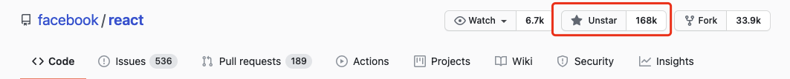
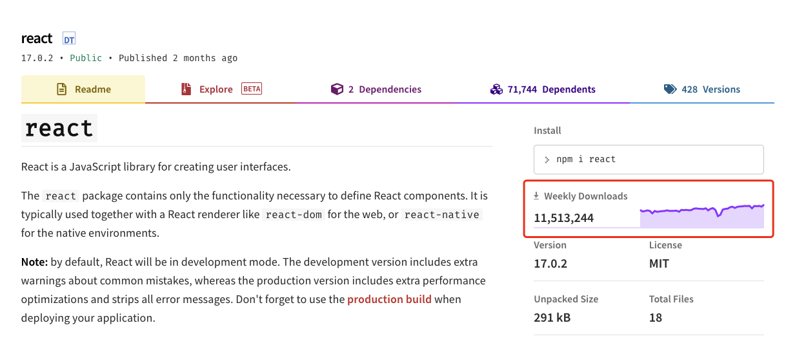

# SPA 它真的香吗？

我喜欢用三个里程碑来界定目前 Web 发展的历史：

* HTML + CSS + JavaScript 模式的诞生 -> 静态页面时代
* Server-Side-Render (SSR) 的诞生 -> 动态页面时代
* React / Vue / Angular 的普及 -> SPA 时代

在远古时期，网页的组成其实非常简单，简单来说以前的服务器其实就是简单的文件服务器，上面只存放 HTML、CSS、JavaScript 文件，而用户通过浏览器去访问页面，实际上就是把文件下载下来跑起来而已。

SSR 的诞生，催化了 Web 的极速发展，实际上跟静态页面的变化只是之前固定的 HTML 页面变成了由服务器根据模板引擎动态拼接 HTML 字符串返回而已，但仅仅是这么一点变化，就让原本静态的网页，产生了丰富多彩的组合，各种论坛像雨后春笋一样狂野生长，这段时间也诞生了一大批轮子，WordPress、JavaWeb、.NetWeb，可以说这些轮子是那个年代 Web 人的烂漫。

近几年 React / Vue 一类的 SPA 框架出来之后，可以说一时间前端界为之癫狂，再加上 Node.js / NPM 生态的繁荣，一时间乱花渐欲迷人眼，所有人都被 SPA 惊艳到了。

所谓 SPA，全称 Single-Page-Application，简单来说就是把部分以前 Server-Side 做的事情放到了 Browser-Side，服务器只负责把静态资源 (HTML, CSS, JavaScript, Images) 打包好返回给前端，然后由前端自己来进行 HTML Document 的渲染。

从架构上来看，SPA 简直酷炫无比，因为它的设计原则是把整个网站当成一个应用来看待，加载站点的过程实际上就像下载一个资源包，下载好资源包之后就把控制权完全交由应用，让应用自己负责，服务器只负责提供资源和处理一些 Ajax 数据请求。

听起来是不是无限美好？符合人类思维的设计理念、丰富的轮子、组件化的开发、强大的工具链，简直不要太完美。事实上也如此，看 React / Vue 的 Star 和 NPM 下载量就能看出来人们对 SPA 有多热衷了：

**我曾经也是 SPA 的忠实拥趸**，尤其是 React，Prop、State 的设计让我癫狂，让我迷恋。可是用的越久，我发现的问题越多。

# 聊聊我个人的经历

我大概是 17 年开始使用 React 的，到现在为止已经 4 年了，而事实上，我制作的大部分页面都是使用 React 编写的，就拿我博客来说，我的博客到现在已经是第五版了，站点的重写经历如下：

* BlogV1 (源码已丢失): WordPress + Custom Theme
* [BlogV2](https://github.com/FlyAndNotDown/Blog): Django + Materialize
* [BlogV3](https://github.com/FlyAndNotDown/blog-v3-frontend.git): Koa + React + Ant.Design
* [BlogV4](https://github.com/FlyAndNotDown/blog-v4): Egg + Next + React + Ant.Design
* [BlogV5](https://github.com/FlyAndNotDown/KindemBlog): Hugo + Stack Theme

其中第三第四版两版加起来运行了三年之久，两版的前端都是基于 React，但我想说的是，**他俩绝对是我这么多年来投入心血最多却带的最差的两届学生**。

为什么这么说呢，主要问题有两点：

* 首屏性能过差
* SEO 极度不友好

在 V2 时代，我有一套不是很完善但功能完备的博客系统，SEO 优化效果也还可以，百度收录量一度达到 50+，排名也比较靠前，而根据我的印象，我其实完全没特意地去做 SEO 优化，也没做什么性能优化。

然后就是 React 的普及让我心动，我果断上车，编写了 V3，当时后端是采用 Koa 加我自研的 MVC 架构，纯 SPA，无 SSR，上线之后收录量狂掉，直到 1 为止，然后首屏性能离谱到在水管服务器上要比原来慢 10 倍不止，后来分析其实主要是因为 Ant.Design 的庞大加上我自己代码优化粒度不够。

我开始意识到，纯 SPA 是走不通的，因为 **SPA 其实是为小程序、Web 应用一类的场景设计的，博客、展示类页面使用 SPA 其实只有死路一条**。但我抱着对 React 的无限期望，依然走了下去，接着我编写了 V4，V4 的存在意义就是解决 V3 时代的那两个痛点。

事实上我也取得了一定成果，切换成 Next.js 后，React SSR 变成了开箱即用的功能，再加上 SSR 不需要传输所有资源，性能也一下子上去了。

但 SEO 的问题还是解决不了，归根到底还是百度的爬虫对 SPA 支持是真的不太好，同样的站点， Google 爬的好好的，百度却怎么提交都一动不动。后来我才了解到，哪怕采用了 SSR 也没办法完全解决 SPA 的软肋，因为毕竟**你是 Hook 的，怎么可能有土著动态页面这么快。** 我尝试着在 Google Search Engine 中体检了一把，性能得分只有 36 (后来的静态页面 V5 能到 96 分，满分 100)。

当然我也不是说 SPA 就一定不好，SPA 在做 Web 应用、小程序一类的场景有着超强的能力，而且这类应用其实本来就不需要很好的 SEO 效果，只需要首页排名靠前就已经足够了。我想表达的是采用 SPA 之后，你需要为你的站点付出很多额外的心思，举例来说，SPA 的搜索引擎快照一般都会不正确，因为动态渲染 HTML 导致很多错乱，但你去打开知乎某个页面的快照，你会发现它的快照却正常的很，我猜测知乎的做法是维护 SPA 站点的同时生成一个静态站，导引爬虫去爬静态站，因为这样是最稳妥的办法。

那我我想说，既然已经花费了这么多心思去操劳，那为什么不一开始在技术选型的时候就将其放弃呢？**既然一开始就要落回静态页面 / 动态页面，那为什么还要不断尝试不可能的 SPA 呢**?

这也是我 V5 博客的初心，**不要把本来简单的事情变得复杂，不要因为热爱就犯傻**，V5 已经落回静态页面了，采用的技术栈是 Hugo + Stach Theme，没什么花里胡哨的，两小时建站，督促自己把注意力集中在写博客本身上，而不是一天又一天地去优化看不见的站点基础设施。

# 聊聊静态页面框架

如果经历过 WordPress 时代，相信大家都听过这么一句都市传说：

> 世界上 80% 的页面都是由 WordPress 搭建的

我其实很赞同这句话，WordPress 是一个优秀的 SSR 框架，在那个年代基本你看见一个网站，就可以看见下面标注着：

> 自豪地采用 WordPress

其实可以说 SPA 的崛起直接导致了 WordPress 的消亡。人们开始把注意力集中在 SPA 上，不断尝试新前端带来的新机遇，接受新前端带来的新挑战，而逐渐遗忘了以前的大哥们。

可是近来，静态页面框架以肉眼可见的速度增长，从开始的 Jekyll 到 Hexo，再到 Hugo，越来越多的站点开始 ServerLess，静态页面又开始流行了起来。其实我认为这完全是可以理解的，我自认为自己是一个老前端了（虽然我多数时候没有靠前端吃饭），**就我的经历而言，我对 SPA 是期待、狂热再到失望**，可能大家也都发现了，技术的酷炫并不能带来什么，优质的内容才是站点的核心，大家都更愿意复用轮子，不走弯路，专注于自己本该关注的事情本身。

再提一句，如果你使用过 Hexo、Hugo，你就能体会我说的话了，主题一堆随便挑，两小时建站，( 逃：

# 写在最后

想说 React 是我三年的挚爱，不过只能说好钢没用对地方，如果让我自己创业布设网站的话，我还是会毫不犹豫地选择 React / Vue 一类的 SPA 框架，因为当你拥有足够的资源、时间去优化、调试、强化，SPA 会给你带来很多效益。

但对我来说，我的体验只能是 **“React，爱你在心口难开”**。

我相信，静态页面的文艺复兴只是一个信号，会逐渐让大家相信，**每一种技术都有它自己的存在意义与适用场景，就像打工人，专业对口才是真正的奥义~**。
