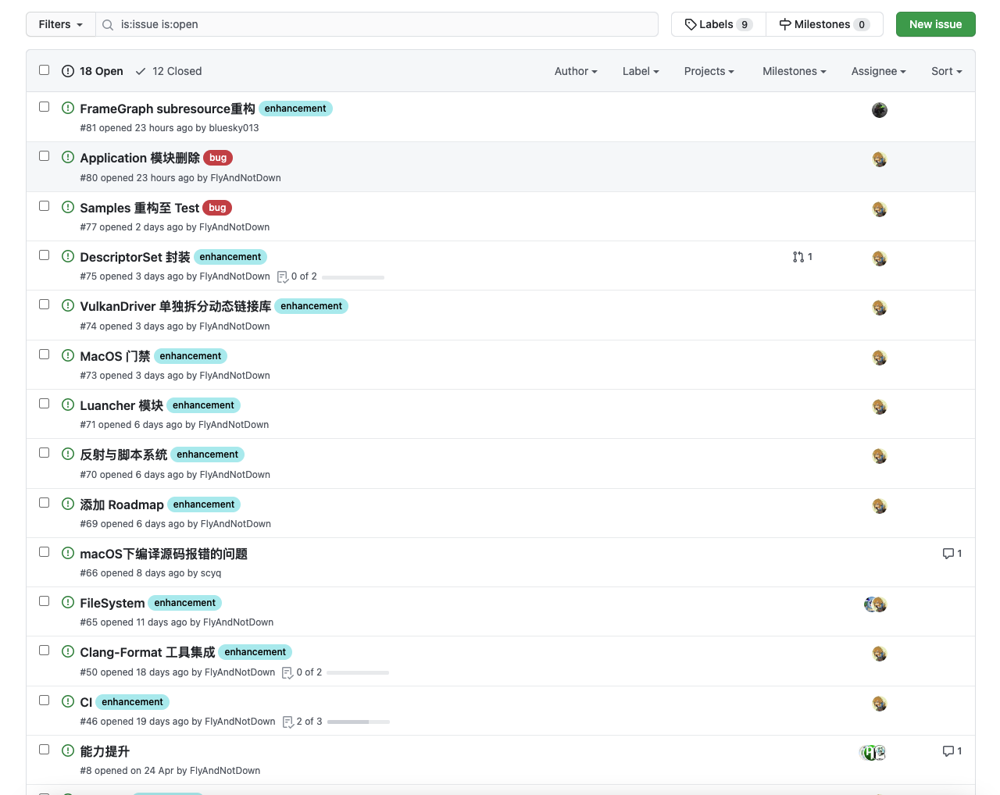
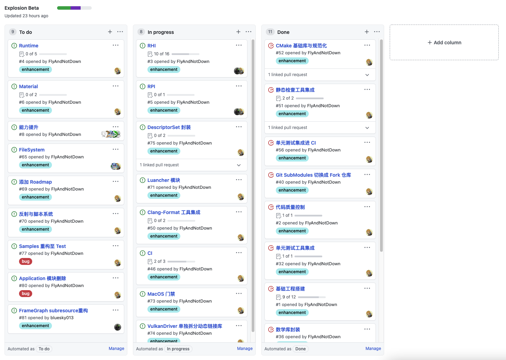
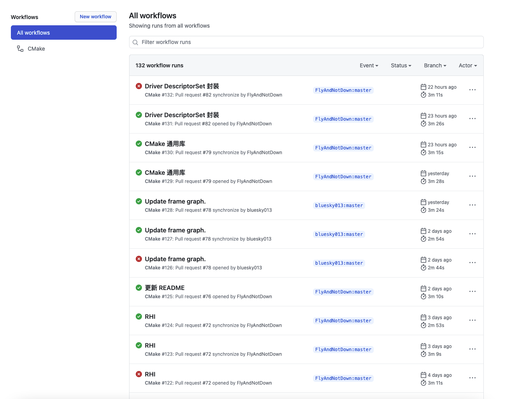
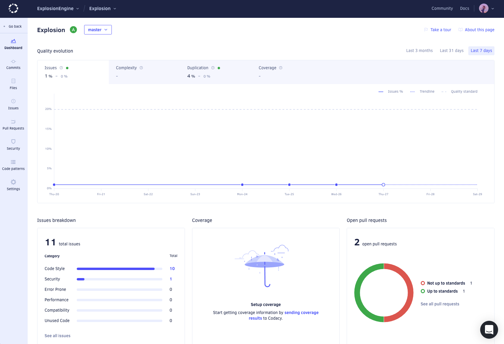
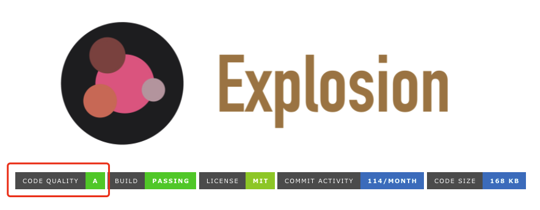
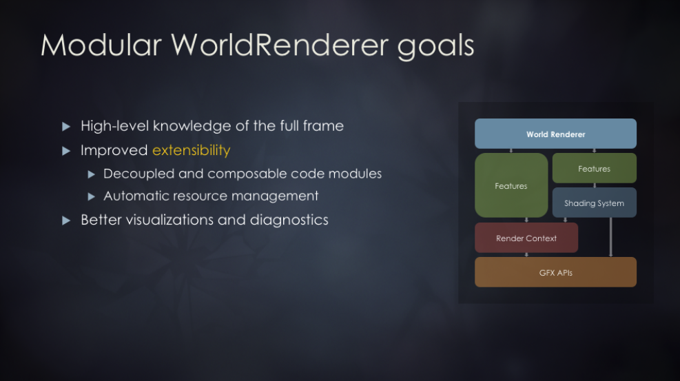
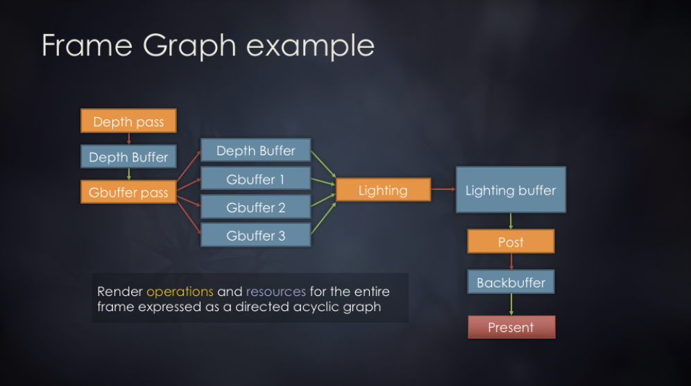
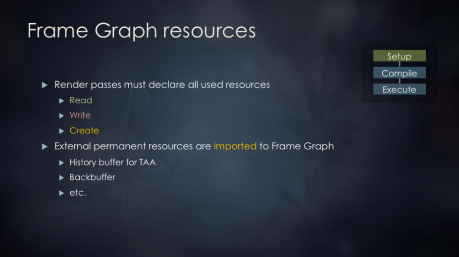
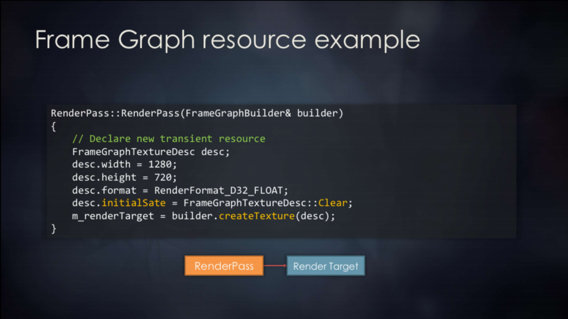
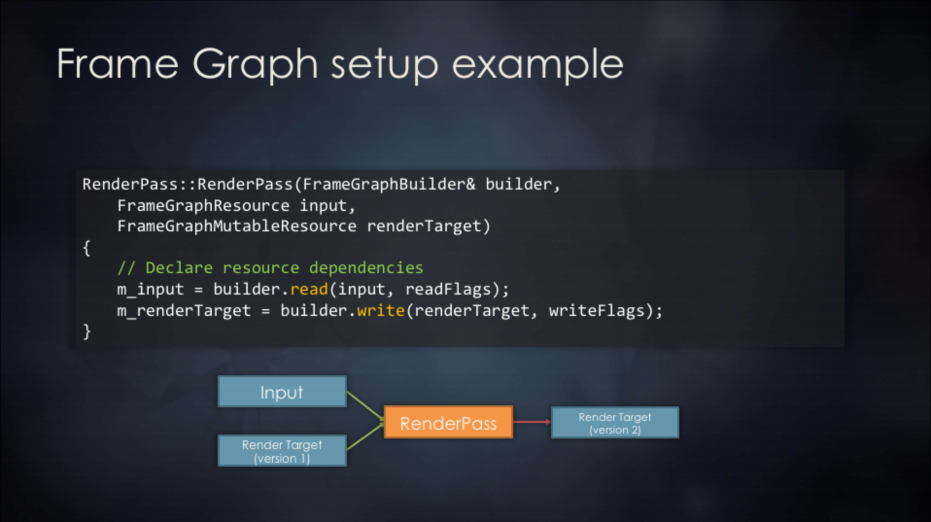

# 进展概览

## Repo 建设

先说说最近的进展吧，首先是 Repo 方面的建设，README 先写起来占坑了，顺便随手自己画了张 logo 图上丢上去占坑，可以简单看看现在的 README：


回头还需要把中文版的 README 和其他的细节慢慢补起来，不过我们现在真没太多人力投入这块，要做的东西太多了，之后把引擎本身完善的差不多了之后再慢慢弄吧。

## 工程管理

我们在团队内推崇大家使用 Issues 来交流、跟踪进展，使用 Project 来管理整个项目，大概效果是这样：





提交 Issues 会自动关联到 Project，MR 中需要关联对应的 Issues，在 MR 关闭时，Issues 会自动跟随 MR 关闭，并移动到 Project 的 Done 一栏，这样我们就能方便地跟踪需求和进展。

## CI

CI 方面我们目前使用的是 [GitHub Actions](https://docs.github.com/cn/actions)，不得不说这玩意可塑性要比其他的 CI/CD 工具强很多，写起来也是比较方便的，目前 CI 就配置了一个 cmake 构建，覆盖平台有：

* Ubuntu
* Windows

具体的代码在这：[Actions Code](https://github.com/ExplosionEngine/Explosion/tree/master/.github/workflows)，提交 MR 后自动触发，构建结果可以在 [Actions](https://github.com/ExplosionEngine/Explosion/actions) 查询：



构建通过是合入的硬性指标。其实我在纠结 MacOS 要不要加，因为实际上从构建来说，MacOS 的编译器和 GCC 还是比较一致的，一般不会出什么大岔子，后面再说吧。

## 构建系统优化

我抽空对所有的 CMake 进行了一次重构，主要做的事情是把常用的一些基本 CMake 指令做了一次封装，主要涉及：

* add_executable
* add_library
* add_test

我把他们封装成了：

* exp_add_executable
* exp_add_library
* exp_add_test

其实做的事情很简单，就是在原有指令的基础上，把头文件目录、链接库这类必备的操作与其合并了，用起来会更方便些，下面是一段示例：

```cmake
exp_add_executable(
    NAME ${TARGET_NAME}
    SRCS ${TARGET_SOURCES}
    INC_DIRS ${TARGET_INCLUDE_DIRS}
    LIBS ${TARGET_LIBS}
)

exp_add_library(
    NAME ${TARGET_NAME}
    TYPE ${TARGET_TYPE}
    SRCS ${TARGET_SOURCES}
    PRIVATE_INC_DIRS ${TARGET_PRIVATE_INCLUDE_DIRS}
    PUBLIC_INC_DIRS ${TARGET_PUBLIC_INCLUDE_DIRS}
    LIB ${TARGET_LIBS}
)

exp_add_test(
    NAME ${TARGET_NAME}
    WORKING_DIR ${TARGET_WORKING_DIR}
    SRCS ${TARGET_SOURCES}
    INC_DIRS ${TARGET_INCLUDE_DIRS}
    LIB ${TARGET_LIBS}
)
```

目的就是统一大家写 CMake 的风格。

## 代码质量控制

经过一番考量，我暂时选用了 [Codacy](https://www.codacy.com/) 作为我们的静态检查工具，因为是纯在线的工具，完全不需要集成，只需要按步骤启用 GitHub App 即可启用扫描，可以在 [Codacy Dashboard - Explosion](https://app.codacy.com/gh/ExplosionEngine/Explosion/dashboard) 找到静态扫描结果：



主干的代码提交以及 MR 会自动触发静态扫描，之后评级会自动刷新，然后同步到 README 的 Badge 中：



至于代码风格、安全问题、圈复杂度、重复率的扫描要不要整合到 CI 中，之后再考虑吧，现在来说已经够用了~

## RHI 重构

最近投入 Explosion 的时间并不是很多，RHI 重构算是最近的主要进展了，我之前写过一篇文章叫做 [《醒醒吧，静态多态根本没有这么香》](https://www.kindem.xyz/post/39/)，其实主要纠结的地方在于要不要追求极限性能，把 RHI 的主要架子完全用模板实现，但我最后还是放弃了。

模板在大型的架构设计与代码量级下会带来很多负面影响，主要会直接影响到接口的设计，虽然性能高，但我最后还是决定使用传统的 OOP 来完成 RHI 的编写。

抛开这些，我总算是决定先把 VulkanDriver 拆分出来了，抽象了一套公共的 Driver 接口，用于以后实现 DX12 和 Metal 后端，我很庆幸先做了这件事，不然后面改起来估计更蛋疼。

目前封装的类有：

* Driver
* Device
* CommandBuffer
* Buffer
* Sampler
* Image
* ImageView
* FrameBuffer
* SwapChain
* RenderPass
* GraphicsPipeline
* ComputePipeline
* DescriptorPool
* DescriptorSet
* Signal

封装粒度还是相对比较细的，之后准备通过脚本 / 插件的形式将 RHI 和 RPI 一起提供出去，为用户自己造 Renderer 提供可能性（咱们之后的 DefaultRenderer 本身就会作为一个插件提供）。

RHI 要走的路还很长，不过我打算小步快跑，先用 VulkanDriver 顶着，慢慢把上面的代码也写起来，让其他团队成员也能快速地参与进来。

## RPI / FrameGraph

RPI / FrameGraph 主要由 [bluesky013](https://github.com/bluesky013) 操刀，思路主要参考 GDC 2017 寒霜引擎的一次 Talk，可以在 [GDC Vault - FrameGraph](https://www.gdcvault.com/play/1024612/FrameGraph-Extensible-Rendering-Architecture-in) 找到这次 Talk 的 PPT。

我们设计的蓝本就是这个 Talk，目前逻辑差不多写完了，不过 AsyncComputePass 和 TransitionResources 处理上还有点小问题。

下面简单讲讲 FrameGraph：



FrameGraph 的目标很简单，就是用一种合理、可预测的方式去维护 Renderer 中繁重不堪的资源与 RenderPass 的依赖关系。从另外一种角度讲，FrameGraph 的作用是让渲染流程更清晰、可维护。下面是一个简单的例子：



黄色的节点是 RenderPass，蓝色的节点是资源，红色节点是送显，它很好地描述了一帧中资源和渲染流程的关系（但是要注意的是它并不维护具体的渲染任务，也就是它不管 Pipeline）。下面是几张资源和 RenderPass 的图：








资源这里就不多说了，可以自己看看原 Talk，主要是 RenderPass，FrameGraph 用一个结构体来描述 RenderPass 节点的输入输出资源，用两个 Lambda 表达式来描述 RenderPass 节点的 SetUp 和 Execute 流程，这里的 Execute 实际上就是真正的绘制过程了，FrameGraph 和 RHI 就是在这里结合的。

FrameGraph 是 RPI 的重要组成部分，可以说它是 Renderer 的骨架，而 RHI 则是 Renderer 的血肉，它俩配合可以为可编程渲染管线提供强大的支持。

# 思考

## 反射系统搭建

我很喜欢拿反射系统说事，之前也写过 [一篇对反射系统的剖析](https://www.kindem.xyz/post/33/)，不过那是针对 UnrealEngine 的。反射系统在游戏引擎中最大的作用，无非就两个：

* 自动序列化
* 脚本符号注册

我们目前准备使用 [rttr](https://github.com/rttrorg/rttr) 或者 [meta](https://github.com/skypjack/meta)，rttr 应该不说我多说了，老牌反射框架了，meta 是 entt 内置的反射框架，作者 skypjack 觉得市面上没什么好的反射框架然后自己写的。其实从工程建设角度看我更认可 meta 一些，但是 meta 提供的接口实在是不好用：

```cpp
std::hash<std::string_view> hash{};

meta::reflect<my_type>(hash("reflected"))
    .data<&my_type::static_variable>(hash("static"))
    .data<&my_type::data_member>(hash("member"))
    .data<&global_variable>(hash("global"));
```

他这里的写法非常巧妙，用地址（地址本身也是一个 uint32_t 或者 uint64_t）来作为模板参数，我第一开始愣是没看懂这写法，不过仔细读一读还好，相当于一口气完成了地址与类型的双重注册，不过我想诟病的地方在于作者为了追求极限性能，连 identity 参数都用了 hash + string_view，就离谱 ......

如果我们最终使用 meta 的话，还是要再封装一层。rttr 的话，接口是比较好用的，但我接受不了的是 rttr 的工程竟然用 cmake 去检查 README 和 LICENSE 符不符合它的要求 ......

具体使用哪个写到反射系统的时候再挑选吧，实在不行自己写一个也不是什么麻烦事，**我是比较倾向于静态反射的**，而 UE 的反射系统是动态反射，实现起来还稍微有些区别，性能上也要差一截，优点就是**动态反射对脚本很友好**，看完下一小节你就知道我说的是什么了。

## 脚本如何与 ECS 融合呢？

其实我早就说了，引擎本身按照 ECS 逻辑编写并不代表脚本也要套 ECS。如果是从头到尾都用 ECS 的话，那么用户必须要接受的是改变以前写 GameObject 的风格，投入编写 Component 和 System 的怀抱。

设想反射系统最后是用纯静态反射，ECS 也在 C++ 层开始构建，脚本完全 ECS 化，那么我们就避不开一个大问题 —— **“用户自定义的 Component 要怎么被下面 C++ 所感知到？”**

假设用户在脚本里面定义了一个 Component 和一个 System：

```javascript
const helloComp = {
    a: 1,
    b: 2,
    c: 3
};

const helloSystem = (registry, time) => {
    // systen logic
};
```

这里用户自定义的 HelloComp 对应的 C++ 的 Archetype 很明显是：

```cpp
struct HelloComp : public Comp {
    int a;
    int b;
    int c;
}
```

但不巧的是脚本是弱类型的，C++ 根本就没办法感知到类型好嘛？那实际上填充数据的时候，entt 可是需要这样的：

```cpp
entt::registry registry;

const auto entity = registry.create();
registry.emplace<HelloComp>(1, 2, 3);
```

这里的模板参数根本就没法填 ......

我和 [bluesky013](https://github.com/bluesky013) 讨论后，我们一起得到一个可行的方案，就是用户将 Component 和 System 分开为两个文件编写，System 部分不动，Component 部分修改成下面这样：

```javascript
// hello.comp.js
export const entry = (componentManager) => {
    componentManager.define({
        name: "Hello",
        attrs: {
            a: DataType.Int,
            b: DataType.Int,
            c: DataType.Int
        }
    });
};
```

然后我们需要**经过一轮预编译**，我们的预编译器会执行所有的 .comp.js 文件，然后找到 entry 方法进行调用，执行完所有类型的注册之后，预编译期会从 componentManager 中取出所有的 Component 类型信息，生成一系列头文件和代码

```cpp
// hello.generated.h
struct Hello : public Comp {
    int a;
    int b;
    int c;
}

// hello.generated.cpp
extern "C" {
    void RegisterComp()
    {
        // 一些初始化的事情，会在库被加载时被自动执行
    }
}
```

这样就能让脚本系统里面定义的类型也被 C++ 感知到了，这个思路其实和 QT、UE 很想，只不过他们是对 C++ 进行元编译，我们是对脚本语言而已~

## 脚本语言和引擎的选择

我是狂热的 JavaScript 爱好者，所以 Explosion 的脚本语言当然要使用 JavaScript 啦~

兜了一圈我看了很多小型嵌入式 JavaScript 引擎，不过说实话质量都一般般，挣扎了一波后我还是准备把这个大家伙给带进来：[V8](https://v8.dev/)

经过这波调研我才发现，果真 V8 出来都没人敢做 JavaScript 引擎了，它的统治地位真没啥好说的 ......

简单看了一下集成指南 —— [Getting started with embedding V8](https://v8.dev/docs/embed)，官方例子如下：

```cpp
// Copyright 2015 the V8 project authors. All rights reserved.
// Use of this source code is governed by a BSD-style license that can be
// found in the LICENSE file.
#include <stdio.h>
#include <stdlib.h>
#include <string.h>
#include "include/libplatform/libplatform.h"
#include "include/v8.h"
int main(int argc, char* argv[]) {
  // Initialize V8.
  v8::V8::InitializeICUDefaultLocation(argv[0]);
  v8::V8::InitializeExternalStartupData(argv[0]);
  std::unique_ptr<v8::Platform> platform = v8::platform::NewDefaultPlatform();
  v8::V8::InitializePlatform(platform.get());
  v8::V8::Initialize();
  // Create a new Isolate and make it the current one.
  v8::Isolate::CreateParams create_params;
  create_params.array_buffer_allocator =
      v8::ArrayBuffer::Allocator::NewDefaultAllocator();
  v8::Isolate* isolate = v8::Isolate::New(create_params);
  {
    v8::Isolate::Scope isolate_scope(isolate);
    // Create a stack-allocated handle scope.
    v8::HandleScope handle_scope(isolate);
    // Create a new context.
    v8::Local<v8::Context> context = v8::Context::New(isolate);
    // Enter the context for compiling and running the hello world script.
    v8::Context::Scope context_scope(context);
    // Create a string containing the JavaScript source code.
    v8::Local<v8::String> source =
        v8::String::NewFromUtf8(isolate, "'Hello' + ', World!'",
                                v8::NewStringType::kNormal)
            .ToLocalChecked();
    // Compile the source code.
    v8::Local<v8::Script> script =
        v8::Script::Compile(context, source).ToLocalChecked();
    // Run the script to get the result.
    v8::Local<v8::Value> result = script->Run(context).ToLocalChecked();
    // Convert the result to an UTF8 string and print it.
    v8::String::Utf8Value utf8(isolate, result);
    printf("%s\n", *utf8);
  }
  // Dispose the isolate and tear down V8.
  isolate->Dispose();
  v8::V8::Dispose();
  v8::V8::ShutdownPlatform();
  delete create_params.array_buffer_allocator;
  return 0;
}
```

说实话其实和 Lua 差不多，应该难度不高，但还是要先试试，不知道这么大体量的怪物会不会有什么天坑 ......

最后，还是跟自己和 Explosion 说一声加油~

# 参考资料

* [GDC Vault - FrameGraph](https://www.gdcvault.com/play/1024612/FrameGraph-Extensible-Rendering-Architecture-in)
* [rttr](https://github.com/rttrorg/rttr)
* [EnTT](https://github.com/skypjack/entt)
* [meta](https://github.com/skypjack/meta)
* [V8 JavaScript Engine](https://v8.dev/)
* [Embedded V8 Sample](https://chromium.googlesource.com/v8/v8/+/branch-heads/6.8/samples/hello-world.cc)
