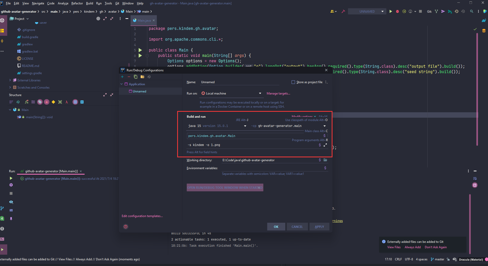

> 每一个程序员都应该有机会重写三年前写下的代码 —— 鲁迅

# 起因

[GitHub 风格头像生成器](https://github.com/FlyAndNotDown/github-avatar-generator) 是我三年前写下的一个 Java 小程序，它的功能很简单，就是生成 GitHub 风格的头像。下午逛 GitHub 的时候突然看到之前写的辣鸡代码，工程管理和使用的库也相当混乱。

离谱的事情是居然还有 30 来个小星星，一时间感觉受之有愧，决定花一个下午推倒重写 ......

# 分析

首先是工程管理上的，老的工程是直接基于 IDEA 的默认 Java 工程搭建的，构建运行都相当依赖 IDEA，如果要命令行编译运行对不了解这块的网友来说还有有点麻烦的。我的想法是使用 Gradle 来进行工程管理，这样无论是命令行还是 IDE，构建和运行都相当方便。

其次，使用的库非常离谱，三年前的我引入了 OpenCV 做图片读写，我现在也没法揣摩三年前的我出于何考虑，果断放弃，直接使用 Java 自带的 ImageIO 和 BufferedImage 替代。

另外，原来的代码是写死输出文件的，也不支持自定义随机种子的配置。我决定在这次重构中添加这些功能。

# 细节
## 命令行参数解析

命令行参数解析我直接使用的 Apache 的轮子 commons-cli，主程序就稍微写一丢丢代码就能完成解析：

```java
public class Main {
    public static void main(String[] args) {
        Options options = new Options();
        options.addOption(Option.builder("o").longOpt("output").hasArg().required().type(String.class).desc("output file").build());
        options.addOption(Option.builder("s").longOpt("seed").hasArg().required().type(String.class).desc("seed string").build());

        CommandLineParser commandLineParser = new DefaultParser();
        CommandLine commandLine = null;
        try {
            commandLine = commandLineParser.parse(options, args);
        } catch (ParseException e) {
            System.out.println("bad command line arguments");
        }
        if (commandLine == null) {
            return;
        }

        Generator generator = new Generator(commandLine.getOptionValue("s"));
        Saver.saveImage(generator.nextAvatar(), commandLine.getOptionValue("o"));
    }
}
```

没啥好说的，各种命令行参数解析工具的一贯用法，定义 Options，用 Parser 开始解析即可。

## 种子与随机算法

这一次重构添加了自定义种子的功能，可以支持从命令行输入一个种子字符串，程序会把种子加上当前计数一起做 Hash，Hash 完了拿到 Bytes 生成一个 `AvatarInfo`，它的作用是记录本次生成过程中，需要采用的颜色和 5x5 方块矩阵中每一个矩阵是否要填充颜色，原理也不复杂，直接贴代码：

```java
private AvatarInfo nextAvatarInfo() {
    byte[] hash = nextHash();

    // 3 byte for color, 15 byte for block
    int[] info = new int[18];
    for (int i = 0; i < hash.length; i++) {
        int index = i % 18;
        info[index] = (info[index] + (hash[i] + 128)) % 256;
    }

    AvatarInfo avatarInfo = new AvatarInfo(new Color(info[0], info[1], info[2]));
    for (int i = 3; i < 18; i++) {
        avatarInfo.setBlockValue(i, info[i] > 127);
    }
    return avatarInfo;
}

private byte[] nextHash() {
    MessageDigest messageDigest = null;
    try {
        messageDigest = MessageDigest.getInstance("SHA-256");
    } catch (NoSuchAlgorithmException ignored) {}
    if (messageDigest == null) {
        return new byte[0];
    }
    messageDigest.update((seed + count++).getBytes(StandardCharsets.UTF_8));
    return messageDigest.digest();
}
```

## Gradle

采用 Gradle 进行工程管理后，既可以兼容 IDEA，又可以在命令行进行构建和运行，非常方便，如果你是 IDEA 用户，只要打开工程，点击右上角 `Add Configuration` 按钮，添加一个运行配置即可：



把红框里的填一填就 OK 啦，尤其注意参数一栏要记得填东西，之后直接点击绿色小三角运行即可。

如果是命令行用户，则直接使用 gradlew 指令构建运行即可：

```shell
# build and install
./gradlew build
./gradlew install

# run
./build/install/gh-avatar-generator/bin/gh-avatar-generator -s amazing_seed -o sample.png
```

# 展示

下面是重构之后用应用生成的一些 GitHub 风格头像：

<div>
    
    
    
</div>
<div>
    
    
    
</div>

<br/>

喜欢的话可以 Clone 我的仓库体验一下，顺便给我个小星星~ 🤣
