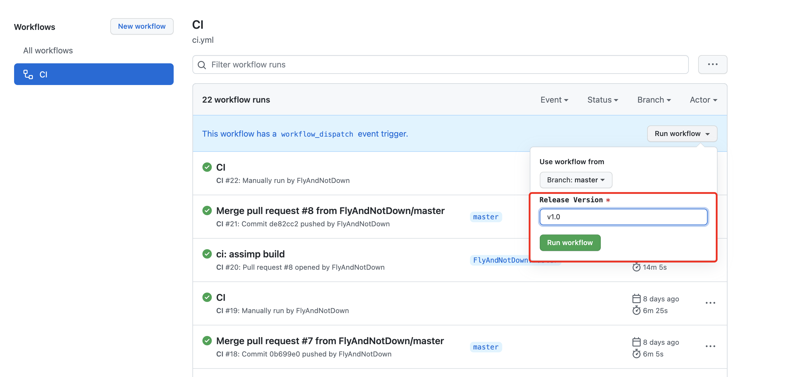
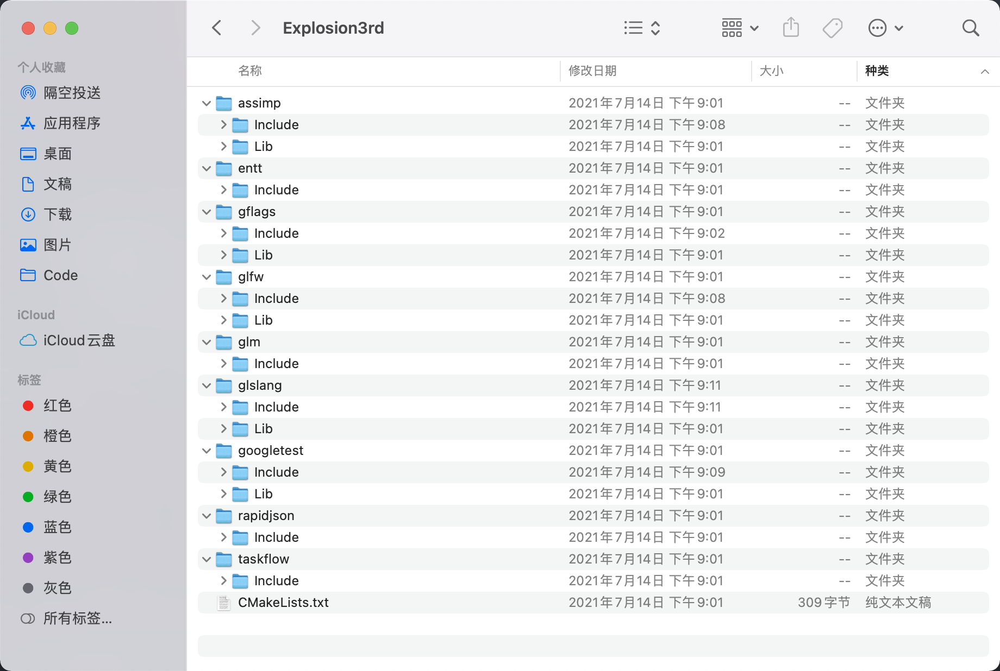

前两个月在 Explosion 上下了不少功夫，好几周双休都抽出了一整天来开发引擎、做之后的设计，平日里下班了也是第一时间埋着头就开始写。直到这两周，Explosion 又暂停了下来，主要因为被安排了杭州出差以及个人发展的一些事情。

今天下班比较早，想起来了该要写笔记了，就提笔记录记录。

# 近期进展
## System / SystemGroup / SystemGraph

ECS 框架我们是直接引用的 [EnTT](https://github.com/skypjack/entt)，但 EnTT 只提供了 Entity、Component 的概念，没有直接提供 System，它的本意是只负责 ECS 框架中最困难的内存管理部分，所以 System 的概念需要自己封装。

在基础的 System 定义上，我们稍作了简化，并添加了 SystemGroup 和 SystemGraph 的概念，他们的定义如下：

* System：一个 Lambda 表达式，即代表一段可执行的逻辑。
* SystemGroup：保存了一组 System 和一个 SystemGraph。
* SystemGraph：描述了 SystemGroup 内部 System 之间的依赖关系。

另外，他们遵循如下规则：

* World#Tick() 会更新所有 SystemGroup，SystemGroup 具有优先级，SystemGroup 之间会按照优先级**串行**更新。
* SystemGroup 内部的所有 System 会按照 SystemGraph 编译成一个 TaskFlow，用于描述一个更新任务。
* TaskFlow Execute 的时候有依赖关系的 System 会进行软同步，按照先后顺序执行，没有依赖关系的 System 会并行执行。
* System 之间可以拥有共享内存，也使用 Component 实现，我们称之为 SharedComponent，SystemGraph 产生的依赖关系可以保证这块内存的同步访问。

下面是部分定义以及 World#Tick() 的部分代码：

```cpp
using System = std::function<void(Registry& registry, float time)>;

struct SystemGroup {
    std::string name;
    uint32_t priority;
    std::unordered_map<std::string, System> systems;
    // SystemGraph 的简易实现，等完善的图模板库写出来之后替换掉
    std::unordered_map<std::string, std::string> dependencies;
};

void World::TickSystem(float time)
{
    // update system group on by one
    for (const auto& systemGroup : systemGroups) {
        JobSystem::TaskFlow taskFlow;
        std::unordered_map<std::string, JobSystem::Task> tasks;

        for (const auto& sysIter : systemGroup.systems) {
            tasks[sysIter.first] = taskFlow.emplace([&sysIter, time, this]() -> void { sysIter.second(registry, time); });
        }

        for (const auto& depIter : systemGroup.dependencies) {
            tasks[depIter.first].succeed(tasks[depIter.second]);
        }

        JobSystem::Executor executor;
        executor.run(taskFlow).wait();
    }
}
```

下面是一小段 ECS 的 UT：

```cpp
TEST(WorldTest, SystemDependenciesTest)
{
    struct SharedComponent {
        uint32_t input;
        uint32_t transfer;
    };

    struct OutputComponent {
        uint32_t value;
    };

    World world;
    auto& registry = world.GetRegistry();

    Entity entity1 = registry.CreateEntity();
    registry.AddComponent<SharedComponent>(entity1, 1u, 0u);
    registry.AddComponent<OutputComponent>(entity1, 0u);

    Entity entity2 = registry.CreateEntity();
    registry.AddComponent<SharedComponent>(entity2, 3u, 0u);
    registry.AddComponent<OutputComponent>(entity2, 0u);

    SystemGroup systemGroup {};
    systemGroup.name = "group1";
    systemGroup.priority = 1;
    systemGroup.systems["middleSystem"] = [](Registry& registry, float time) -> void {
        auto view = registry.CreateView<SharedComponent>();
        view.Each([](SharedComponent& sharedComp) -> void {
            sharedComp.transfer = sharedComp.input * 4;
        });
    };
    systemGroup.systems["outputSystem"] = [](Registry& registry, float time) -> void {
        auto view = registry.CreateView<SharedComponent, OutputComponent>();
        view.Each([](SharedComponent& sharedComp, OutputComponent& outputComp) -> void {
            outputComp.value = sharedComp.transfer + 3;
        });
    };
    systemGroup.dependencies["outputSystem"] = "middleSystem";

    world.AddSystemGroups(systemGroup);
    world.Tick(.16f);
    ASSERT_EQ(registry.GetComponent<SharedComponent>(entity1)->input, 1);
    ASSERT_EQ(registry.GetComponent<SharedComponent>(entity1)->transfer, 4);
    ASSERT_EQ(registry.GetComponent<OutputComponent>(entity1)->value, 7);
    ASSERT_EQ(registry.GetComponent<SharedComponent>(entity2)->input, 3);
    ASSERT_EQ(registry.GetComponent<SharedComponent>(entity2)->transfer, 12);
    ASSERT_EQ(registry.GetComponent<OutputComponent>(entity2)->value, 15);
}
```

总体来说写起来还算可以，这么设计的初衷主要有两个：

* 处理 System 依赖问题
* 处理 System 间传递数据问题

大道至简，我不想把一套本来很简单的机制设计的过于复杂，从而增加维护的难度，之后等渲染管线搭起来之后再测一测性能，天然的多线程支持应该不会慢到哪里去。另外就是这样的写法会非常自由，对之后写引擎核心的 CPU 端逻辑会产生更高的要求，后面实际写起来的时候再看看效果吧。

## Explosion 3rd Party Package

我本人其实是非常不想在 CI 上花太多时间的，但是 3rd Party Package 这个事情不搞又完全不行，因为越来越多的三方库直接源码引入，一是主仓体积逐渐增大，二是遇到一些巨大的库 （例如 [V8](https://v8.dev/)），光是构建就需要两小时，不可能本地编译的，这个事情会很大程度上影响大家的工作效率。

我们的解决方案是创建一个单独的仓库，即 [Explosion3rd](https://github.com/ExplosionEngine/Explosion3rdParty)，它的任务如下：

* 以 Git Sub-Module 的形式管理所有三方库源码，支持我们自己的侵入式修改。
* 支持一键构建所有三方库在各平台上（目前支持 MacOS、Visual Stdio 2019）的二进制包，并全自动打包成 Zip 发布到 [Release](https://github.com/ExplosionEngine/Explosion3rdParty/releases) 页面，用户在编译 Explosion 本体前需要自行下载、解压这个包。
* 管理三方库的版本与依赖关系，将其归档到 Release 包的 CMakeLists.txt 中。

这样一来，主仓就可以只管理 Explosion 的代码本身了。

Explosion3rd 的打包流程完全基于 [GitHub Actions](https://github.com/ExplosionEngine/Explosion3rdParty/actions) 实现：



每次更新之后，只需要手动输入版本号并 Dispatch 一下，Actions 就会全自动地构建二进制包，并发布到 Release 页面，下面是其中一个平台自动构建、打包的 CI 代码：

```yml
jobs:
  release-windows:
    runs-on: windows-latest

    steps:
      - uses: actions/checkout@v2

      - name: Update SubModules
        run: |
          git submodule init
          git submodule update
      
      - name: Install 7-zip
        run: |
          Invoke-WebRequest -Uri https://7-zip.org/a/7z1900-x64.msi -OutFile 7z.msi
          msiexec.exe /package 7z.msi /qn
          echo "C:\Program Files\7-Zip" | Out-File -FilePath $env:GITHUB_PATH -Encoding utf8 -Append
          
      - name: Create Archive Directories
        run: |
          mkdir Win
          mkdir Win/entt
          mkdir Win/entt/Include
          mkdir Win/glm
          mkdir Win/glm/Include
          mkdir Win/rapidjson
          mkdir Win/rapidjson/Include
          mkdir Win/taskflow
          mkdir Win/taskflow/Include
          mkdir Win/glfw
          mkdir Win/glfw/Include
          mkdir Win/glfw/Lib
          mkdir Win/glfw/Lib/Debug
          mkdir Win/glfw/Lib/Release
          mkdir Win/gflags
          mkdir Win/gflags/Include
          mkdir Win/gflags/Lib
          mkdir Win/gflags/Lib/Debug
          mkdir Win/gflags/Lib/Release
          mkdir Win/assimp
          mkdir Win/assimp/Include
          mkdir Win/assimp/Lib
          mkdir Win/assimp/Lib/Debug
          mkdir Win/assimp/Lib/Release
          mkdir Win/googletest
          mkdir Win/googletest/Include
          mkdir Win/googletest/Lib
          mkdir Win/googletest/Lib/Debug
          mkdir Win/googletest/Lib/Release
          mkdir Win/glslang
          mkdir Win/glslang/Lib
          mkdir Win/glslang/Lib/Debug
          mkdir Win/glslang/Lib/Release
      
      - name: Archiving CMakeLists
        run: |
          cp CMakeLists.txt Win
      - name: Archiving EnTT
        run: |
          cp -r entt/single_include/entt Win/entt/Include
      
      - name: Archiving GLM
        run: |
          cp -r glm/glm Win/glm/Include/glm
          rm Win/glm/Include/glm/CMakeLists.txt
      
      - name: Archiving rapidjson
        run: |
          cp -r rapidjson/include/rapidjson Win/rapidjson/Include/rapidjson
      
      - name: Archiving TaskFlow
        run: |
          cp -r taskflow/taskflow Win/taskflow/Include/taskflow
      
      - name: Building GFlags
        run: |
          cmake -S gflags -B gflags/build-debug -DBUILD_SHARED_LIBS=OFF -DBUILD_STATIC_LIBS=ON -DBUILD_gflags_LIB=OFF -DBUILD_gflags_nothreads_LIB=ON -DBUILD_PACKAGING=OFF -DBUILD_TESTING=OFF -DINSTALL_HEADERS=ON -DINSTALL_SHARED_LIBS=OFF -DINSTALL_STATIC_LIBS=ON -DREGISTER_BUILD_DIR=OFF -DREGISTER_INSTALL_PREFIX=OFF -DCMAKE_INSTALL_PREFIX=gflags/build-debug/install
          cmake --build gflags/build-debug --config Debug -j 8
          cmake --install gflags/build-debug --config Debug
          cmake -S gflags -B gflags/build-release -DBUILD_SHARED_LIBS=OFF -DBUILD_STATIC_LIBS=ON -DBUILD_gflags_LIB=OFF -DBUILD_gflags_nothreads_LIB=ON -DBUILD_PACKAGING=OFF -DBUILD_TESTING=OFF -DINSTALL_HEADERS=ON -DINSTALL_SHARED_LIBS=OFF -DINSTALL_STATIC_LIBS=ON -DREGISTER_BUILD_DIR=OFF -DREGISTER_INSTALL_PREFIX=OFF -DCMAKE_INSTALL_PREFIX=gflags/build-release/install
          cmake --build gflags/build-release --config release -j 8
          cmake --install gflags/build-release --config release
      
      - name: Archiving GFlags
        run: |
          cp -r gflags/build-debug/install/include/* Win/gflags/Include
          cp -r gflags/build-debug/install/lib/* Win/gflags/Lib/Debug
          cp -r gflags/build-release/install/lib/* Win/gflags/Lib/Release
      
      - name: Building Assimp
        run: |
          cmake -S assimp -B assimp/build-debug -DBUILD_SHARED_LIBS=OFF -DASSIMP_BUILD_TESTS=OFF
          cmake --build assimp/build-debug --config Debug -j 8
          cmake -S assimp -B assimp/build-release -DBUILD_SHARED_LIBS=OFF -DASSIMP_BUILD_TESTS=OFF
          cmake --build assimp/build-release --config Release -j 8
      
      - name: Archiving Assimp
        run: |
          cp -r assimp/include/* Win/assimp/Include
          cp assimp/build-debug/include/assimp/config.h Win/assimp/Include/assimp
          cp assimp/build-debug/lib/Debug/assimp-vc142-mtd.lib Win/assimp/Lib/Debug
          cp assimp/build-debug/lib/Debug/assimp-vc142-mtd.pdb Win/assimp/Lib/Debug
          cp assimp/build-release/lib/Release/assimp-vc142-mt.lib Win/assimp/Lib/Release
          
      - name: Building GLFW
        run: |
          mkdir glfw/build-debug
          cmake -S glfw -B glfw/build -DGLFW_BUILD_EXAMPLES=false -DGLFW_BUILD_TESTS=false -DGLFW_BUILD_DOCS=false -DUSE_MSVC_RUNTIME_LIBRARY_DLL=OFF
          cmake --build glfw/build --config Debug -j 8
          cmake --build glfw/build --config Release -j 8
      
      - name: Archiving GLFW
        run: |
          cp glfw/build/src/Debug/glfw3.lib Win/glfw/Lib/Debug
          cp glfw/build/src/Debug/glfw3.pdb Win/glfw/Lib/Debug
          cp glfw/build/src/Release/glfw3.lib Win/glfw/Lib/Release
          cp -r glfw/include/GLFW Win/glfw/Include/GLFW
      
      - name: Building GoogleTest
        run: |
          mkdir googletest/build-debug
          cmake -S googletest -B googletest/build
          cmake --build googletest/build --config Debug -j 8
          cmake --build googletest/build --config Release -j 8
      
      - name: Archiving Google Test
        run: |
          cp googletest/build/lib/Debug/gtestd.lib Win/googletest/Lib/Debug
          cp googletest/build/lib/Debug/gmockd.lib Win/googletest/Lib/Debug
          cp googletest/build/lib/Debug/gtest_maind.lib Win/googletest/Lib/Debug
          cp googletest/build/lib/Debug/gmock_maind.lib Win/googletest/Lib/Debug
          cp googletest/build/lib/Debug/gtestd.pdb Win/googletest/Lib/Debug
          cp googletest/build/lib/Debug/gmockd.pdb Win/googletest/Lib/Debug
          cp googletest/build/lib/Debug/gtest_maind.pdb Win/googletest/Lib/Debug
          cp googletest/build/lib/Debug/gmock_maind.pdb Win/googletest/Lib/Debug
          cp googletest/build/lib/Release/gtest.lib Win/googletest/Lib/Release
          cp googletest/build/lib/Release/gmock.lib Win/googletest/Lib/Release
          cp googletest/build/lib/Release/gtest_main.lib Win/googletest/Lib/Release
          cp googletest/build/lib/Release/gmock_main.lib Win/googletest/Lib/Release
          cp -r googletest/googletest/include/gtest Win/googletest/Include/gtest
          cp -r googletest/googlemock/include/gmock Win/googletest/Include/gmock
      - name: Building Glslang
        run: |
          cmake -S glslang -B glslang/build-debug -DBUILD_TESTING=false -DENABLE_CTEST=false -DCMAKE_INSTALL_PREFIX=glslang/build-debug
          cmake --build glslang/build-debug --config Debug -j 8
          cmake --install glslang/build-debug --config Debug
          cmake -S glslang -B glslang/build-release -DBUILD_TESTING=false -DENABLE_CTEST=false -DCMAKE_INSTALL_PREFIX=glslang/build-release
          cmake --build glslang/build-release --config Release -j 8
          cmake --install glslang/build-release --config Release
      - name: Archiving Glslang
        run: |
          cp -r glslang/build-debug/lib Win/glslang/Lib/Debug
          cp -r glslang/build-release/lib Win/glslang/Lib/Release
          cp -r glslang/build-debug/include Win/glslang/Include
      
      - name: Zip Release Package
        run: 7z a Win.zip Win
      
      - name: Create Release
        id: create_release
        uses: actions/create-release@v1
        if: ${{ github.event.inputs.version }}
        env:
          GITHUB_TOKEN: ${{ secrets.GITHUB_TOKEN }}
        with:
          tag_name: "Win-${{ github.event.inputs.version }}"
          release_name: "Win-${{ github.event.inputs.version }}"
          draft: false
          prerelease: false
      
      - name: Upload Release Assets
        uses: actions/upload-release-asset@v1
        if: ${{ github.event.inputs.version }}
        env:
          GITHUB_TOKEN: ${{ secrets.GITHUB_TOKEN }}
        with:
          upload_url: ${{ steps.create_release.outputs.upload_url }}
          asset_path: Win.zip
          asset_name: Win.zip
          asset_content_type: application/zip
```

其实就是一堆 CMake 和 Make 指令，最后将所有需要的 Includes 和 Libs 归档到一个 Zip 中，然后调用 `actions/upload-release-asset@v1` 插件自动发布 Release。

可以看看打包的 Zip 的内容：



主仓库那边的代码在 CMake 时需要添加一个 CMake 变量来指定这个包的路径，可以在命令行使用 `-DEXP_3RD_ROOT=xxx` 来传入，这样主库就会直接引入这边的三方库。

下面是 `Explosion3rd/CMakeLists.txt` 的内容以及相关定义：

```cpp
// Explosion/cmake/Explosion.cmake
function(exp_external_library)
    cmake_parse_arguments(
        PARAMS
        ""
        "NAME"
        ""
        ${ARGN}
    )

    if (EXISTS "${EXP_3RD_ROOT}/${PARAMS_NAME}/Include")
        set("${PARAMS_NAME}_INCS" "${EXP_3RD_ROOT}/${PARAMS_NAME}/Include" CACHE STRING "include dirs of ${PARAMS_NAME} library")
    endif()
    if (EXISTS "${EXP_3RD_ROOT}/${PARAMS_NAME}/Lib")
        if (${WIN32})
            set(LIBS "${EXP_3RD_ROOT}/${PARAMS_NAME}/Lib/${CMAKE_BUILD_TYPE}/*.lib")
        else(${APPLE})
            file(GLOB LIBS "${EXP_3RD_ROOT}/${PARAMS_NAME}/Lib/${CMAKE_BUILD_TYPE}/*.a")
        endif ()
        set("${PARAMS_NAME}_LIBS" ${LIBS} CACHE STRING "include dirs of ${PARAMS_NAME} library")
    endif()
endfunction()

// Explosion3rd/CMakeLists.txt
exp_external_library(NAME entt)
exp_external_library(NAME glfw)
exp_external_library(NAME glm)
exp_external_library(NAME glslang)
exp_external_library(NAME googletest)
exp_external_library(NAME rapidjson)
exp_external_library(NAME taskflow)
exp_external_library(NAME assimp)
exp_external_library(NAME gflags)
```

`exp_external_library` 会为每个库自动扫描 Includes 和 Libs 并将其路径填入对应的变量，主仓项目里直接使用这些变量去设置头文件目录和库路径即可，原理和 `find_library` 类似。

至此，Explosion 的编译速度得到了巨大提升，然而，因为库太多，调试 Explosion3rd 的 CI 却变成了噩梦，一想到后面还要调编一次两小时的 V8 就头疼 ......

# 留坑

手头还有一点新的思考，太晚了，先睡了，有空把念头落实了再记录下来，加油！
