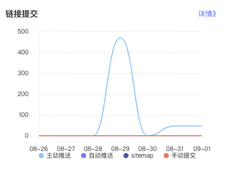

# 序

起因就是最近在做新版博客 [KindemBlog](https://github.com/FlyAndNotDown/KindemBlog) 的 SEO 优化，工作之后也没时间耐心地做引流了，看能不能想想其他方法稍微拯救下博客惨淡的 PV。

印象中百度的自动推送 URL 功能在今年还是去年的时候翻新了一次，翻新后的 API 不再是 GET 请求，而是 POST，再加上辣鸡百度新 API 的 Host 给的协议是 HTTP，这么一来使用 HTTPS 协议的站点就直接暴毙，没法再通过前端来发送 Ajax 请求来推送了，这对静态博客用户（比如我）可是毁灭性打击。

一番思考后，我想到了 GitHub Actions，没错，就没有 Actions 搞不定的事情。整个方案的思路是先写一个 JavaScript 脚本来完成博客仓库下所有博客的扫描，扫描完成后把所有 URL 通过 POST 请求上报到百度的服务器去，然后再用 GitHub Actions 每日定时执行脚本即可。

# 扫描与推送脚本

其实用 Python 写也可以，但一想到这又是一个展现我非凡的 JavaScript 技术的时候，就有点小激动，果断在博客根目录下：

```shell
npm init
```

之后先把依赖安装一哈：

```shell
npm install axios
```

然后编写脚本，放在 /scripts/baidu-auto-commit.js：

```javascript
const Axios = require('axios');
const FileSystem = require('fs');

const config = {
    postDir: 'content/post',
    basePostUrl: 'https://www.kindem.xyz/post',
    targetHost: 'http://data.zz.baidu.com/urls?site=https://www.kindem.xyz&token=lDsJO81mKXxekZI6',
    fixedUrls: [
        'https://www.kindem.xyz'
    ]
};

function collectUrls() {
    const posts = FileSystem.readdirSync(config.postDir);
    return posts.map(post => `${config.basePostUrl}/${post}`).concat(config.fixedUrls);
}

function concatUrls(urls) {
    let result = '';
    urls.forEach(url => { result += `${url}\n`; });
    return result;
}

async function commitData(data) {
    try {
        const result = await Axios({
            url: config.targetHost,
            method: 'post',
            headers: {
              'Content-Type': 'plain/text'
            },
            method: 'post',
            data: data
        });
        const ret = result.data;
        console.log('commit success');
        console.log(`- success: ${ret.success}`);
        console.log(`- remain: ${ret.remain}`);
    } catch(e) {
        console.log('failed to commit');
    }
}

(async function() {
    const urls = collectUrls();
    const data = concatUrls(urls);
    await commitData(data);
})();
```

很简单，就是先扫描目录下的所有文章，然后 mapped 成目标 URL，最后通过 Axios POST 到百度的服务器即可。`token` 字段来自于百度站长平台，其实这里可以稍微增加点安全性，把 `token` 通过命令行传递，然后再透过 GitHub 仓库的环境变量传进来，但我实在是懒，再说也没有人会无聊到连这都要攻击一把吧，我小破站也没啥好攻的，如果后面实在出问题了，再考虑改吧，现阶段能用就行。

# GitHub Actions

脚本链接在 [KindemBlog/workflows/baidu-urls-auto-commit.yml](https://github.com/FlyAndNotDown/KindemBlog/blob/master/.github/workflows/baidu-urls-auto-commit.yml)，也可以直接看下面的代码：

```yml
name: Baidu Urls Auto Commit

on:
  workflow_dispatch:
  schedule:
    - cron: '0 2 * * *'

jobs:
  build:
    runs-on: ubuntu-latest

    steps:
    - name: Checkout Repo
      uses: actions/checkout@v2
    
    - name: Setup Node.js
      uses: actions/setup-node@v2
      with:
        cache: 'npm'
    
    - name: Install NPM dependencies
      run: npm install
    
    - name: Auto Commit Urls To Baidu Spider Server
      run: node scripts/baidu-auto-commit.js
```

很简单的 Actions，北京时间（+8 时区）上午 10 点自动执行，当然也可以手动 dispatch，Actions 触发后会自动安装 Node.js，然后安装依赖，最后执行上面写的脚本，这样整个流程就 OK 啦~

# 效果



很明显可以看见，自从加上了这段脚本，妈妈再也不用担心百度不知道我刷新博客啦~
