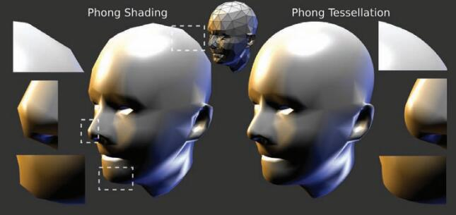
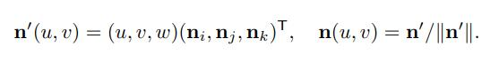
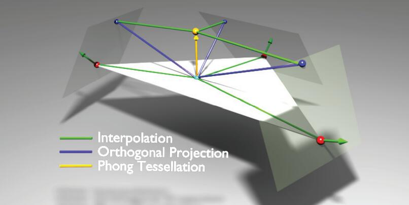
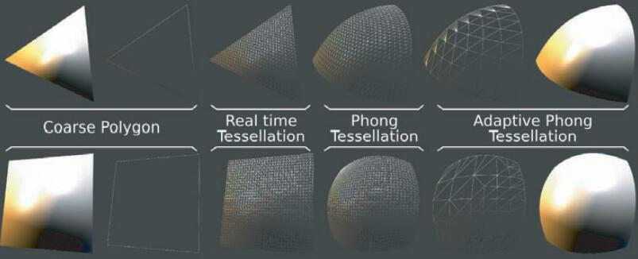

> 原文请参考 GPU Pro 1, Engel W . Chapter 1. As Simple as Possible Tessellation for Interactive Applications. 2010.

# 笔记

文章提出了一种新的曲面细分方法，可以在运行时增加新的顶点，提高几何细节，被称为 Phong Tessellation，下面是普通渲染与曲面细分的对比图：

在介绍 Phong Tessellation 之前，先介绍了一波前人的工作，首先是 Linear Tessellation：

其中 Pi, Pj, Pk 为三角面片的三个顶点 Position，u, v, w 是一个可调整的权重值，满足 u + v + w = 1，P(u, v) 是生成的新的顶点的 Position，Linear Tessellation 可以在三角面片上生成一个新的顶点。但是在面片上生成新的顶点实际上并没啥用 ....

接着是按照类似的思路提出的 Phong Normal Tessellation，它的思路为新顶点产生插值的 Normal，从 Normal 的角度来丰富细节，公式和上面的类似，只是最后还要做一次 Normalize：

作者按照他们的思路，提供了一次非三角面片上的曲面细分，也就是开始说的 Phong Tessellation：

其中 alpha 是一个 0~1 之间的权重，通常取 3/4，P(u, v) 是上面 Linear Tessellation 的结果，PI 是 P(u, v) 点在三角面片的三个顶点所决定的平面（Position + Normal 可以决定平面）上的投影。看图更好理解：

作者还给了 Shader：

然后作者又了提一句，说 Phong Normal Tessellation 已经能提供不错的细节提升了，而且相对他们这个算法来说开销更小，不一定所有顶点都需要使用 Phong Tessellation。Phong Tessellation 在轮廓上的表现会比 Phong Normal Tessellation 更好，所以只需要在轮廓上采用 Phong Normal Tessellation 就行了，然后给了一个计算“轮廓度”的计算公式：

其中 c 是相机位置，m 是深度。

最后作者说他们这个算法不止可以用于 Triangle Polygon，还可以给 Quad Polygon 用，效果如下：

# 总结

相对来说比较平平无奇的一个曲面细分算法，实际上原理很简单，可以考虑手动实现一波试试手。
