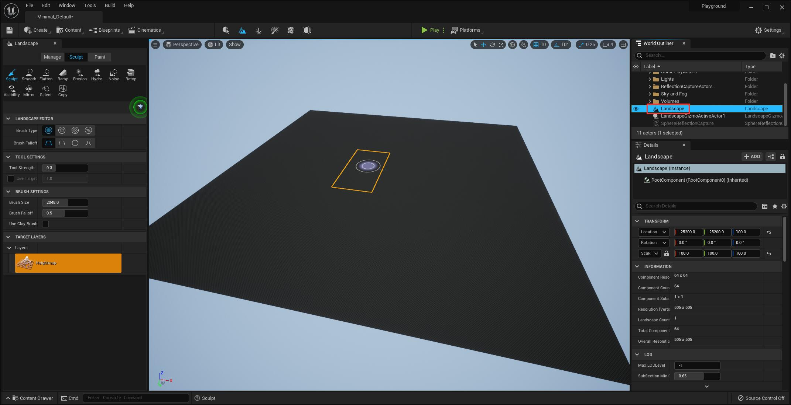
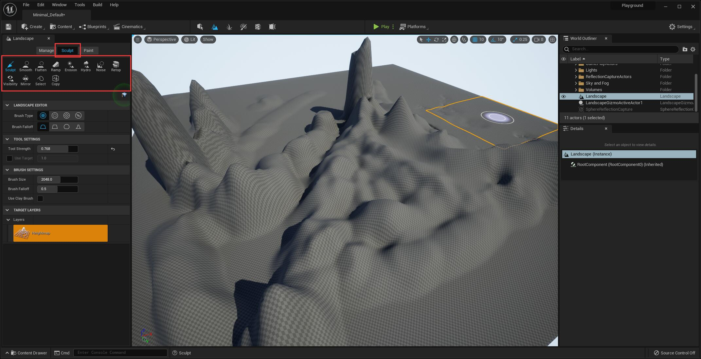
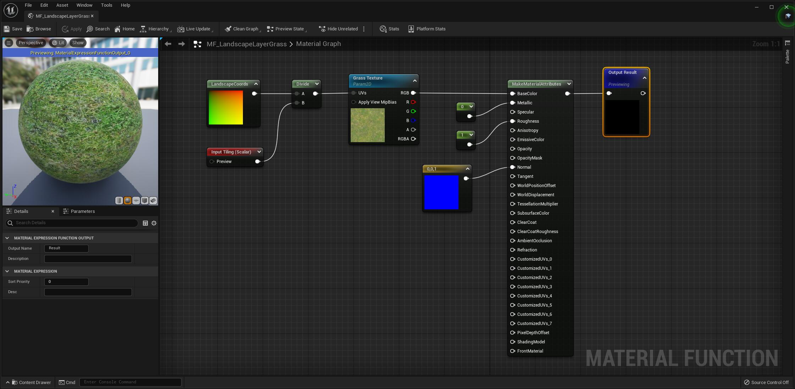
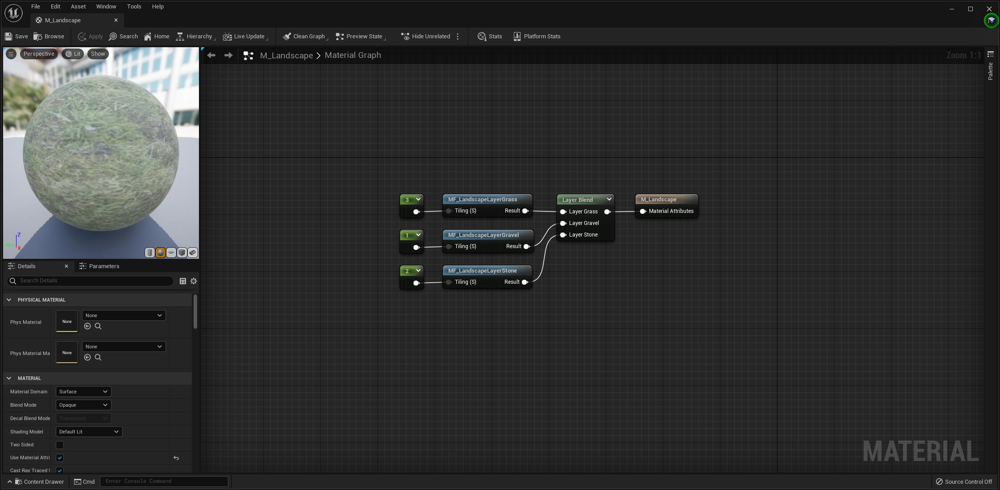
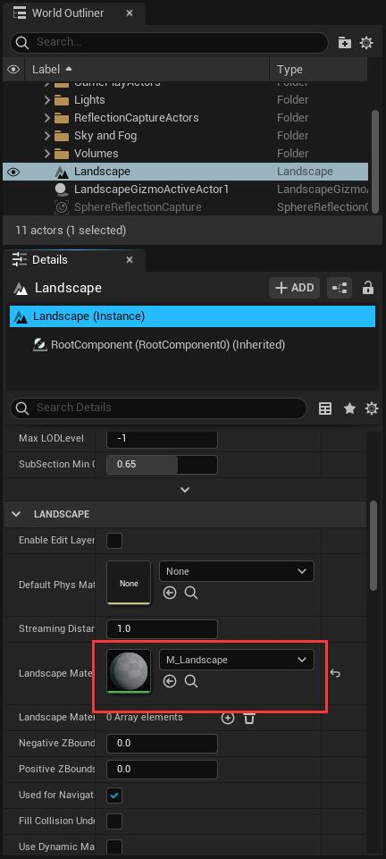
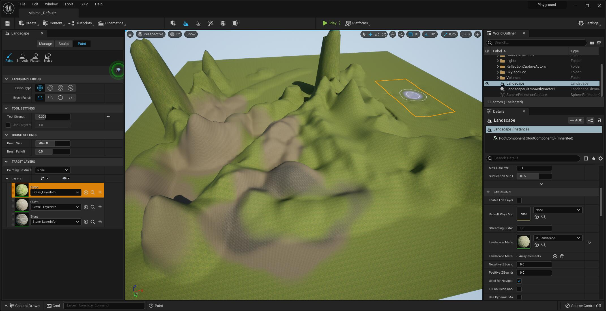
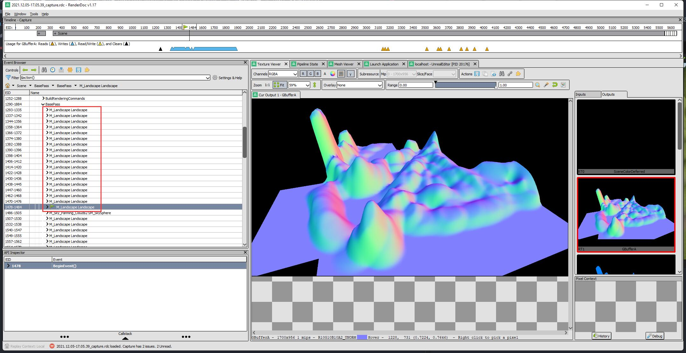
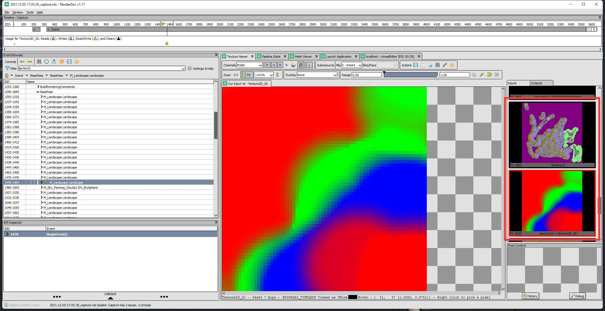

> 使用的版本：UE5 Early Access

# 地形系统介绍

UE 可以直接在编辑器中创建并编辑地形，编辑地形的模式有两种：Sculpt 和 Paint。

* Sculpt 的作用是对地形进行造型和雕刻，Sculpt 对地形产生的修改最终会体现在 Heightmap 即高度图中，UE 会在运行时对这张图进行采样，从而产生地形 Mesh，很经典的做法。
* Paint 则可以让开发者对地表进行绘制，开发者可以创建多个 Landscape Layer，每一个 Layer 可以使用不同的纹理，比如雪地、草地、土壤等，在 Paint 模式下，用户可以选择不同的 Layer 对地形进行绘制，绘制完成后，会根据 Layer 的数量生成对应的 Weightmap 即权重图，其中保存了每一个 Layer 的权重，由于 Weightmap 有 RGBA 四个通道，一张 Weightmap 至多能保存四个 Layer，每四个 Layer 会额外生成一张 Weightmap，Layer 数量越多，显存消耗越大。在运行时，UE 会对当前地块的 Weightmap 和 Layer 纹理进行采样，并进行混合，最终形成地表。

在创建地形的时候，有 Section 的概念，Section 可以认为是一块地形，每一个地形 Component 可以选择保存 1x1 或者 2x2 块 Section，创建地形的时候，需要输入 Section 的大小和 Component 的数量，来决定最终地形的大小。

要在 UE 中创建地形，需要先切换到 Landscape Editing Mode：

在 Manage 面板，我们可以输入参数创建新的地形：

完成创建后，会生成一个 Landscape 的 Actor：

之后切换到 Sculpt 模式即可进行雕刻，有很多工具可供选择，我这里随便整了个地形：

下一步就是刷地表，在刷地表之前，我们先要为每一层 Layer 创建一个 MaterialFunction，每个 MaterialFunction 使用 Landscape TexCoord 采样自己需要的纹理，然后输出一个 MaterialAttribute，我这里为了简单起见，直接用 LandscapeCoords 采 BaseColor 然后返回，Normal 给 (0, 0, 1)，实际上做的时候材质是会很复杂的（要注意不光 BaseColor 会做混合，而是所有的 MaterialAttribute 都会做混合）：

做完了草，再做几层其他的，也是类似的：

接下来我们需要创建地形的材质，并在其中使用 LandscapeLayerBlend 节点对多层地表进行混合：

注意材质选项中勾选 Use Material Attributes 来直接输出 Material Attributes，然后 MF_ 开头的三个就是我们之前创建的三个 Layer，在 Landscape Layer Blend 节点中填写 LayerName 并把对应的 Layer 连上来即可。

接下来选中 Landscape Actor，将其材质设置成我们刚刚创建的这个材质：

这时候你可以注意到，左边的 Paint 面板已经自动识别到了我们刚刚创建的几个 Layer：

我们需要为每一层 Layer 创建一个 LayerInfo Object，后面 UE 将使用这个信息来创建 Weightmap，点击右边的 + 号，然后选择 Weight-Blended Layer 即可：

这时候你会发现地形从黑色变成了第一层 Layer，这是因为当识别到有 LayerInfo Object 时，如果各层权重之和不为 1，UE 会默认使用第一层 Layer 来填满剩余的权重。

最后选中不同的 Layer 即可直接在地形上绘制地表，我这随便画了点：

地形的基本功能就是这样了，原谅我的美术水平实在太糟糕 .....

# RenderDoc 分析

先抓一帧：

可以看见最终是一个 Component 一个 DrawCall，一次只画一块，接下来可以看看 Heightmap 和 Weightmap：

Landscape 的 DrawCall 中可以清楚地看见 Heightmap 和 Weightmap，上面那张就是 Heightmap，整个地形一张，而下面的 Weightmap 则是按 Section 来的，每个 Section 一张。
