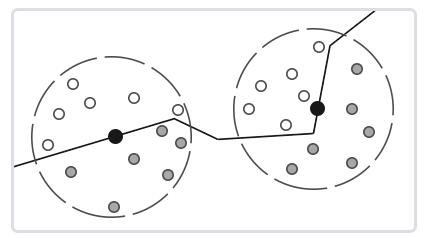
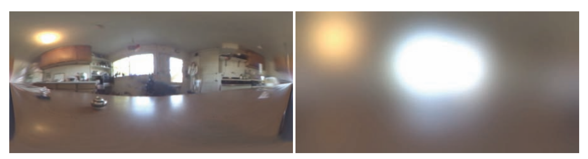
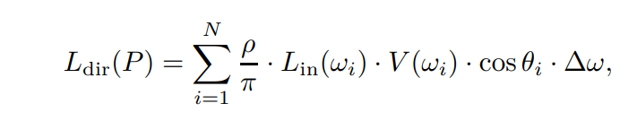
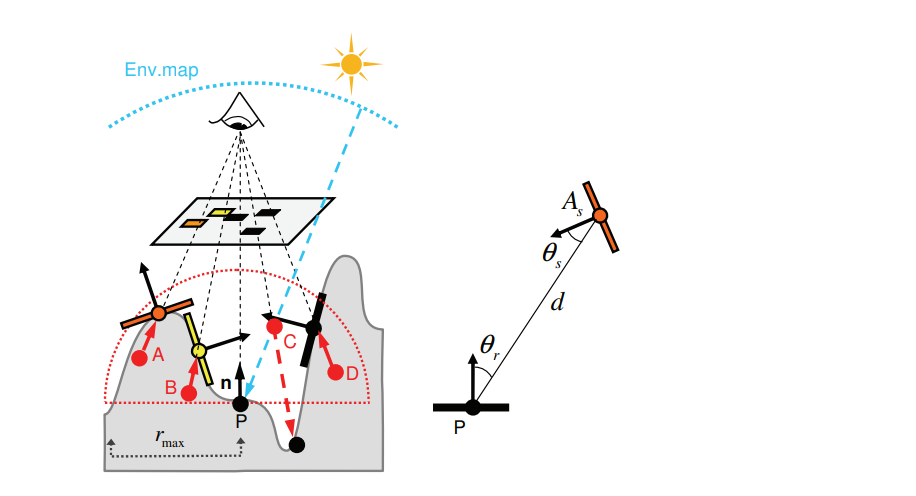
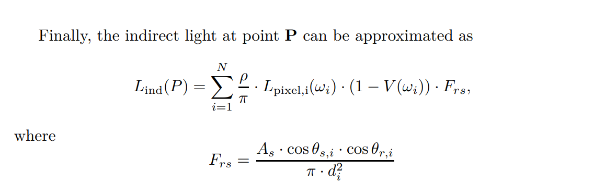

SSDO 全称 Screen Space Directional Occlusion，可以看做一种实时 GI 算法，是 SSAO 的升级版。

Ambient Occlusion (AO) 即环境光遮蔽是一种常见的提升表面细节的技术，基本思路是在 Mesh 表面预计算周围的遮挡信息，然后在计算光照的时候把遮蔽因子作为系数叠加到环境光上。遮蔽因子计算也比较简单，就是在表面上的一个半球区域内发射一系列射线，然后同级被遮挡的光线的数量即可。应用 AO 后，可以明显看到，表面的拐角处会变得更黑，从而体现出更真实的效果。

AO 的计算比较耗，通常会为 Mesh 离线计算 AO 纹理，然后在运行时采样直接使用，下面这三张图分别是直接光照、AO 纹理、应用 AO 后的光照：

因为 AO 纹理是预计算的，所以对于动态场景就没办法了。于是 SSAO (Screen Space Ambient Occlusion) 应运而生，在屏幕空间进行计算，在开销可以接受的情况下支持动态场景。SSAO 最早是 CryTek 提出的，并运用于自家的引擎 CryEngine 中，最初的 SSAO 算法是直接在屏幕空间表面的一个球形区域内随机进行一系列采样，然后把采样点的深度跟表面的深度相对比，如果在表面之下，则该采样对最终的遮蔽因子产生贡献。下面是盗的 LearnOpenGL 的图：

但是这种算法实际效果不太好，会使得画面有一种灰蒙蒙的感觉：

更好的做法是按照表面的法线取一个半球空间进行采样：

这样效果会更好，但是无论如何，SSAO 有个致命的缺陷，就是它只考虑了遮挡关系，所以只能让拐角处 “更黑”，还是没办法记录光照信息。比如下面这张图，P 点附近有两个颜色不同的光源，按照遮挡关系，P 点应该会被绿光照亮，从而体现出绿色，而不是 SSAO 表现出来的黑色：

SSDO 的提出就是为了解决这个问题，SSDO 在计算遮挡关系的同时还会考虑光照信息，从而让拐角处产生能带颜色的遮蔽效果：

首先来看下 SSDO 怎么捕获直接光信息：

我们在 P 点法线方向的一个半球空间中均匀散布一些采样点，用类似 SSAO 的方法，我们可以得知他们是在表面之上还是之下，如果在之上的话，就按照 P 点与采样点的连线方向采样 IrradianceEnvMap 即可，各个采样点的贡献累加后就是 P 点最终的直接光颜色。

要提一句 EnvMap，EnvMap 原图保存的是 LatLong 格式的 Radiance（左图），对其进行高斯模糊可以得到一个小锥形区域内的 Irradiance（右图），我们在 SSDO 算法中采样的是右边这张图。

上面是 P 点直接光信息的计算公式，没有 Latex 不好打公式解释，需要实现的朋友们自己看下论文原文吧，这里就放一放。

我们可以看到加上了直接光信息后，体现出来的遮蔽效果是带颜色的，效果会比 SSAO 好很多。

SSDO 可不光能搞定直接光信息，还可以从表面附近的其他表面获取反射过来的间接光（反射前是直接光）信息。看图中，对于所有被遮挡的采样点，我们都找到他们在表面上真正对应的点，然后根据表面的法线计算对 P 点贡献的间接光。

公式如上。

可以看到效果又提升了一个档次。

---

总结一波：SSDO 是 SSAO 的后继者，要比 SSAO 效果更好但是更耗。在 SSAO 计算遮挡信息的基础上考虑了光照信息，可以对所有没有被遮挡的采样点计算一次直接光贡献，对所有被遮挡的采样点计算一次间接光贡献，最后得到带颜色的环境光遮蔽效果。
