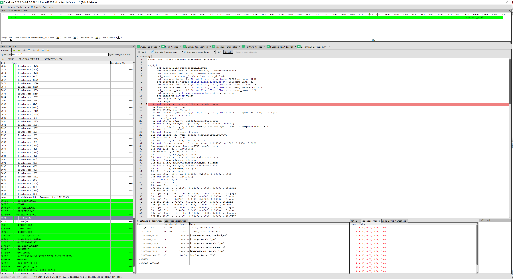
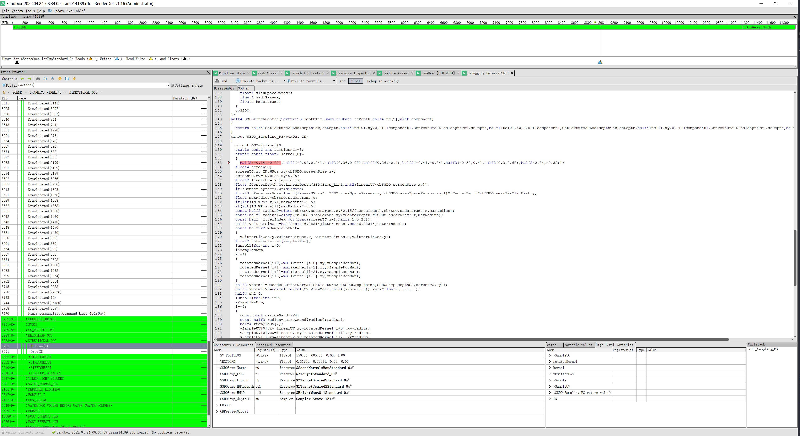

# CryEngine5 Shader 调试

CryEngine5 跟 UE 一样，默认情况下 Shader 的符号表是隐藏了的，用 RenderDoc 抓帧之后是没法直接进行 Shader 调试的：



这时候需要启用 Shader 符号表并重新编译 Shader，首先找到引擎根目录，打开 `system.cfg` 文件，在最后加上下面几行：

```bash
r_ShadersEditing=1
r_ShadersDebug=3
r_ShadersRemoteCompiler=1
r_ShaderCompilerServer=127.0.0.1
r_ShaderCompilerPort=61453
```

然后进入 `Tools/RemoteShaderCompiler` 目录，打开 `config.ini`，确认端口号跟上面的一致。确认无误后打开同目录下的 `CrySCompilerServer.exe`出现下面字样 Shader 编译服务器就成功启动了：

```bash
caching enabled
Ready
```

找到项目目录（有 `.cryproject` 文件的目录），进入 `user/shaders/cache/d3d11` 目录把下面所有文件都删了，清空 Cache 以便 CryEngine 识别并重新编译 Shader。

最后重新进入 Sandbox，随便打开一个 Level，可以看到 Shader 编译器服务器已经开始重新编译所有 Shader 了：

```bash
1094 | 24/04 16:35:30 | Updating: GameSDK/ShaderList_PC.txt
1786 | 24/04 16:40:20 | Compiled [ 1128ms|      22s] (D3D11 vs_5_0) Common_SG_VS
1788 | 24/04 16:40:21 | Compiled [ 1156ms|      24s] (D3D11 vs_5_0) Common_SG_VS
1790 | 24/04 16:40:22 | Compiled [ 1174ms|      25s] (D3D11 vs_5_0) Common_ZPassVS
1792 | 24/04 16:40:24 | Compiled [ 2068ms|      27s] (D3D11 vs_5_0) Common_SG_VS
1794 | 24/04 16:40:27 | Compiled [ 2452ms|      29s] (D3D11 vs_5_0) Common_SG_VS
1796 | 24/04 16:40:29 | Compiled [ 2523ms|      32s] (D3D11 vs_5_0) Common_SG_VS
1798 | 24/04 16:40:32 | Compiled [ 2523ms|      34s] (D3D11 vs_5_0) Common_SG_VS
1800 | 24/04 16:40:34 | Compiled [ 2419ms|      37s] (D3D11 vs_5_0) Common_ZPrePassVS
1804 | 24/04 16:40:34 | Compiled [   51ms|      37s] (D3D11 ps_5_0) Common_CustomRenderPassPS
1806 | 24/04 16:40:35 | Compiled [  152ms|      37s] (D3D11 ps_5_0) IlluminationPS
1808 | 24/04 16:40:36 | Compiled [ 1364ms|      38s] (D3D11 ps_5_0) IlluminationPS
1810 | 24/04 16:40:36 | Compiled [   84ms|      38s] (D3D11 ps_5_0) Common_DebugPassPS
1812 | 24/04 16:40:37 | Compiled [  953ms|      39s] (D3D11 ps_5_0) IlluminationPS
1814 | 24/04 16:40:38 | Compiled [ 1012ms|      40s] (D3D11 ps_5_0) IlluminationPS
1816 | 24/04 16:40:38 | Compiled [  109ms|      40s] (D3D11 ps_5_0) Common_ZPassPS
1818 | 24/04 16:40:39 | Compiled [  555ms|      41s] (D3D11 ps_5_0) Common_CustomRenderPassPS
......
```

完成编译后再使用 RenderDoc 重新抓取，再编辑或调试 Shader 就能看见源码了：



---

我的博客即将同步至腾讯云开发者社区，邀请大家一同入驻：https://cloud.tencent.com/developer/support-plan?invite_code=2lqleka8dkysc
