> 原文链接：[GDC 2022 - FidelityFX Super Resolution 2.0](https://gpuopen.com/gdc-presentations/2022/GDC_FidelityFX_Super_Resolution_2_0.pdf)
> 

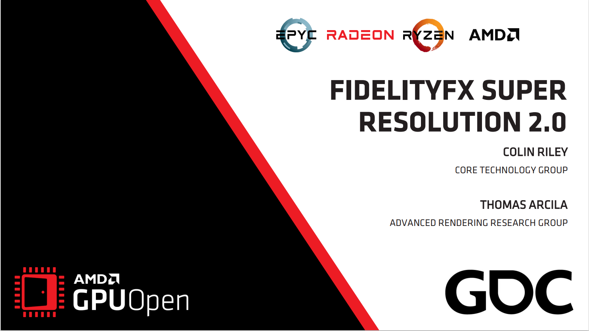

AMD FSR 2.0 版本，相对 FSR 1.0 架构上有较大改动。

先回顾下 FSR 1.0，FSR 1.0 推出于 2021 年七月，是 AMD 推出的空间域超分解决方案，高性能，易集成，比价友好的 MIT License，已经在很多游戏中被集成了。

因为 FSR 1.0 是基于空间域的超分算法，好处就是很容易集成（直接挂在后处理最后就行了），但同时也有一些缺陷：

- FSR 1.0 的输入需要经过高质量的抗锯齿处理，这个问题就算是不考虑超分，也是一个比较头疼的问题，把 FSR 1.0 挂在低质量的 TAA 实现后面就会产生质量很差的输出，这意味着如果游戏没有实现抗锯齿就集成 FSR 1.0，就要花上更多的时间。
- 超分的质量取决于输入图像的分辨率，如果输入图像的分辨率太低，就没有足够的信息来重现细节，太低的分辨率还会导致一些画面的缺陷，比如闪烁、边缘模糊等，这种情况通常在使用 Performance 模式时出现。

FSR 2.0 是下一代超分解决方案，不再基于空间域，而是基于时空域。FSR 2.0 与 FSR 1.0 并不兼容，需要不同的输入，并且直接内置了抗锯齿。质量要比 1.0 更高，提供了不同的 Quality  Mode，同时支持了动态分辨率。跟 FSR 1.0 一样的是开源、跨平台、高度优化，不需要硬件支持的深度学习（内涵 DLSS），以 C++ / HLSL 库的方式提供 API，并且可以随意定制。

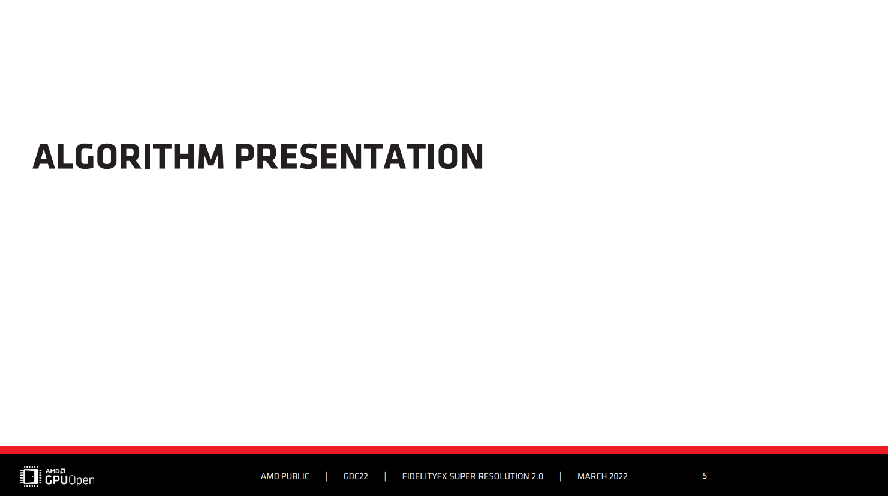

算法介绍。

FSR 2.0 的输入和 1.0 不再一样，输入为渲染尺寸的 Color、Depth、Motion（像素相比前一帧的位移）。与之对比，FSR 1.0 只有 Scene Color。

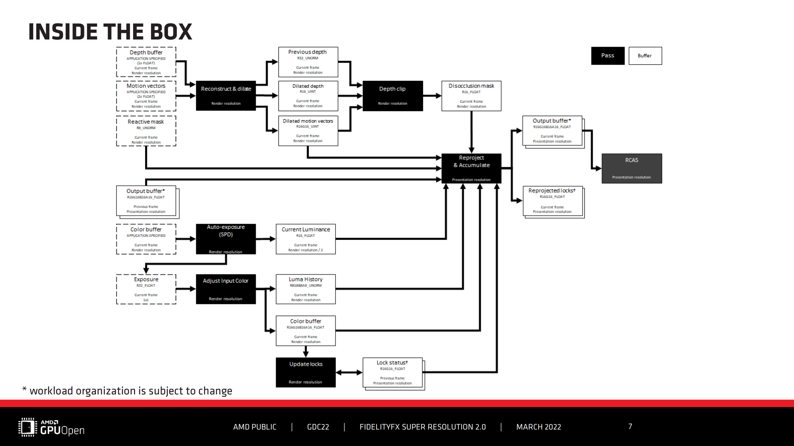

RenderGraph。

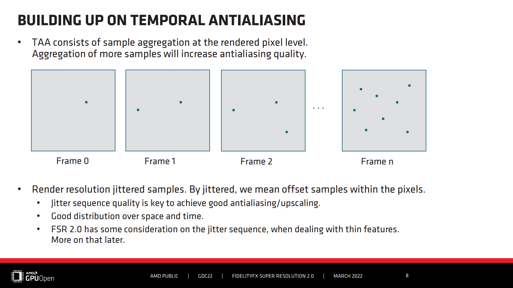

FSR 是基于 TAA 的，TAA 大家都比较熟悉了，对每一帧的像素进行抖动，在多帧间累加不同的采样点，从而达到多采样的效果，采样点越多，最终抗锯齿的效果就会越好。Jitter 序列的质量会直接影响到最终的效果，所以 Jitter 序列需要在时空域上有良好的分布，这样地分辨率的输入图像中的每一个像素都能在 Jitter 之后被采样点均匀覆盖。虽然理论上 Jitter 序列的长度是可以无穷大的，但是为了处理 Thin Features （后面会提到），FSR 2.0 在 Jitter 序列长度的设定上有一些自己的考虑。

每一个历史帧的采样点对新一帧的像素都会产生影响，但是采样点是有自己的权重的，取决于两个要素：

- 采样点与目标像素的空间相关度（也就是距离），距离越近，权重越高。
- 采样点与目标像素的时间相关度（采样点所属历史帧的年龄），年龄越小，权重越高。

如图所示，灰色方块表示一个像素，红点为像素中心，蓝点为采样点，第 N - 1 帧的采样点很靠近像素中心，理所当然要被纳入考虑范围，而第 N 帧的采样点虽然离得比较远，但是因为年龄较小，所以也有一定权重。

- 第一个公式是新采样点与已经计算好的像素颜色混合的公式。S 是新增采样点，H 是已经累加的历史颜色，alpha 是混合的权重。
- 第二个公式是混合权重的计算公式，omega 是新增采样点的空间域权重（距离），tau 是该像素的空间域总权重。要注意的是这个公式中实际上并没有引入任何时间相关的变量，所以历史采样点在时间域上的空间都是一样的，但是因为历史采样点的权重在分母，会被新加入的采样点不断稀释，从而达到强调新加入采样点的目的。

在 FSR 2.0 中，输入图像是低分辨率的，输出图像是高分辨率的，所以中间有上采样的步骤。一个灰色方块还是一个像素，灰色的点代表输出的高分辨率像素的中心，蓝点代表 Jitter 得到的采样点。上采样的过程主要是使用 Lanczos 插值算法。

一维 Lanczos 插值公式中，a 表示核的大小。x 为输入，L(x) 为输入点的权重，二维 Lanczos 公式就是分别在 x,y 方向上做两次。

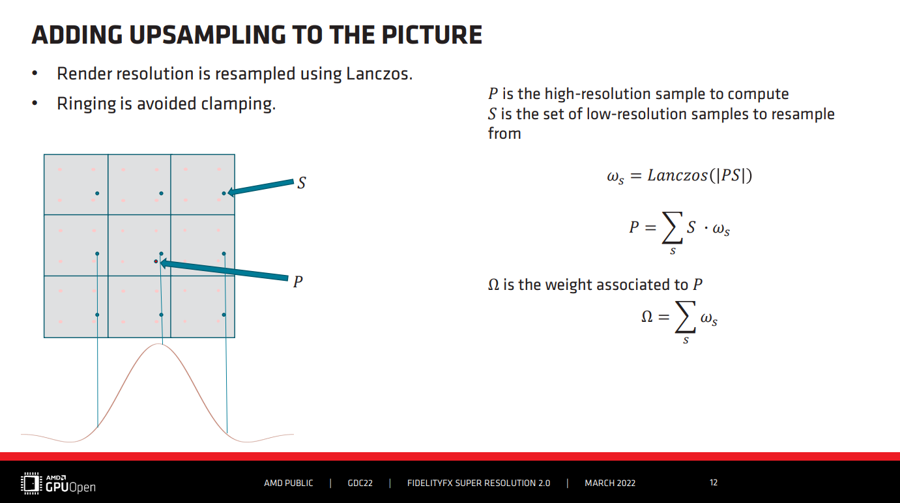

在 FSR 2.0 中，对于每一个目标像素 P，都使用核为 2x2 的二维 Lanczos 公式进行插值，所有参与最终混合的采样点的权重都通过 Lanczos 公式计算。

从低分辨率到高分辨率需要更锐利的采样，在原有公式的基础上添加了一个系数 belta，用于对二维 Lanczos 函数的 xy 轴分别做缩放，belta 根据局部的 Luminance Stability （应该就是边缘度?）计算得到。

- 上面的 Upscaling 流程做了一个基本假设，就是输入图像在时空域上是静态的，所以为了处理动画，需要引入 Motion Vectors。
- Motion Vectors 描述了采样点如何从前一帧移动到当前帧。Motion Vectors 必须取消 Jitter，这样当图像静止的时候，Motion Vectors 也应该为 0。
- 为了正确地跟随边缘，很多基于 TAA 的解决方案都会取 3x3 领域中最近的值，之后会详细说。

如图所示，通过 Frame N - 1 和 Frame N，可以计算出来箭头所示的 Motion Vectors。

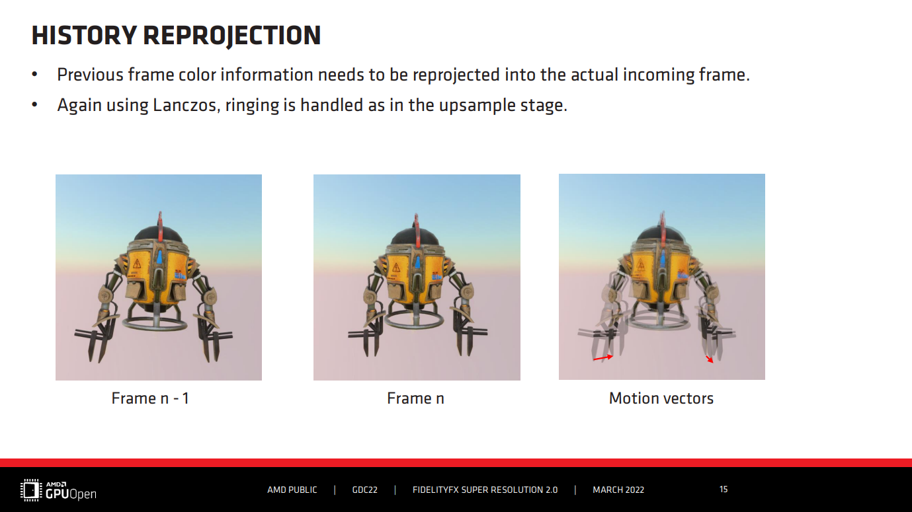

在场景运动时，前一帧的颜色信息需要重投影到当前帧。具体是根据 Motion Vectors 来计算采样点的历史位置，并且将其投影到当前帧，这一步依然使用 Lanczos 算法，在 Upsample Stage 完成。

有些情况下历史帧的数据跟当前帧已经没有任何关系了，这时候将历史帧的信息投影到当前帧就会有鬼影问题（无用的历史颜色信息在当前帧可见）。常见的情况有 Disocclusion、Shading Changes （光照变化、纹理变化）等。如图所示，机器人的爪子部分有鬼影。

针对这些情况需要单独处理，首先是 Disocclusion。通过比较当前帧的深度和重建得到的历史帧深度得到一张 Disocclusion Mask，然后通过 Disocclusion Mask 来检测 Disocclusion。

重建历史帧深度的流程：

- 将当前帧深度的采样点重投影到历史帧
- Gather 周边的四个点，将他们都设置为当前帧的深度
- 重复上述过程，每个像素如果同时受多个当前帧像素的影响，取最近的深度作为最后的结果

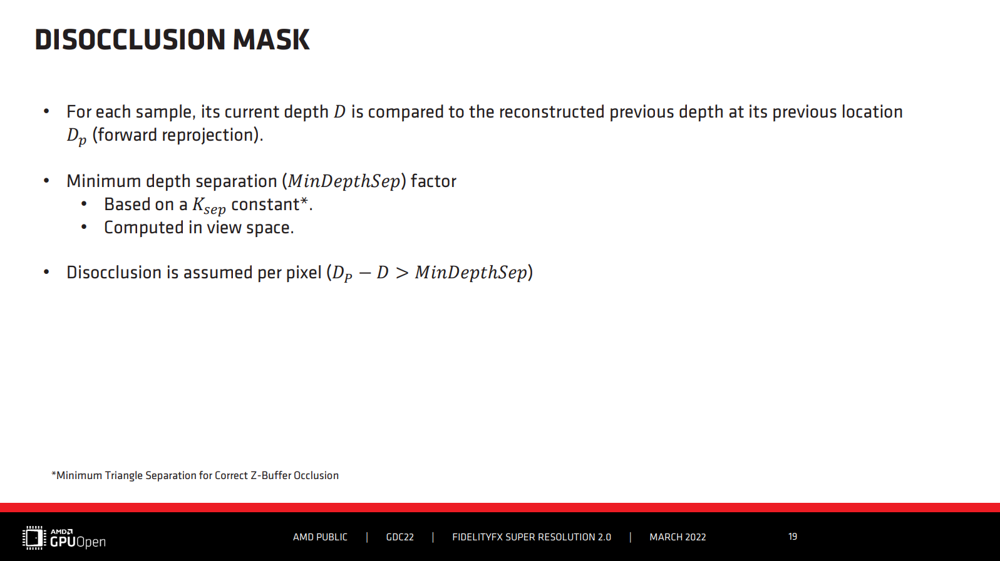

Disocclusion Mask 使用的具体方法：

- 对于每一个采样点，我们可以得到当前帧的深度 D 和前一帧的深度 Dp
- 设置一个容忍度 MinDepthSep
- 如果 Dp - D > MinDepthSep 我们就认为产生了 Disocclusion

有了 Disocclusion Mask 就可以做历史颜色矫正了，需要先声明的一点是所有的矫正都只使用当前帧的信息，因为历史帧的信息可能会导致鬼影，违背了矫正的目的。

如果检测到了某个采样点产生了 Disocclusion：

- 首先需要丢弃绝大部分历史累积的颜色。全部丢弃会让画面看起来不那么平滑，所以还需要保留一小部分历史颜色，这会产生微小的鬼影，不过一般不是这么容易被注意到。
- 对于新加入的采样点，需要对其做 Blurred，这是前面 Upscaling Stage 就完成的，就是在计算权重的时候稍微减小 belta 的值。

前面说到除了 Disocclusion，Shading Changes 同样也会导致鬼影。就算是错误的，历史帧的信息依然有一定价值，所以我们不能简单地将其丢弃，而是在当前帧 3x3 的邻域中将所有颜色映射到 Lunminance/Chrominance 空间，然后计算一个 Clamping Box，再将错误的历史帧颜色 Clamp 到范围内，接着使用。

另外一点需要注意的是细微特征的处理。这种细微的特种在 Jitter 序列中获得的采样点信息并不足够，所以前面提到的颜色矫正会把他们当成 Shading Changes 干掉，比较常见的常见是 Specular 高光。这个问题就会导致输出图像不稳定，部分位置比较模糊，如图所示，右图的扶手部分放大了看就出现了着色不足的现象。

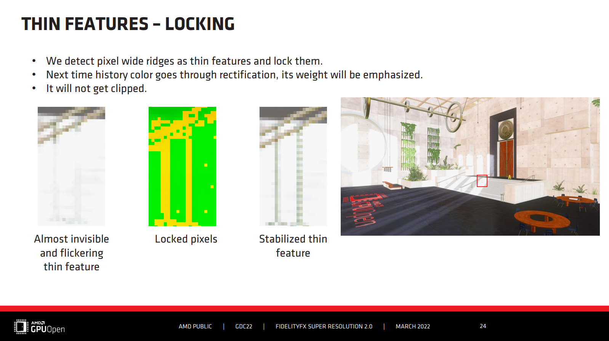

对于细微特征需要单独处理一下：

- 检测像素的起伏并且锁定突兀的像素
- 被锁定的项目在颜色矫正阶段会获得更高的权重，以免被干掉

一旦某个像素被锁定，在整个 Jitter 序列中，锁都会持续生效，可以通过老化机制隐式地移除超出生命周期的锁。Jitter 序列要在保证效果的同时足够短，以便锁可以尽快释放。

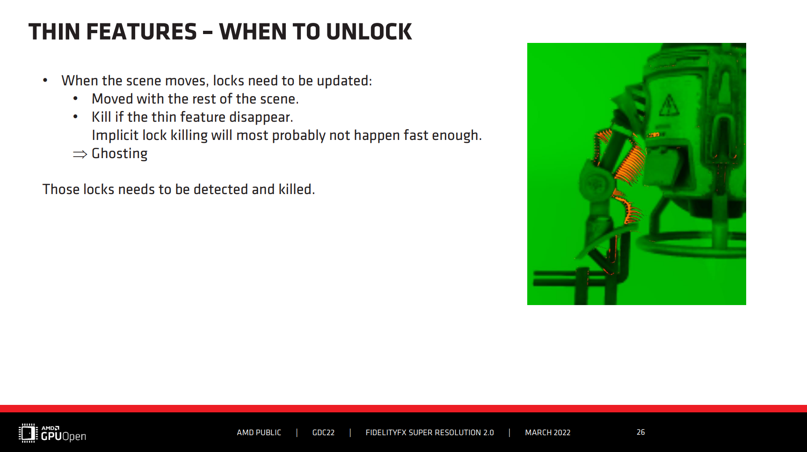

在产生 Disocclusion 或者 Shading Changes 后，锁就不再有效了。像前面说的一样通过老化机制来移除锁肯定是不够快的，此时就会产生鬼影。如图所示，黄色的拖影就是未能及时释放的锁。我们需要显式地检测这些锁并及时释放他们。

- 对于 Disocclusion，同样可以使用前面提到的 Disocclusion Mask 来处理
- 对于 Shading Changes，在局部、低频空间对锁定颜色和新颜色进行亮度比较，如果差值大于一个规定的阈值，就把锁干掉

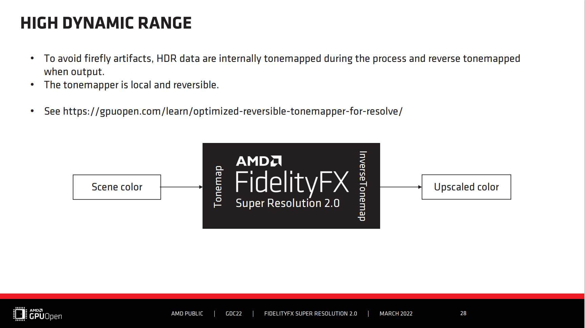

因为通常 FSR 2.0 是在 ToneMapping 前，会遇到另一个 TAA 解决方案中常见的问题，Firefly Artifacts，产生的原因是拥有较大 HDR 颜色值的采样点参与多采样时，其对最终效果的影响会远远大于其他采样点，从观感上来看表现为边缘的走样。FSR 2.0 用了跟其他 TAA 解决方案类似的处理方法，即 Local Reversible ToneMapping。

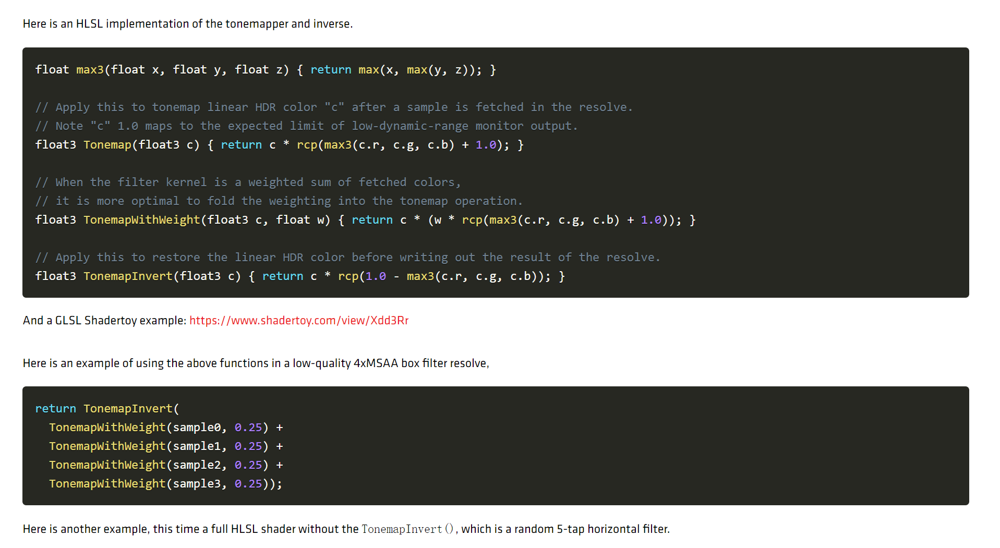

一个示例 Shader，简单来说就是在多采样输入时先进行一次带权重的 ToneMapping，降低高强度 HDR 值在结果中的占比，计算完再对输出进行一次 ToneMappingInvert 还原回去。因为计算完还会还原，所以 FSR 2.0 在内部做的 ToneMapping 对用户是无感的，整个输入输出都还是 HDR。这个功能在 FSR 2.0 Pipeline 中是可选的，需要手动配置开启。

另外一个 HDR 相关的话题是两个会影响到 FSR 2.0 输出质量的参数，一个是很多引擎会使用的预曝光，通常预曝光会持续到 ToneMapping Stage 被 Cancel 掉，这意味着它会影响到 FSR 2.0 的输入，因为 FSR 2.0 会使用到历史帧的数据，而预曝光参数有可能在帧间变化，所以需要把这个参数传递给 FSR 2.0 使其能够做出一些调整。另外一个参数是曝光度本身，也是类似的原理，如果引擎没有曝光度，FSR 2.0 也可以添加一个自动曝光 Pass 来做相关的处理。

DRS，动态分辨率缩放，可以让游戏引擎根据当前负载动态调整渲染分辨率，使其即便在负载比较高的情况下也能输出一个效果较好的渲染结果。FSR 2.0 天生就支持 DRS，因为 FSR 2.0 内部的绝大部分工作都只依赖渲染分辨率的输入，而所有需要持久化保存的数据（如 Pixel Locks）都按照显示分辨率保存，所以无论输入分辨率怎么变化其实 FSR 2.0 都能处理。如图所示，连续几帧画面的分辨率各不相同，最终的输出分辨率都是一致的。

FSR 2.0 跟 FSR 1.0 一样在 Upscaling 之后会提高一个 Sharpening Stage 来做锐化提高画面细节，依赖的是 AMD 的另外一个技术 RCAS。

讲完了算法，接着讲一下优化部分。

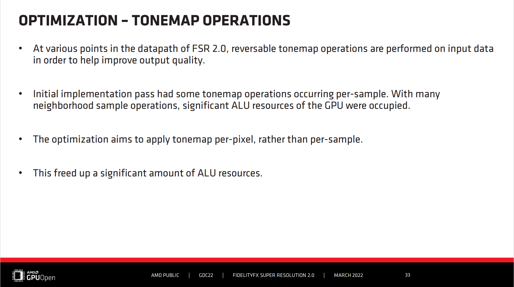

首先是前面提到的 Local Reversible ToneMapping，在 FSR 2.0 Pipeline 中的很多地方都使用了 Local Reversible ToneMapping，用于处理输出数据提高输出质量。早期的实现版本中一些 ToneMapping 操作是 Per-Sample 的，而且有很多采样相邻像素的操作，占用了大量的 ALU 资源。优化的目标是接近 Per-Pixel，释放 ALU 资源给其他的计算。

FSR 2.0 算法非常依赖显存带宽，所以提升 GPU Cache 命中率很重要。对于 4k 场景来说，数据量远远超过了 GPU 的可用 Cache，就算是拥有 Infinity Cache 技术的最新架构 RDNA2 都没法 Cover。为了解决这个问题，FSR 2.0 会把单个大的 Compute Shader Dispatch 指令拆分成多个小的 Dispatch 指令，来提高 Cache 命中率。

在 AMD Radeon RX 6800XT 上 L0 Cache 命中率有 37% 的提升。

按照之前说的，FSR 2.0 提供了自动曝光选项，以便在引擎不提供曝光度输入时自动计算输入图像的曝光度，这部分计算有一定开销。最开始这部分计算效率是比较低的，使用了单线程 Dispatch 或者 1x1 RenderTarget 的 PixelShader，GPU 利用率很低。优化的方法是使用 AMD 的另外一个技术，Single Pass Downsampler，SPD，SPD 通常用于高效地对图像进行连续降采样，比如 Mipmaps 的生成就可以使用。SPD 具有可配置的 Kernal，可以将 SPD 配置成降采样到单个像素来计算曝光度，从而提高性能。1080p， 6800XT 仅需要 17us 来计算曝光度。

之前说了上采样的时候会使用 Lanczos 插值来计算采样点对最终像素的贡献权重，Lanczos 公式还是比较费的，尤其是在老的硬件上。优化方法是在保证质量的基础上沿袭 FSR 1.0 的做法，对 Lanczos 公式做一个近似，这样可以减少 ALU 压力，另外就是把 Lanczos Look Up Table 做成一张 LUT Texture 来加速 Lookup，这两个优化在自家硬件上都还有额外的效果。

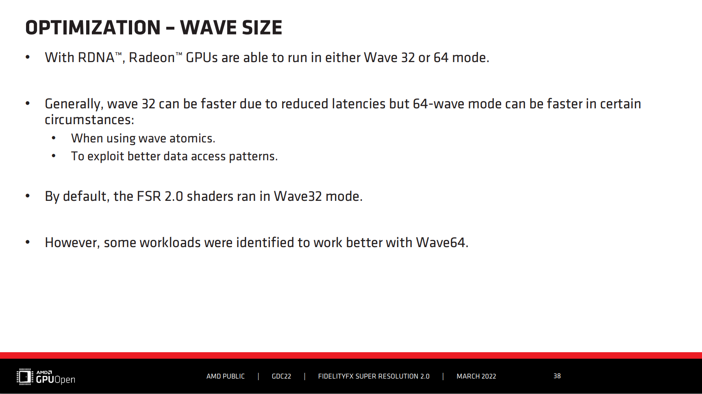

在 RNDA 架构中，GPU 可以在 Wave32 和 Wave64 两种模式下运作（GCN 架构只有 Wave64）。通常情况下 Wave32 模式要比 Wave64 模式更快，因为延迟更小。但是在一些特殊场景下 Wave64 模式会更快。默认情况下 FSR 2.0 的 Shader 在 Wave32 模式下工作，但是 FSR 2.0 的一些运算在 Wave64 模式下会工作地更快。

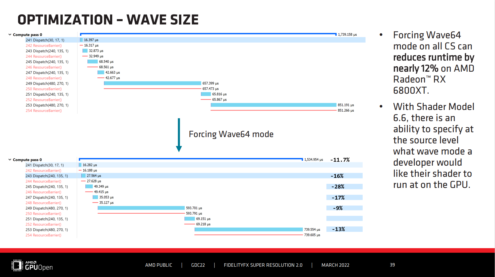

实测下来强制 Wave64 模式 FSR 2.0 的不少 Stage 都有更高的收益。在 Shader Model 6.6 下，可以在 Shader 源码中指定使用哪种模式，在 FSR 2.0 正式开源后，开发者可以根据自己的需要选择哪种模式运行。

因为 FSR 2.0 是跨平台的，需要支持各种各样的 GPU，这样自己 RDNA2 架构上的优化在别的 GPU 上有可能是负优化。所以在别的 GPU 上运行时，会做一些 Fallback，有一些优化不会开启，比如 Wave64 模式就只在 AMD GPU 上默认打开。集成 FSR 2.0 的时候可以直接使用 AMD 的推荐配置，可以帮助根据硬件自动选择最佳参数，FSR 2.0 在性能上肯定是很能打的。

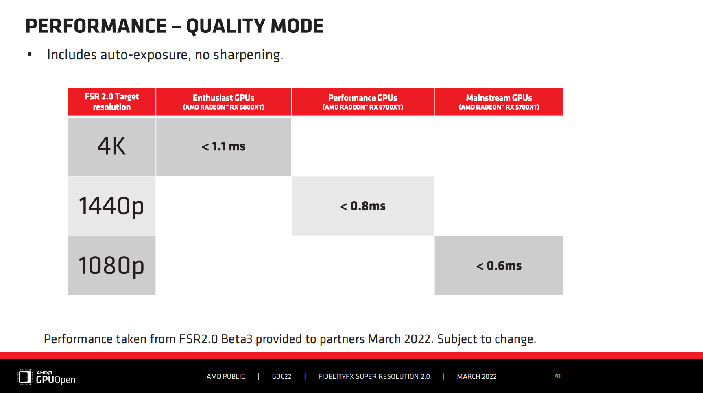

2022 年 3 月 FSR 2.0 Beta3 版本几种模式下的性能数据，4k Quality Mode 只需要 1.1ms，还是很可观的，类似的超分算法 DLSS 就要差很多，而且这个时间还是可以 Cover TAA 的开销，还是很可观的。

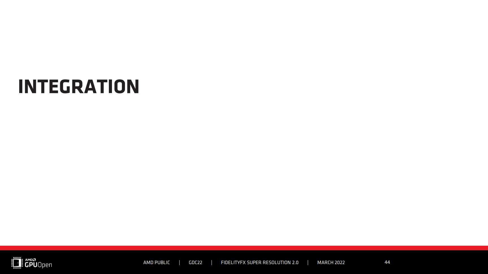

FSR 2.0 的集成。

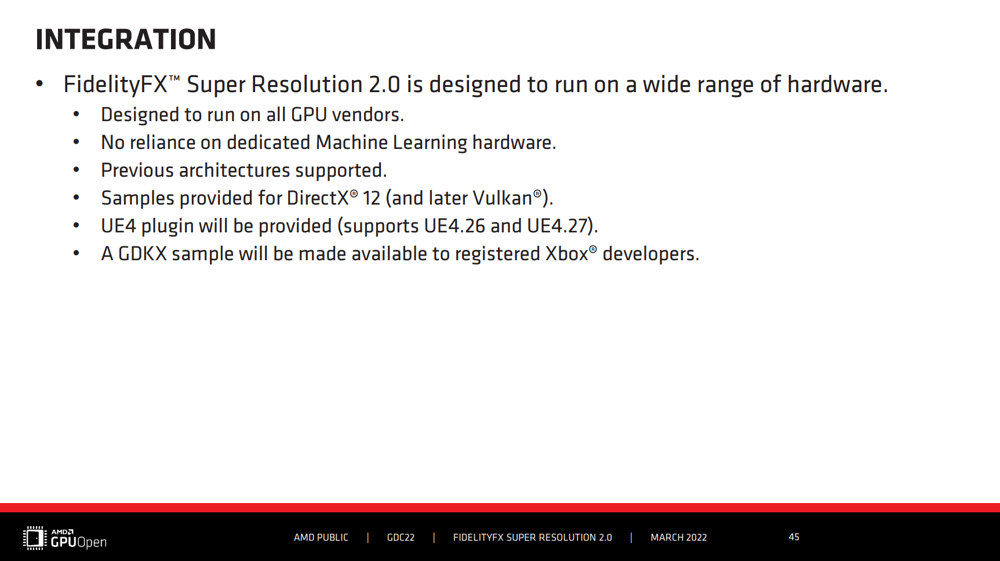

FSR 2.0 设计的一大目标就是良好地兼容性：

- 支持所有 GPU
- 不依赖 ML 硬件
- 支持老的 GPU 架构

另外还会提供 DX12、Vulkan 的 Samples，提供 UE4.26 和 UE4.27 的插件，提供 Xbox GDKX 的 Samples，无论是什么平台，FSR 2.0 都能完美集成。

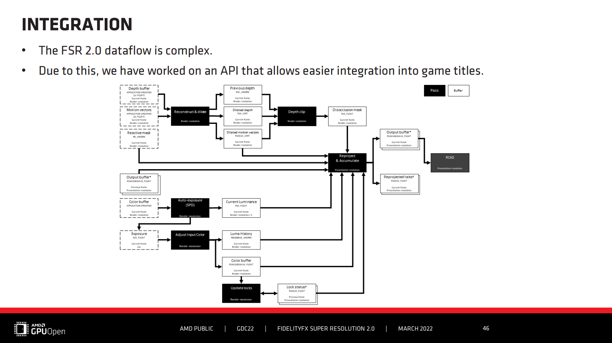

因为 FSR 2.0 的工作流很复杂，所以专门设计了一套 API 来便于开发者方便地集成。

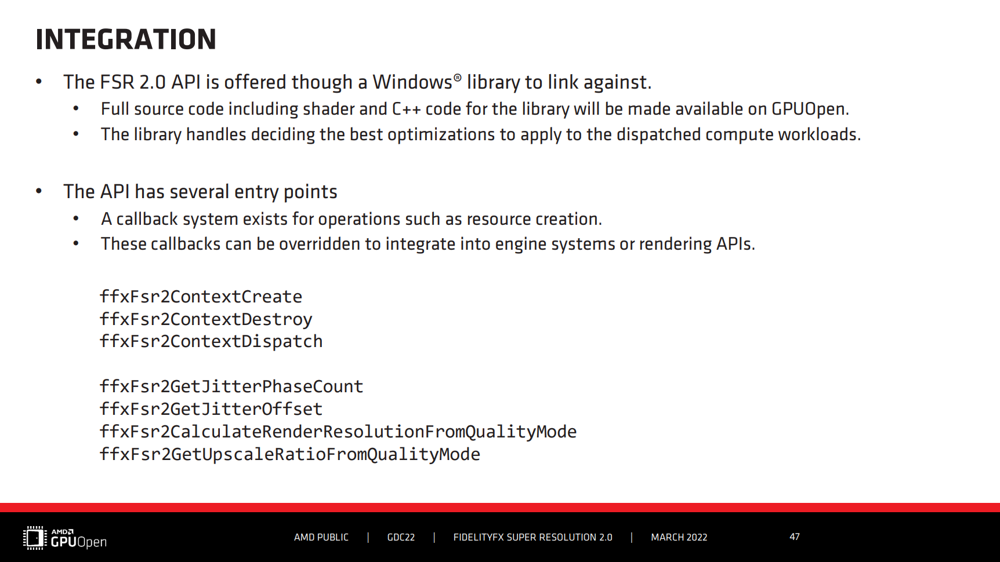

- FSR 2.0 提供了可以直接链接的 Windows 库，当然同时也会在 GPU Open 开源所有的 C++ 代码，也可以在其他平台上手动编译集成。跟 FSR 1.0、NIS 比较类似，使用 SDK 可以直接获取最佳参数，然后直接传入 Shader 就可以了。
- SDK 的 API 有三个主要接口，ContextCreate、ContextDestroy、ContextDispatch，然后还提供了一些接口用于获取 JitterPhaseCount、JitterOffset、RenderResolution、UpscaleRatio 等。

给了一些集成的参考时间，像已经集成了 DLSS 2.0 的游戏最快只要三天就能搞定，其他集成的工作量视情况而定，最慢也只需要约 4 周左右。

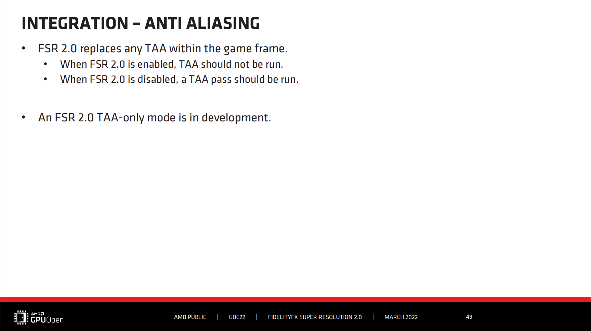

按照之间说的，FSR 2.0 在集成时是直接替换 TAA Stage 的，关闭 FSR 2.0 时需要打开 TAA，打开 TAA 就需要关闭 FSR 2.0。另外 FSR 2.0 还提供了一个 TAA-Only 模式，只开启 TAA 不做 Upscaling，方便直接切换。

FSR 1.0 在一帧中的位置是后处理的最后阶段，而 FSR 2.0 不一样，它处于整个 Pipeline 比较早期的阶段。因为是替换 TAA，所以所有需要抗锯齿输入的后处理都应该放到 FSAR 2.0 后面，所有需要 Depth Buffer 的后处理都要放到 FSR 2.0 的前面。

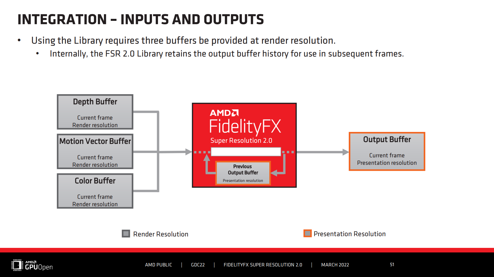

FSR 2.0 的 Buffer 输入只有当前帧的 Depth、Motion Vector、Color，不需要开发者传入任何历史帧的信息，FSR 会在内部存储上一帧的 Output Buffer。

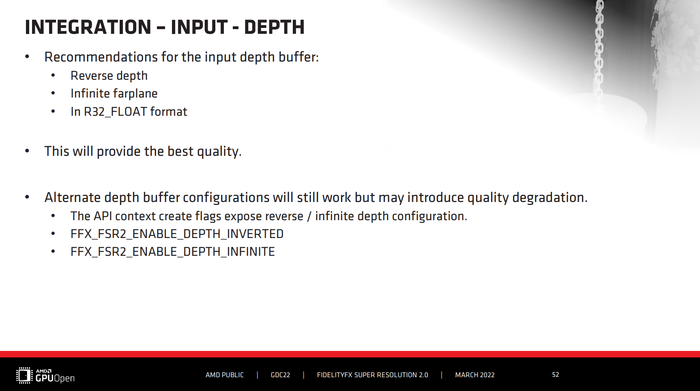

FSR 2.0 对 Depth Buffer 是有一定要求的，Reversed、Infinite Farplane、R32_FLOAT 精度，这样的话可以达到最佳效果，如果集成时 Depth 不能满足条件的话，也可以在创建 Context 的时候通过修改 FLags 来进行调整。

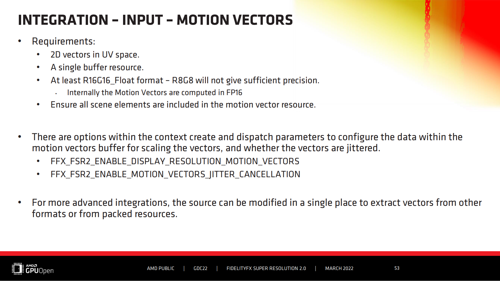

类似的，对 Motion Vector Buffer 也有要求，需要 UV Space 的 2D Vector，是一张单独的 Buffer Resource、至少需要 R16G16 精度（R8G8 不能满足精度需求），还要就是需要保证所有的场景元素都要在 Motion Vector Resource 中。类似的 Motion Vector 也有控制的 Flags，可以根据需要调整。如果需要进行一些其他的定制（比如做一些定制化的 RT 合并）可以自行修改源码。

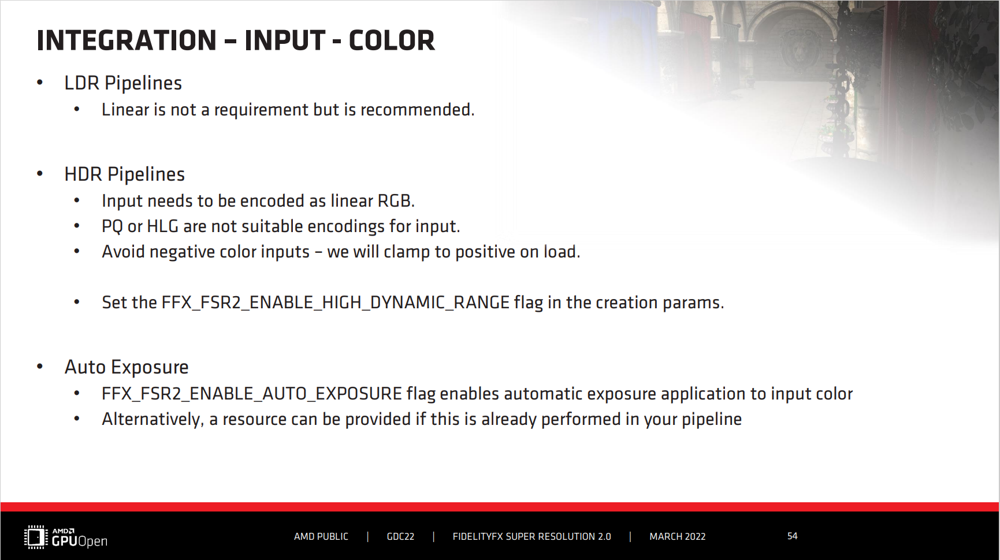

最后是 Color Buffer，对于 LDR Pipelines，推荐使用 Linear Format 但不是必须的。对于 HDR Pipelines，输入必须是 Linear RGB，PQ / HLG 不太适合作为输入格式，另外输入颜色值不能为负数，需要 Clamp 到 0 以上。使用 HDR Pipelines 需要在创建 Context 指定对应的 Flags。另外就是自动曝光，如果需要启用自动曝光的话传入对应的 Flags 就行了，如果引擎本身就做了自动曝光的话，把对应的 Shader Resource 传入即可。

另外一项配置是 Jitter Patterns，推荐的 Jitter Patterns 是 Halton(2,3)，在 FSR 2.0 SDK 中提供了相关的接口用于获取 Jitter Offset。要注意的是 Halton 序列长度随着会 Scaling Ratio 不同而产生变化，下面是一个对照表，序列长度可以通过 ffxFsr2GetJitterPhaseCount 获取。

DRS 可以使用 Flags 开启，上面一页我们知道 Jitter Sequence Length 会随着 Scaling Ratio 变化而变化，ffxFsr2GetJitterPhaseCount 的入参是渲染分辨率的大小，所以每一帧得到的 Jitter Sequence Length 是不同的。Jitter Phase Id 不会立即清零，等到 Id 跟 Length 相等时就会归零重新开始，这样新的 Length 就生效了。

Mip Bias 在 Upscaling 时也是一个很重要的参数，因为以渲染分辨率渲染会导致纹理在被渲染时使用比较高的 Mip，这样再进行 Upscaling 之后就会出现失真的情况。所以我们需要计算一个负的 Mip Bias 来让纹理被采样时使用与目标分辨率匹配的 Mip。公式也很简单，就是 RenderResolution 与 DisplayResolution 的比例 - 1，右边是 Quality Mode 所对应的 Mip Bias。有一点需要注意的是表现出高频细节的纹理需要把 Mip Bias 设置成 0，否则经过 TAA 处理后会出现闪烁现象。

前面已经提到了，FSR 2.0 有一个可配置的锐化 Pass，叫做 RCAS，默认情况下，RCAS Pass 是关闭的（FSR 1.0 是默认开启的）。RCAS Pass 可以配置一个锐化强度参数，参数范围为 0.0 → 1.0（与 FSR 1.0 相同），在 ContextDispatch 时传入。上面两张图是开关 RCAS 的对比，可以看见右图细节明显要清晰很多。另外一点要注意的是，如果单独使用了 AMD 的 RCAS，在集成 FSR 2.0 之后需要关掉，同时只需要启用一个 RCAS Pass 即可。

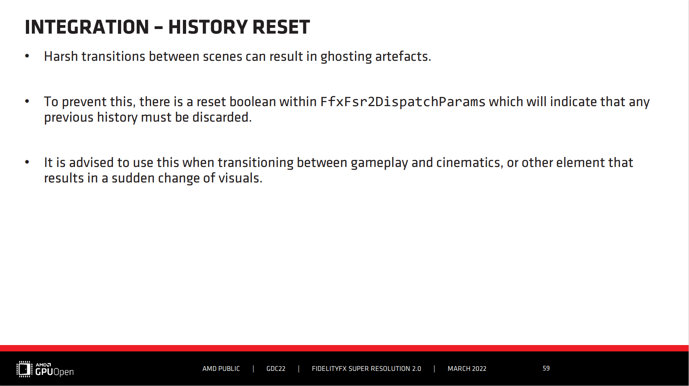

FSR 2.0 SDK 还在 ContextDispatch 的参数中提供了一个 boolean 用于重设所有历史帧，通常用于大面积的场景切换后防鬼影，比如主场景与过场动画的切换。

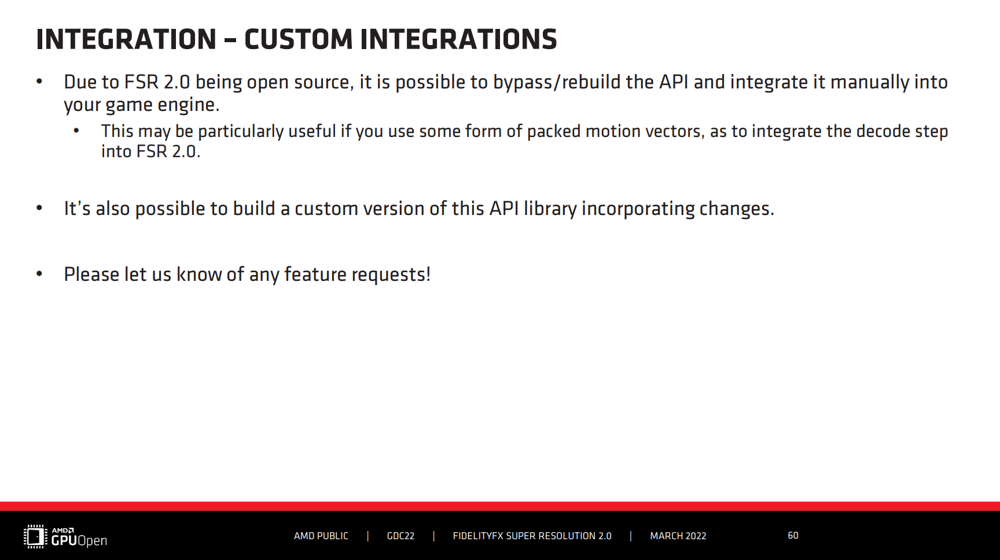

前面说的都是 FSR 2.0 SDK 的使用方法，由于 SDK 本身是开源的，在集成时可以对 API 做各种自定义修改，比如前面提到的把 Motion Vector 跟其他 RT Pack 到一起。

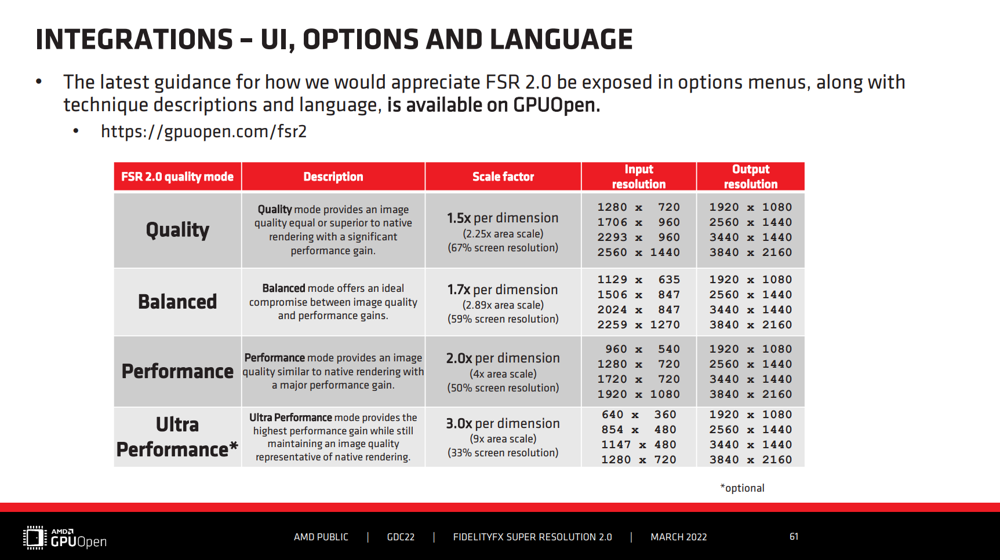

跟 DLSS 类似，对于 UI、各种语言的选项描述，FSR 2.0 也有一套官方的 Guidline。

总结一下：

- FSR 2.0 相比 FSR 1.0 有着更高的质量，基于新的 TAA 算法。
- FSR 2.0 提高了容易使用的 SDK，如果已经集成了 DLSS，集成 FSR 2.0 是很容易的一件事，另外 FSR 2.0 完全开源，支持各种硬件。
- 关注 GPU Open 的新消息。

DLSS 在 4k 下其实还是挺耗的，而 FSR 2.0 效果不错，在 4k Quality Mode 下都只需要 1ms，还能把 TAA 的开销也给省了，论集成友好度和兼容性也远好于 DLSS，看起来还是挺香的。
