FarCry6 的一个分享，热带天气的模拟。

Speakers 的介绍，一个图形程序和一个 TA。

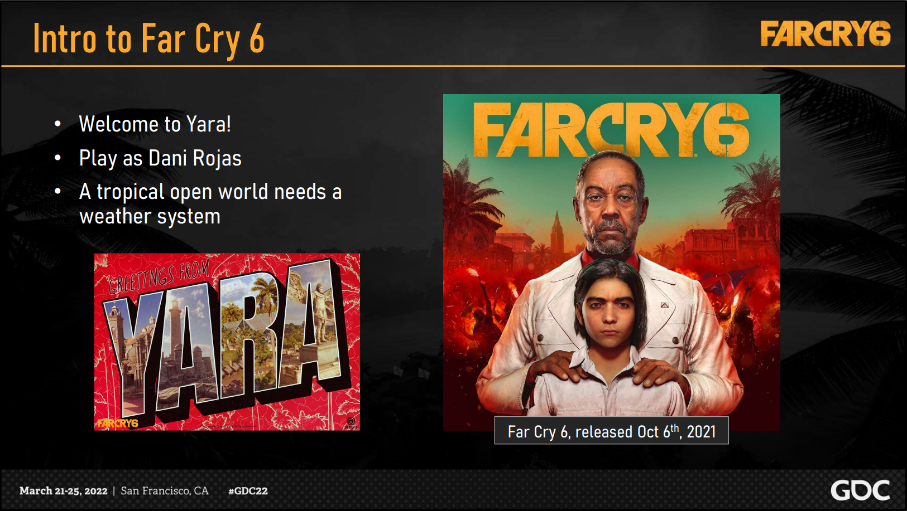

先介绍下 FarCry6，FarCry 系列大家都比较熟悉了，一直都做的开放世界第一人称射击，每一代 FarCry 的剧情都会在一个不同的环境下展开。这一代故事发生在一个名为雅拉的热带小岛上，雅拉的原型是古巴（现实生活中古巴在美洲加勒比海附近，是一个热带群岛国家，北纬 19-24 度）。

这一代玩家会扮演一名名为丹尼罗杰斯的本地反叛军，剧情就是推翻独裁者安东和他儿子迭戈的凶暴统治。这里的封面就是安东和迭戈，看过绝命毒师的应该都知道，这张脸的原型就是炸鸡叔，看着就知道是大反派。

FarCry 的每一代开放世界都有自己的特色，本作的特色就是热带风情，要给玩家完美地展示热带风土人情，全动态的天气系统是必不可少的。

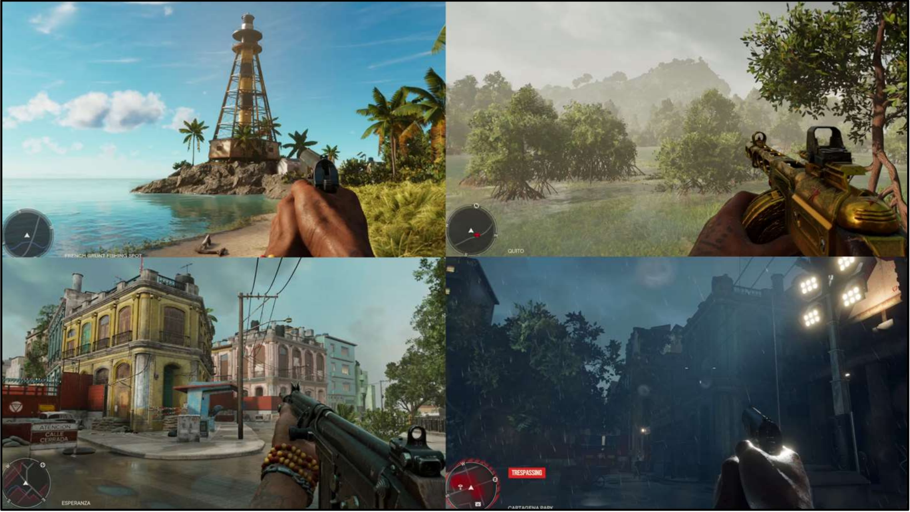

这几张图展示了游戏中的不同天气，分别是晴天、雨天、阴天、夜晚。

下面会分为几个板块去介绍 FarCry6 的天气系统：

1. 天气系统的灵感来源
2. 天气系统的核心概念
3. 如何让湿度影响所有资产的材质
4. 用到的渲染技术
5. 总结

首先是一些现实生活中热带天气的参考，之前说的古巴就是一个很合适的地方。

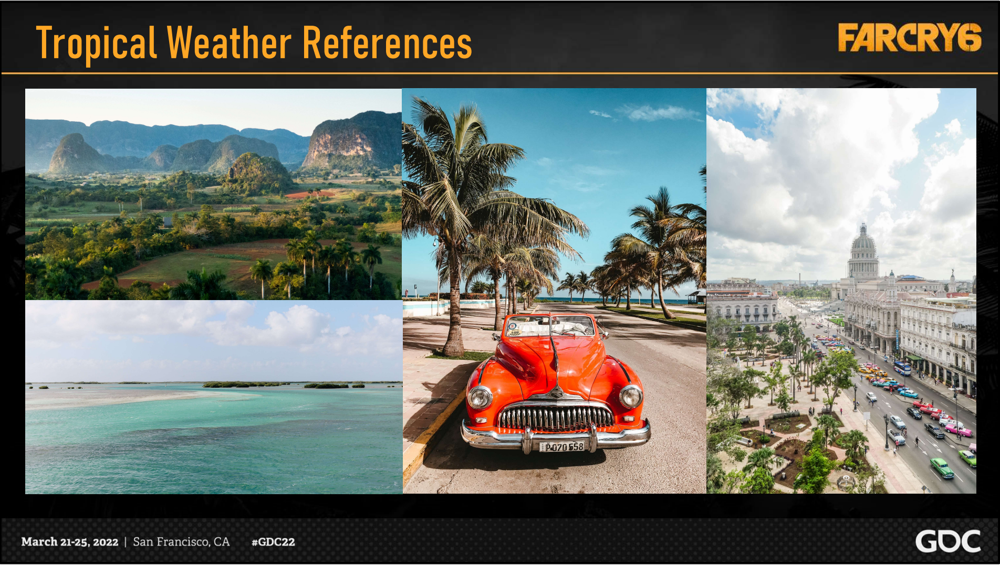

在项目开始的时候，项目组花时间对热带天气进行了大量的调研，以带给玩家一个更加真实的世界。热带小岛的天气是独特而多变的，这几张图是热带小岛标志性的晴天。

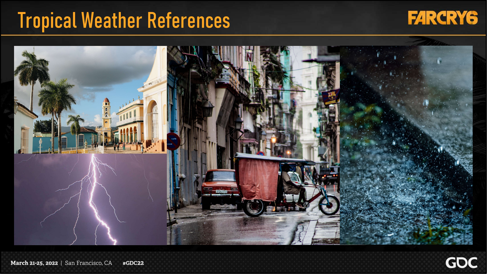

这几张图是压抑的雨天和雷暴天气。除了实现天气效果本身，天气系统还要能够支持剧烈地变化与切换。

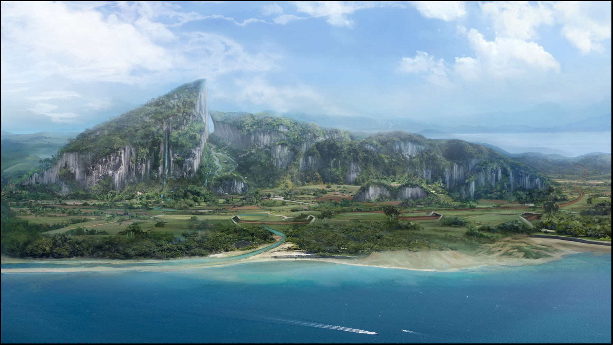

上面的参考被吸纳进了他们的概念设计中，这张图是早期的概念设计图。

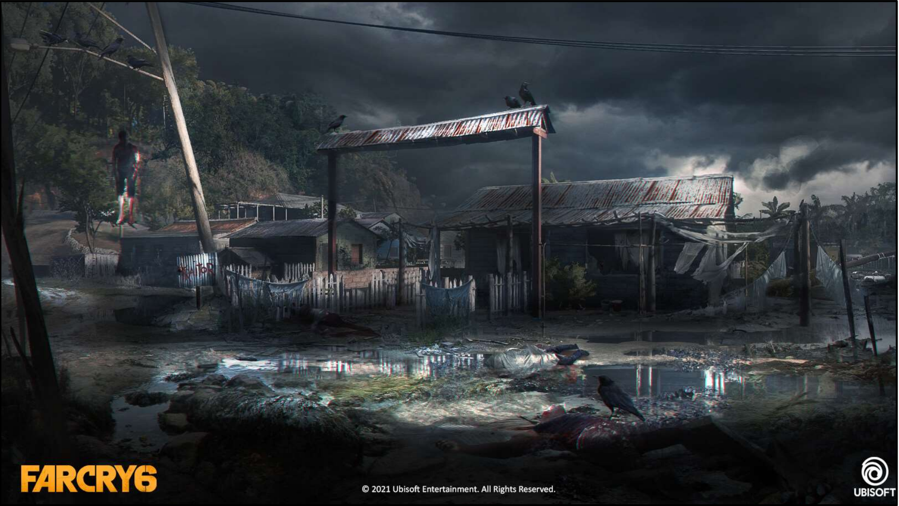

然而他们的艺术总监想要打造一种不祥的氛围，然后就改成了上面这种充满雷暴的天气。

想要营造一种被风暴困住的感觉，真实的雨和湿润效果是必不可少的。

当然，雅拉是一个小岛，所以天气与海的互动也是天气系统中重要的一环。

时候需要记得我们是为一个开放世界游戏打造一套天气系统，所以有这些目标：

1. 足够真实
2. 全动态，支持 TOD
3. 天气切换过渡自然
4. 高性能

下面介绍天气系统的一些核心概念。

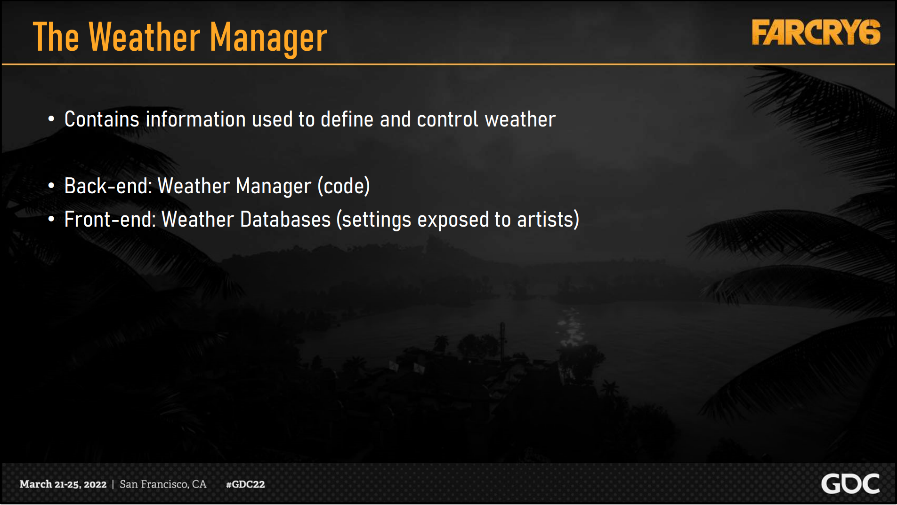

天气系统的核心是 Weather Manager，里面包含了一些定义并控制天气的关键信息。Weather Manager 本身是一个后端，前端则是 Weather Database，即暴露给美术的各种天气设置。

Weather Presets 是项目中可以引用的一系列天气预设，每一个 Weather Preset 都引用了一系列 Weather Manager 暴露的参数，参数的变化可以印象天气。

举几个例子，这张图是 Few Clouds 预设的效果与对应的参数。

对比下，Broken Clouds 预设下云的覆盖率就更大，而且显得更蓬松。

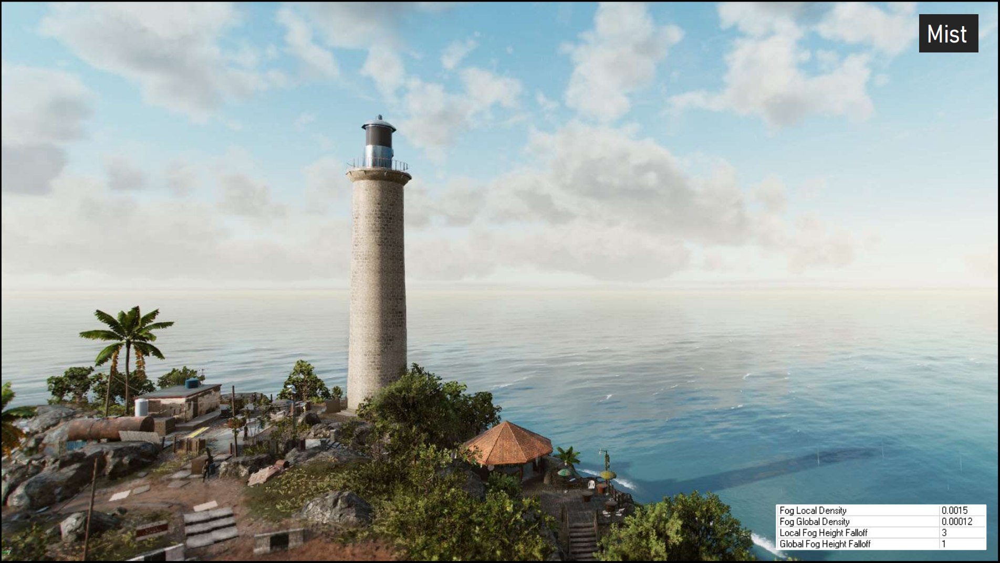

Mist 预设下就能看见一层淡淡的雾。

Fog 预设下则更明显。

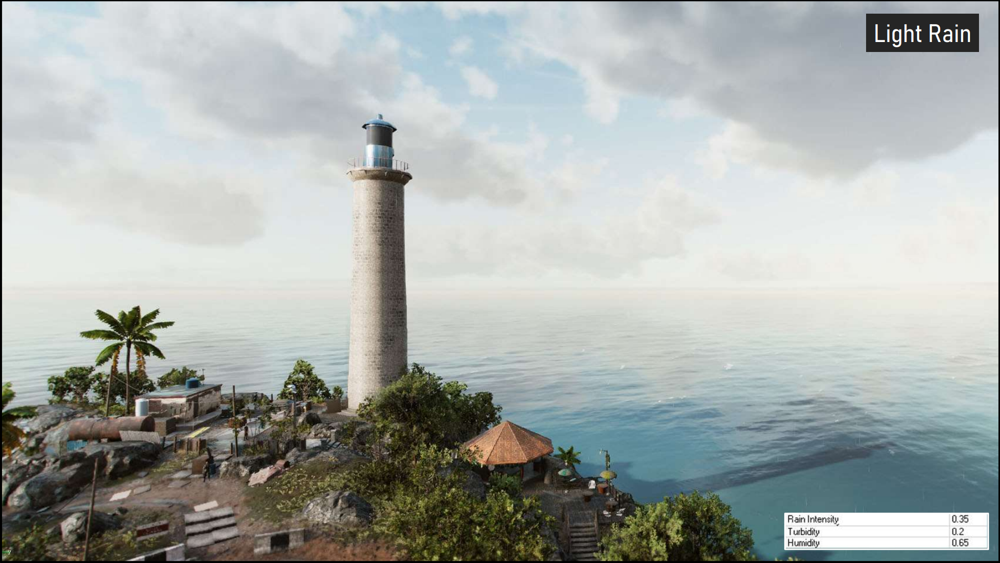

Light Rain 预设，开始下小雨。

Moderate Rain 预设，中雨。

Heavy Rain，暴雨。

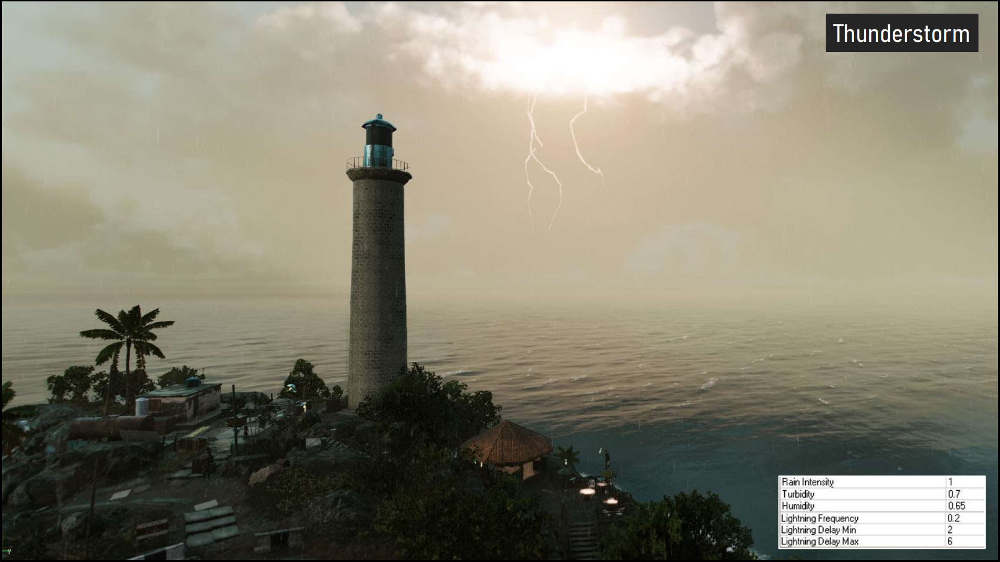

Thunderstorm，雷暴。

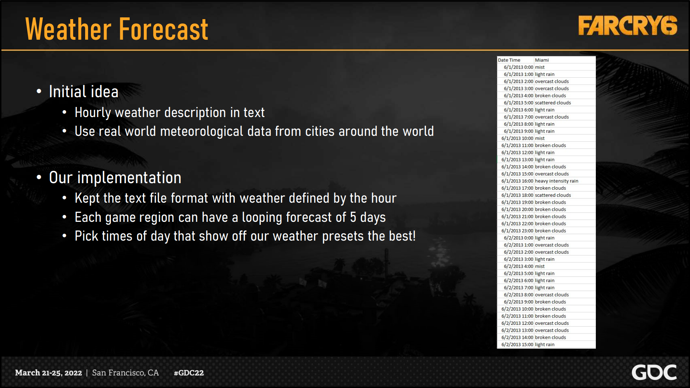

有了一系列天气预设之后，我们需要按照某种模式让天气不断循环切换，并支持在游戏中进行天气预报。最开始的想法是收集并使用现实生活中某个城市的天气数据，这张图就是 2013 年某段时间迈阿密的真实天气预报数据。

但是权衡下来还是觉得用现实生活中的数据不够艺术化，控制起来也不够自由。于是改为了使用类似的文本描述，但是天气数据改成了自己的预设。最后每个区域设计了足够使用 5 天的天气循环。

FarCry6 的游戏地图由东部岛屿、中部岛屿、西部岛屿三部分组合而成，每个地区都有自己的气候特点，西部是干旱地带，中部是湿地，西部则是丛林。天气系统的表现在不同的地区也需要有对应的修改。

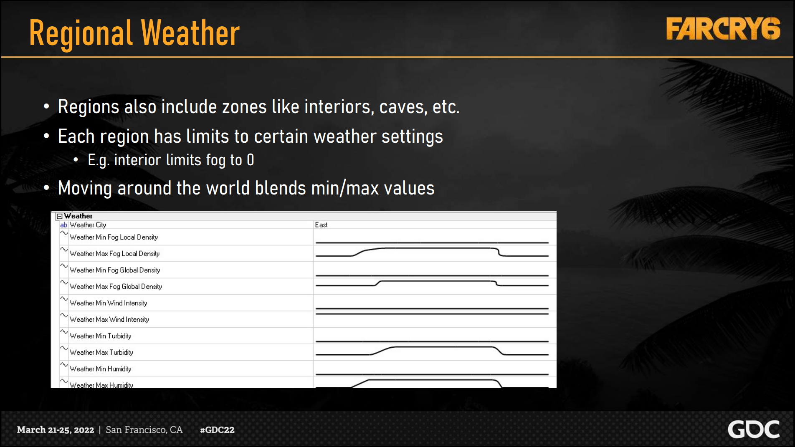

为了实现不同区域的天气变化，天气系统中的每一个参数都会由美术指定两条曲线，曲线对应经度空间上的变化，指定了每个参数的最大值和最小值。在世界中不断移动，最终的天气参数就是插值的结果。

举个例子来说，美术可以设定室内区域的 Max Fog Density 为 0，这样走进室内区域雾就会消失。当然，通过这种方法来控制天气参数在空间上的变化限制也很明显，如果一间房子有窗户，这小块区域设定了 Max Fog Density 为 0，走进房间之后会看见雾当面消失掉，这就要求美术在设计场景的时候需要小心一点，避免这种情况的发生。

有的时候全局天气需要支持临时 Override，比如 Gameplay 中的任务开始后或播放过场动画这种。除此之外，因为 FarCry6 还支持多人合作模式，所有天气系统还需要支持多人同步。

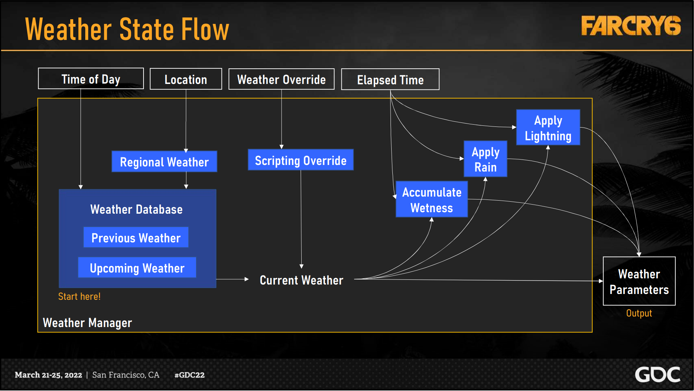

整个天气状态的工作流，首先是 TOD 中保存的 Preset 参数，经过位置插值和脚本的 Override 之后，结合天气已经运行的时间来更新湿度、雨量、闪电等参数，最后输出为 Weather Parameters，之后这些 Parameter 就可以用于渲染、音效、Gameplay 等了。

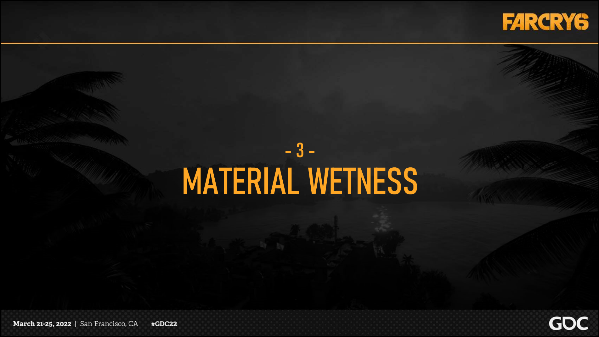

下面讲湿度是如何影响材质的。

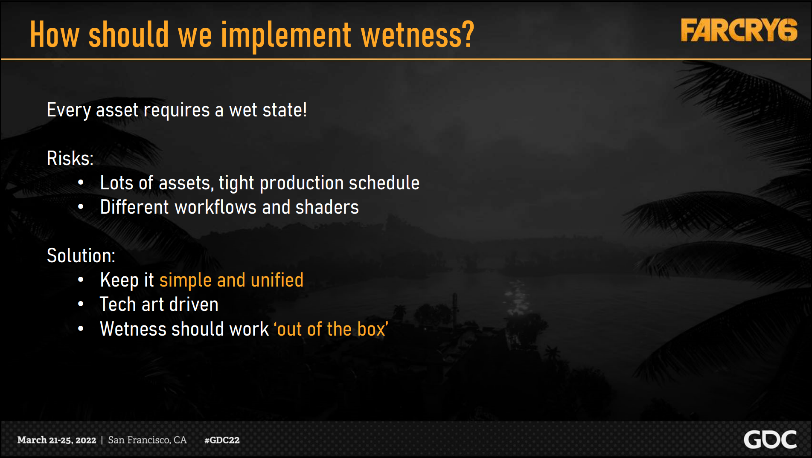

湿度是天气系统中重要的一环，下雨时湿度会影响所有物体的渲染效果，这就意味着所有资产都需要支持湿度。

然而资产数量庞大，并不是所有资产都使用同一套管线和材质。最终的解决方案是让湿度独立于资产制作，由 TA 控制，对于普通材质可以做到开箱即用，拖进场景就能受到湿度影响。当然，有些材质本身需要使用湿度来控制更多细节，这种材质不在讨论范畴内。

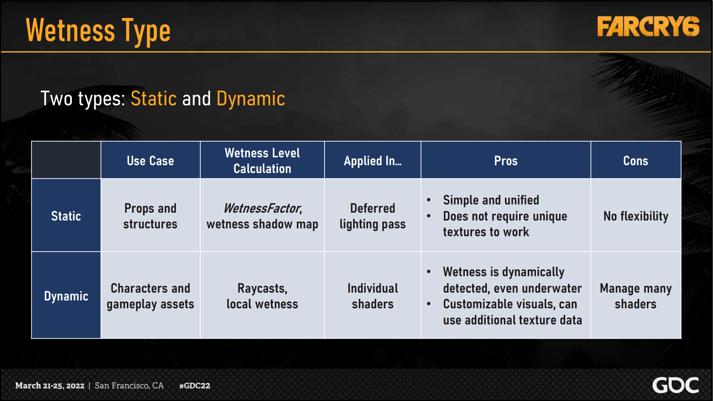

湿度分为两种类型，静态湿度和动态湿度。就跟名字一样，静态湿度是给静态物体使用的，动态物体则是给动态物体使用的。

静态湿度的绝大多数使用场景是道具和建筑，强度取决于 Weather Manager 提供的参数 Wetness Factor 和一种叫 Wetness Shadow Map 的特殊 Mask。静态湿度的计算是在 Deferred Lighting Pass。静态湿度的优点是简单通用，不需要专用的纹理，确定就是不灵活。

动态湿度主要是为武器、载具和角色设计的。强度取决于两个参数，第一个是通过 Raycast 计算在雨水中的暴露程度，第二个是在水中的淹没程度。动态湿度的计算是放在单独的 Shader 中进行的，这意味着可以进行随意定制。这种方法优点是动态、可定制，缺点是需要管理额外的 Shader。

上面提到的 Wetness Shadow Map 包含了物体的遮挡信息，其实 Wetness Shadow Map 很形象，想象雨水是一束平行光，那么处于阴影中的物体就不会被淋湿。Wetness Shadow Map 会在 Deferred Shadow Pass 被计算，然后在 Deferred Lighting Pass 中被使用，就跟阴影的使用方法一样。采样 Wetness Shadow Map 之后再与 WetnessFactor 相乘就可以得到最终的湿度。

这是一个 Wetness Shadow Map 的例子，图中显得更亮更干燥的区域就是位于 Wetness Shadow 之中的部分。

这个是 Wetness Shadow 的 Debug View，很多地方都能很好的工作，但是近乎垂直的面会有精度问题。为了处理这种问题每一帧都会略微 Dither 一下，这样就会从硬切的边缘变成图中这种较柔和的边缘，更加贴近自然。

下面看一下如何在画面上表现出湿润的效果。这里是一些湿润物体的参考图，想沙子、纸板这种渗水性能比较好的材质在湿润后会呈现出更深的颜色，像石头、地砖这种渗水性能不是很好的材料就会表现得更光滑，当然还有的材质会同时呈现这两种效果。表现湿润效果得重点是我们怎么去描述材质的渗水性。

我们引入了一个新的参数叫 Porosity，孔隙率，描述了物体内部细小空间的多少，代表了渗水能力。较高的孔隙率会让材质变暗（代表材质有泥土、纺织物、没有刷油漆的木头等），较低的孔隙率则会让材质反光（比如塑料、大理石、金属等）。

引入这个参数之后，意味着与其他 PBR 参数一样，我们也需要一张 Porosity Map。但是问题是已经没有性能预算能够给到 Porosity Map 了。

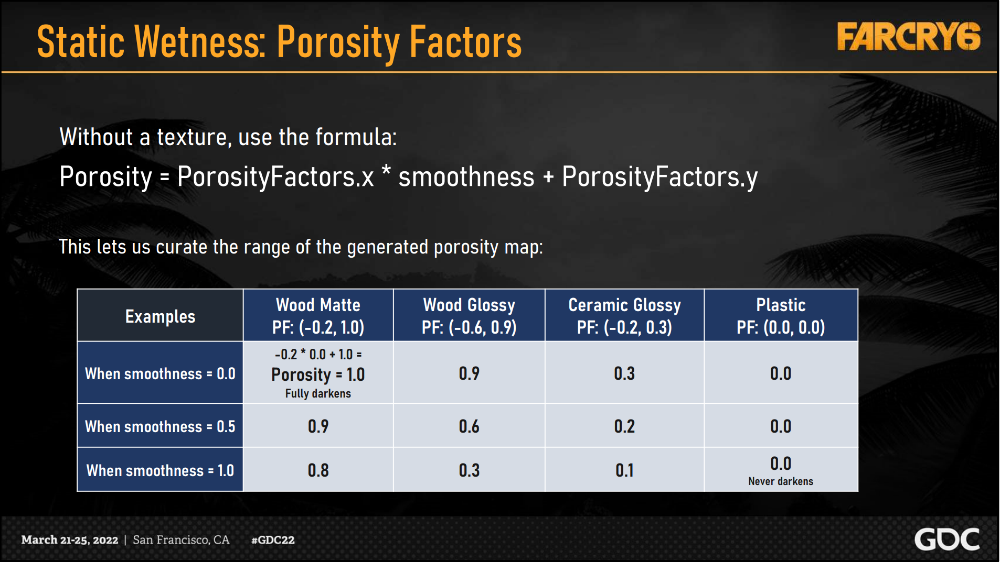

因为 Porosity 本身跟 Smoothness 是相关的，所以设计了一个基础公式来根据 Smoothness 推导 Porosity，其中 PorosityFactors 是根据材质类型预设的一组参数。根据这个公式就可以直接利用现有的 PBR Texture 计算得到 Porosity。

好在 FarCry 系列本来就已经有一系列预设的 PBR Hard Code 参数了，直接把 Porosity 也加了进去，这样甚至连美术管线也完全不需要动。

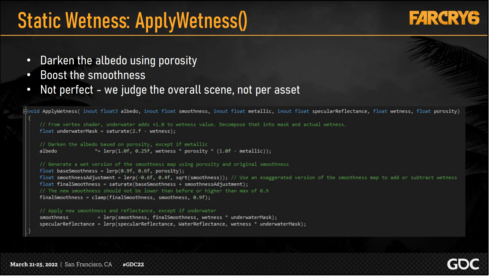

ApplyWetness Shader 展示，主要就是根据 Porosity 使 Albedo 变暗，Smoothness 提升。这段 Shader 对于单个物体来说并不是完美得，只是从场景级别看起来还不错。

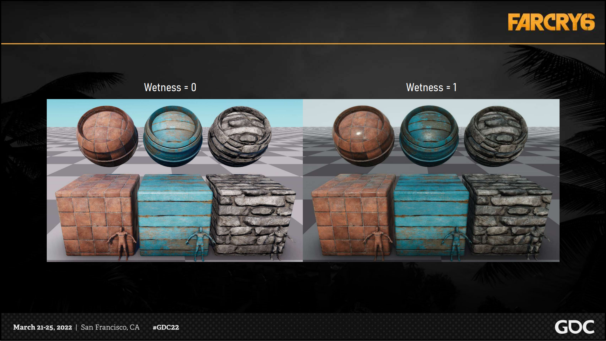

这是部分材质在干燥和湿润效果下的差异。

整个场景的展示。

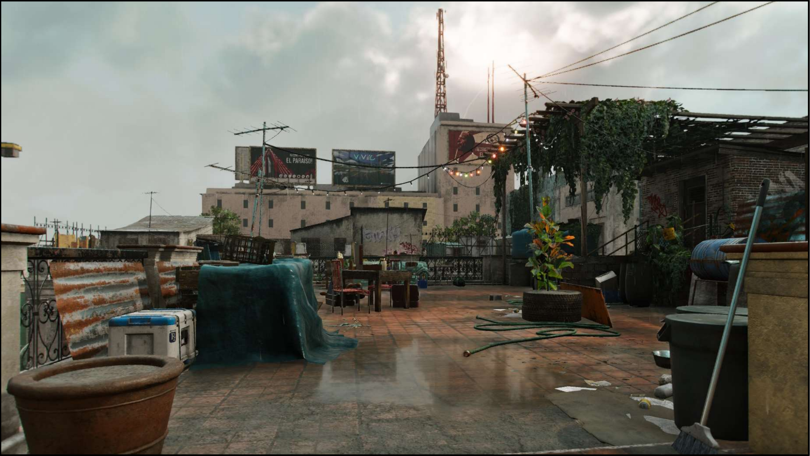

整体调高湿度后的表现。

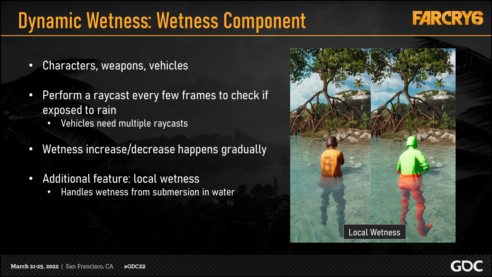

下面介绍动态湿度。动态湿度是针对角色、 武器、载具一类的动态物体的。每一帧都需要用 Raycast 判断是否暴露在雨中，载具需要进行多次 Raycast。动态湿度的增减是逐步的。另外为了支持被水淹没的效果还添加了 Local Wetness Feature。

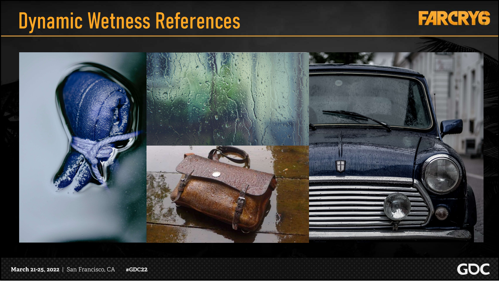

前面说过动态湿度的好处是可以随意定制物体湿润后的表现效果，先看一些参考图。

服装的效果跟小物体类似，只是额外添加了光滑度上限的参数，来展现更好的效果。头发的话就直接由 Porosity 参数控制，本来开始是想做头发湿润后缠绕在一起的效果，后面因为太难就放弃了。

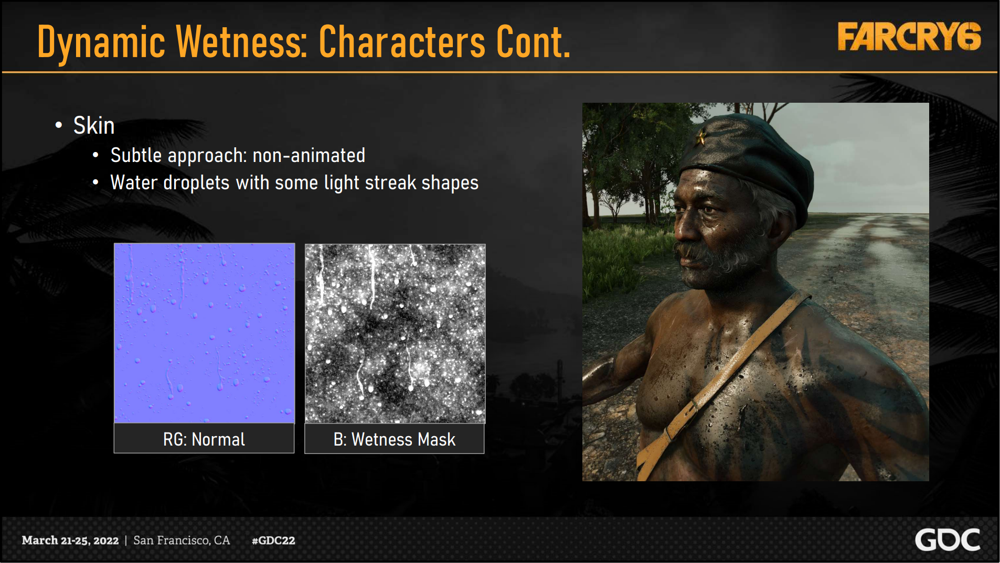

皮肤的话想要做雨水吸附在上面的效果，而且看起来要尽量自然。实现的方法是使用一张纹理，RG 通道存放雨水的 Normal，B 通道存放 Wetness Mask，最终就能表现出图中的效果。

在 FarCry6 中，载具和武器其实是比较类似的，他们都会受 Gameplay 控制，并且会被玩家近距离观察，所以为这两类物体做了雨水的动画效果，每一帧都会更新雨水的相关纹理。雨水在这类物体上的表现分为两种，水纹和水滴。

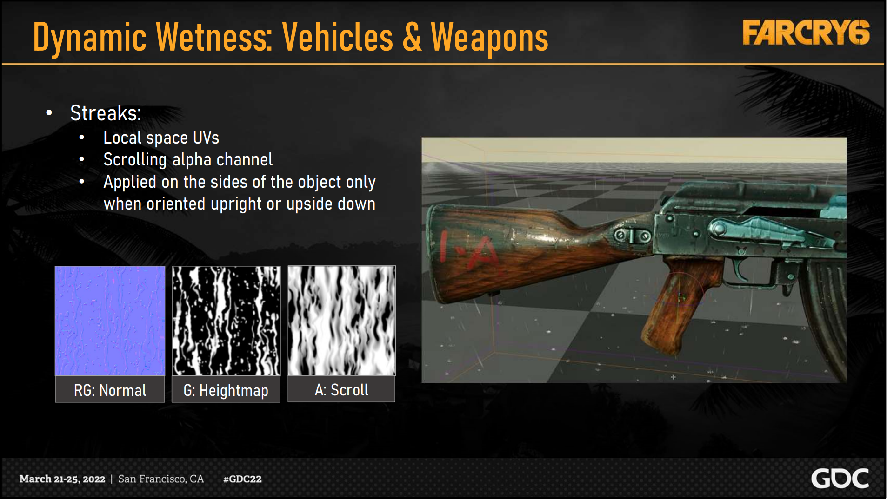

先说水纹，水纹只会在枪械和载具的竖直平面上出现。输入纹理也只有一张，RG 通道存 Normal，B 通道存 Heightmap（这里应该写错了），A 通道存 Scroll，Scroll 纹理驱动了水纹在垂直方向上的移动，再按 Scroll 的 Local Space UV 采样 Normal 和 Heightmap，Scroll 纹理会被每帧更新。

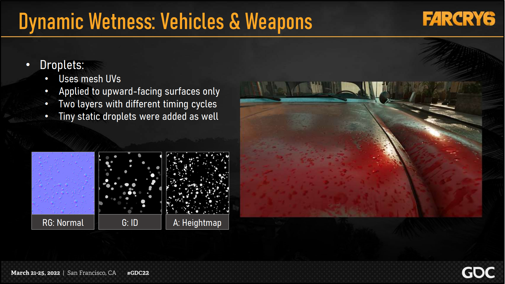

下面是水滴，水滴只在物体的水平平面上出现。同样是单张纹理，Pack 了 Normal、ID、Heightmap。也是类似的，ID Map 会每帧更新，按照 ID Map 采样两次 Normal、Heightmap 纹理然后做 Blend 就可以做出雨点产生和消失的动画。

另外，因为雨点在水平平面上移动困难，所以会随着时间的推移不断累积到平面上，所以还做了随着时间推移改变 Heightmap 的效果。另外对于这张纹理，用自动制作的 Mipmaps 会导致闪烁的问题，所以改用了纯手工的 Mipmaps。

为了节省 Drawcall，游戏中的载具车内车外基本都用的同一套材质，这种情况下车内也会收到雨水影响。为了解决这个问题用了顶点色来做 Mask，美术刷完之后车内就不会再受影响了。图中就是这个 Mask 的 Debug View。

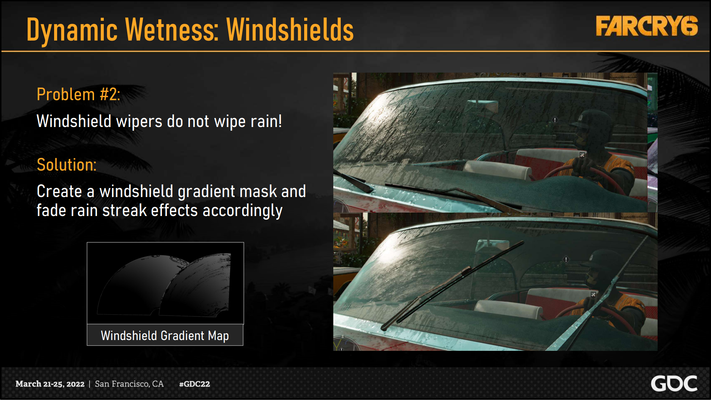

Gameplay 团队做了一个雨刷器的游戏玩法，开始 3D 团队并没有考虑到这个设定。为了支持这个玩法，单独做了一张雨刷器的梯度 Mask，在 Shader 中会采样这张纹理来调整雨水的效果。图中就是最终的效果。

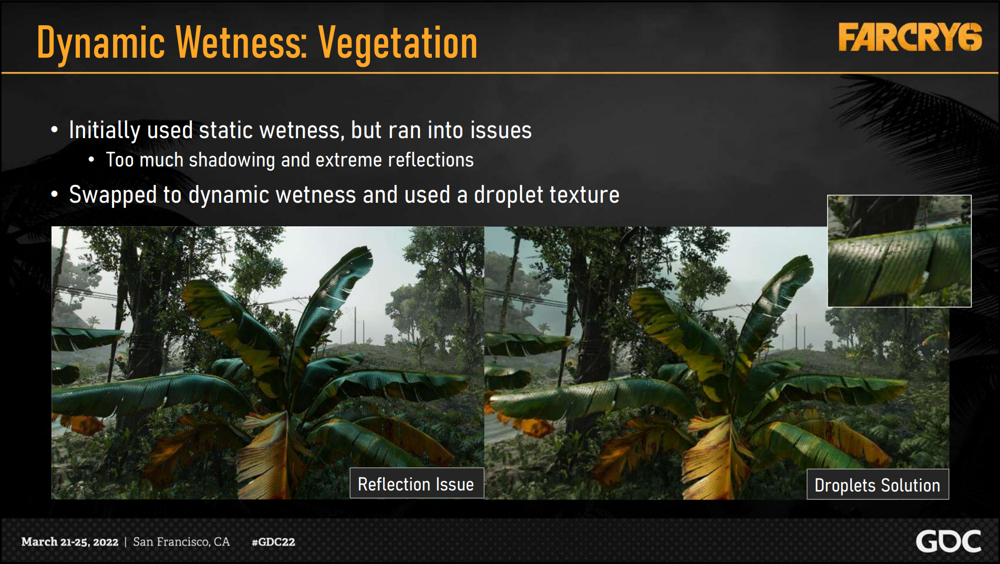

最开始的时候植被本来使用 Static Wetness 的，但是会有一些问题。首先是下雨时植被相互遮挡，在丛林中位于下层的植被就不会受到雨水影响，这在自然界中是比较难见到的。然后就是用 Static Wetness 植被高光太明显了，看起来就很像金属。

为了解决这两个问题，植被还是改用了 Dynamic Wetness，这样就可以在 Shader 里定制湿润效果。当然这样的话 Wetness Shadow Map 对植被就没用了，但是 99% 的情况下都不会把植被放到室内，所以其实也没太大关系。

最终是在叶子上做了水滴效果，然后调整了反射，看起来就不会像左边那张图这么奇怪了。

最后是地形，在雨天低洼的地面会有积水，这个效果也是需要实现的。

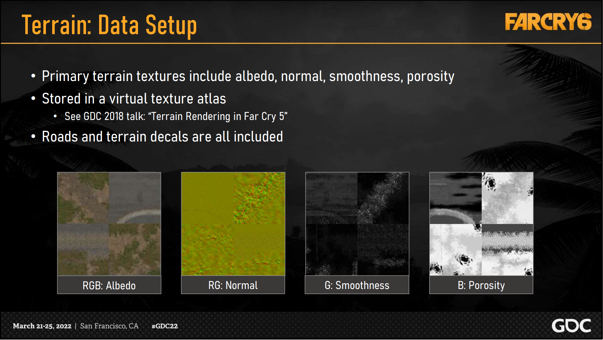

FarCry5 原来的地形系统就已经有 Albedo、Normal、Smoothness 这几张纹理了，现在又单独新加了一张 Porosity 纹理。因为 FarCry5 开始地形渲染就已经用 VT 了，所以道路和贴画使用起来会比较方便，直接往 VT 上拍就可以了。

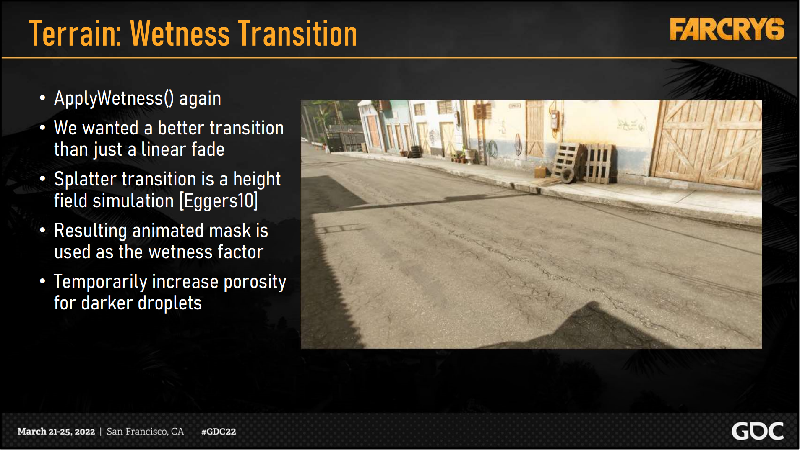

地形的湿度计算跟使用 Static Wetness 的物体类似，也是搬了 ApplyWetness() 然后做了些修改。主要区别是不想让 Wetness 的过渡看起来这么平滑，而是像做成雨滴飞溅的效果，就像视频中展示的这样（pdf 没法放视频）。

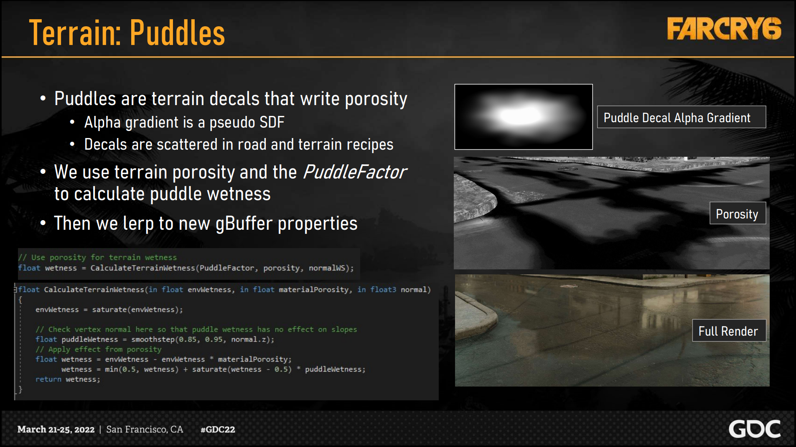

下面是水坑，水坑对视角效果的影响是非常大的，因为它会产生反射效果，极大地提升真实感。在游戏中，水坑其实就是一个贴花，一般都放置在低洼的道路上。

绘制水坑的时候，gBuffer 的 Albedo 会变成泥泞的颜色，Smoothness 会接近 1，Normal 会变成垂直向上，最终就形成了图中的效果。

有了基础的效果之后还要考虑跟环境的交互。雨水落在水坑上会产生涟漪，而风吹过水坑会产生波纹。

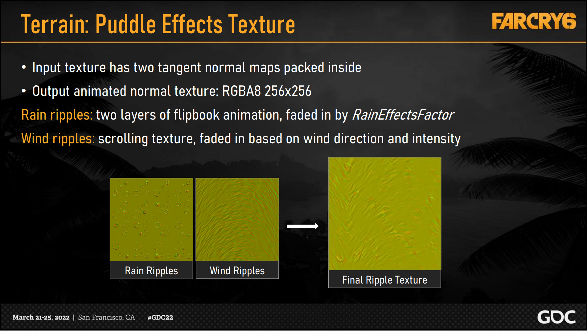

两个效果分别对应两张带动画的 Tangent Normal Map，涟漪效果是帧动画，每帧按照序列替换一张新的纹理，强度受 Weather Manager 的 RainEffectsFactor 影响。波纹效果则是一张滚动纹理，受风的方向和强度控制。把两张纹理组合起来得到 Ripple Texture，再把这张图应用到树坑的渲染上就能做出来前面说的效果。

进入下一部分，换图形程序来讲。

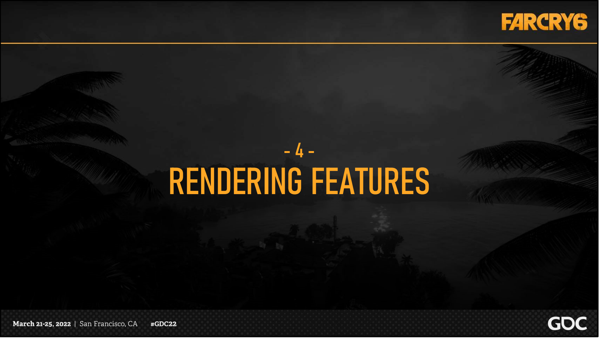

下面介绍天气系统相关的渲染技术。

在开始讲渲染技术前，先看一下 FarCry6 的各种技术参数，FarCry6 会在 9 个平台上发布，除了 PC、上世代和次时代主机，还有 Stadia、Luna 两个云游戏平台。次时代的主机要求 60fps，上世代 30fps。地图大小 10 km2。支持 TOD、有各种室内室外场景、一座大都市。现在好了，又要动态天气。

下面看看各种渲染技术是怎么影响画面效果的，这是只有大气散射的效果。

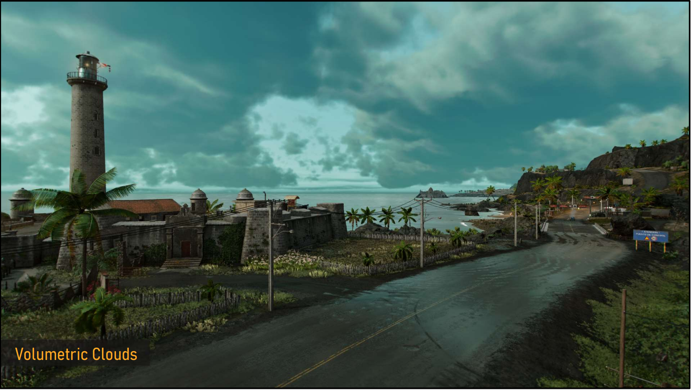

添加体积云之后的效果。

添加体积雾。

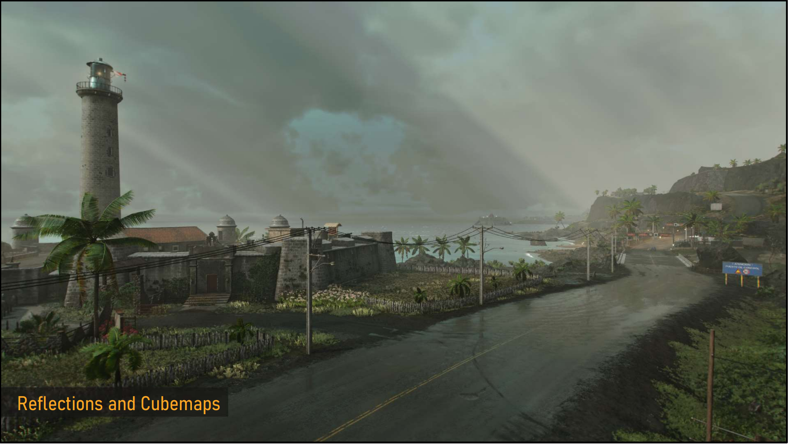

添加反射与 Cubemaps。

添加雨水和雷电，最后就得到了一个被困雷暴中的场景。

在讲单个渲染技术前，先看一下 FarCry6 的光照模型。FarCry 系列的光照是 PBR 的，并且尽量高性能。FarCry6 Diffuse BRDF 使用的是 Multiscattering Diffuse，Specular 使用的是 GGX + Multiscattering Lobe，并且支持面光源。

右边这个表展示了各种不同的 Surface Type 使用的公式，主要不同的地方是半透明 Surface，在游戏中主要是给植被使用的，半透没有使用 Multiscattering Diffuse，改用了 Two Wrapped Lambert Lobes，来模拟透光效果。

FarCry 的 GI 系统用的是摆探针的方法，美术纯手摆，每天都会通过打包机 Bake 然后进版本。GI 数据的存储用的是 Voxels，打包了 13 帧数据，其中 11 帧用于 TOD，一帧给夜晚的 Local Lights，一帧给天光遮蔽。

这个系统并没有考虑云或者天气的影响，解决方法也很简单粗暴，当云的覆盖率设定的比较高时，直接给间接光做一个淡出来模拟云的阴影。

另外就是这套系统直接放在城市里用效果并不太好，所以后来把数据改成了稀疏存储，探针尺寸也改成了可变的，这样就可以针对室内场景提高 GI 精度。

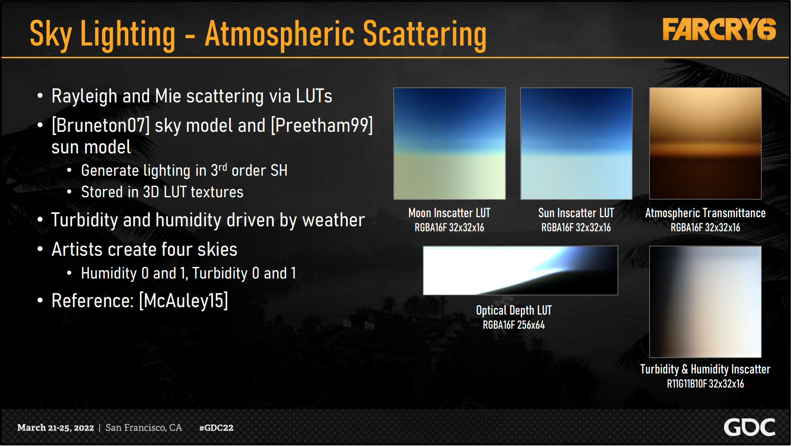

先说天光，用的是 Bruneton 和 Preetham 两篇论文里面的 Sky Model 和 Sun Model。这部分是预先计算好然后存在 LUT 里的，但是之前是直接运行时计算的。

Weather Manager 里面有两个参数会影响天光，浊度 Turbidity 和潮度 Humidity，两个参数的取值都只有 0 和 1，因此能组合出四种天空。

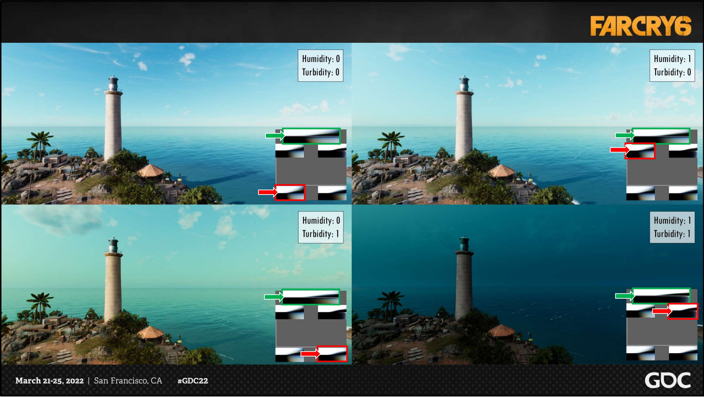

展示下四种天空。

大气散射配合体积云的效果。

接下来是体积云。基于 Skybox 的云实现很简单，但是运动效果很差，也没办法跟天气系统做配合。Skybox 更像是一个背景，很难与世界产生交互，所以还是想要做体积云。

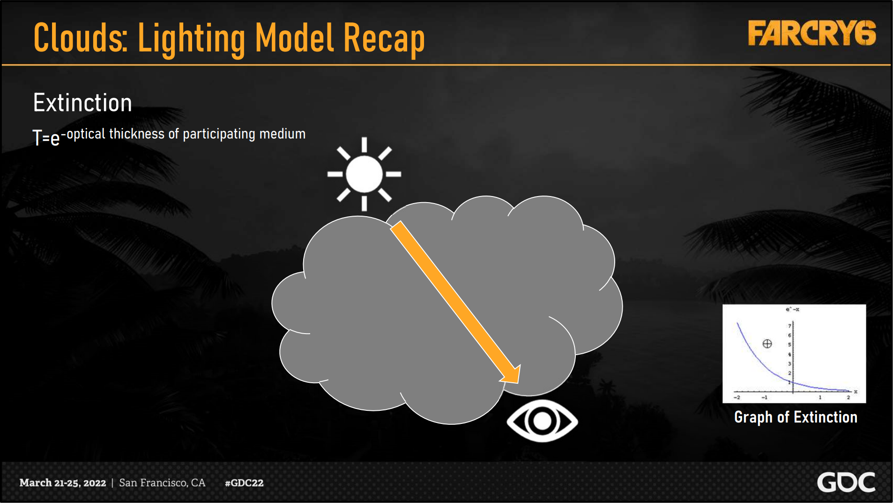

云的渲染中最重要的部分是描述光穿过云层时的能量损失。云本身是由水分子聚集而成的，光穿过云层时会不断与水分子碰撞从而损失能量，这个过程遵循 Beer-lambert 定律，我们之后会用透光率 Transmittance 来描述它。

光在云中会有两种行为，一种是被吸收，一种是散射，吸收在云中发生的比较少。散射后最终到达眼睛的光是通过 Radiance 来衡量的。

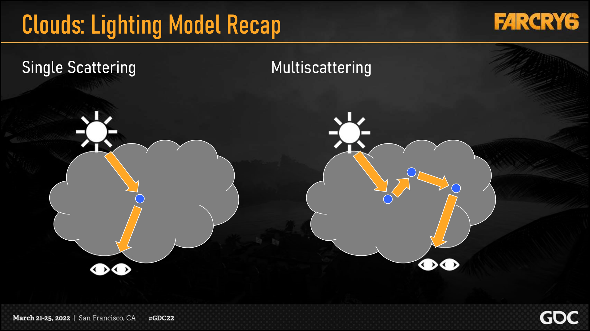

散射分为两种，单散射和多散射，单散射就是碰到水分子后光改变方向然后直接到达人眼，多散射则是在云内部很多次遇见水分子并改变方向，之后到达人眼。

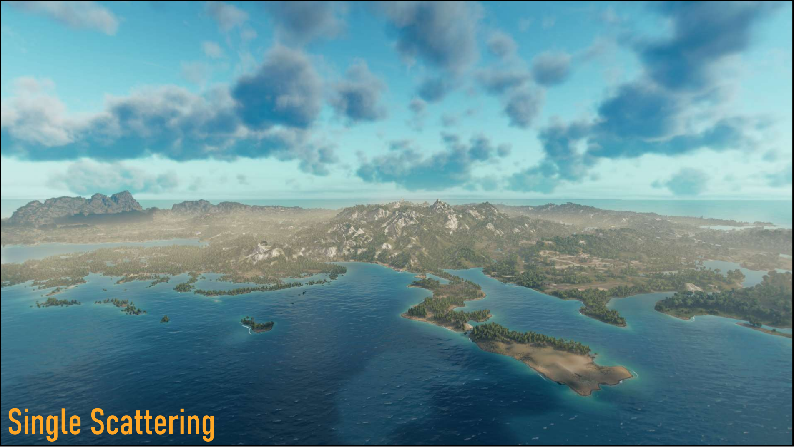

这是只有单散射的效果。

这是只有多散射的效果。

结合起来的效果。

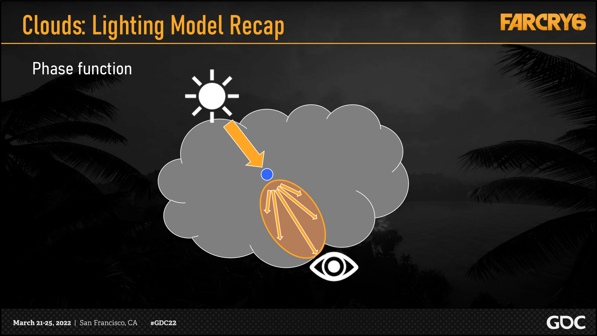

所有的散射事件都可以通过相函数来建模。通过相函数可以计算出光遇见水分子之后会分散成什么方向，降低多少强度。相函数求值结果是一个近似的椭球形。

最后选用的相函数是一个近似公式，按照这个公式求值可以得到右边这个椭球形。

下面谈下如何存储云的数据，其实主要就是描述云内部的水分子密度。首先是两张 3D 噪声纹理，Base Noise Texture 和 Detail Noise Texture，Base 和 Detail 两种纹理都是离线工具生成的，组合了多种不同频率的噪声，他们之后会被用于生成云的形状。

然后是 Weather Map，Weather Map 会被直接屏幕在世界空间上，还会随着风向滚动。用这张图可以构建出 XY 方向上云的形状，同时 Weather Map 中保存的值还代表了云的密度。

最后是 Curl Noise，里面保存了三维的偏移数据，对 Base 和 Detail 纹理采样的时候会拿这张图进行偏移，让云看起来细节更丰富。

最后是 Cirrus Map 和 Cirrus Horizon，Cirrus Map 会被半球映射到天空上，看起来会有一些细散的残云，Cirrus Horizon Texture 会在相机周围按照圆柱体映射，在地平线附近产生云的效果。

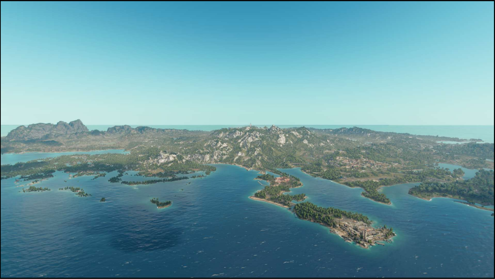

下面看一下这些纹理对画面产生的影响，这张图是只有大气散射的效果。

添加了 Cirrus Map 和 Cirrus Horzion Map 后的效果，有了残云和地平线的效果。

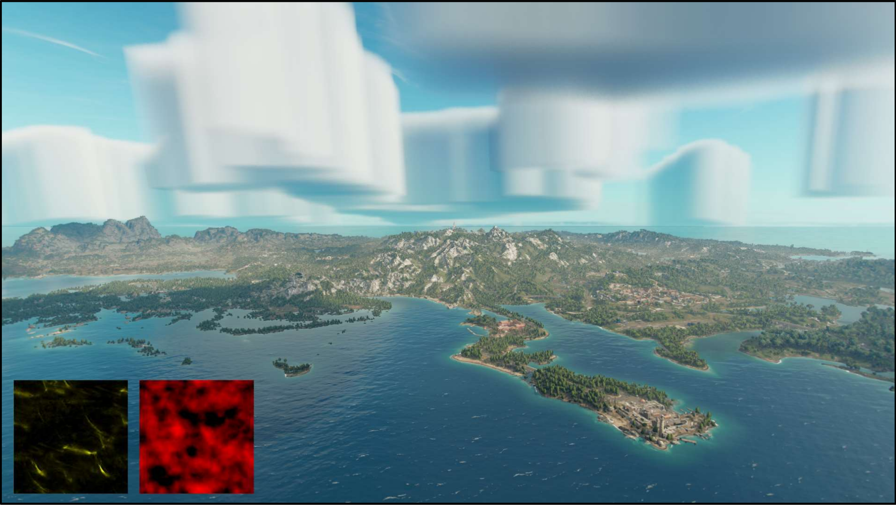

添加 Weather Map，XY 方向上云的形状已经出来了。

预设了一张云的梯度图来限制云的高度，采样这张图之后云的基本形状就有了。

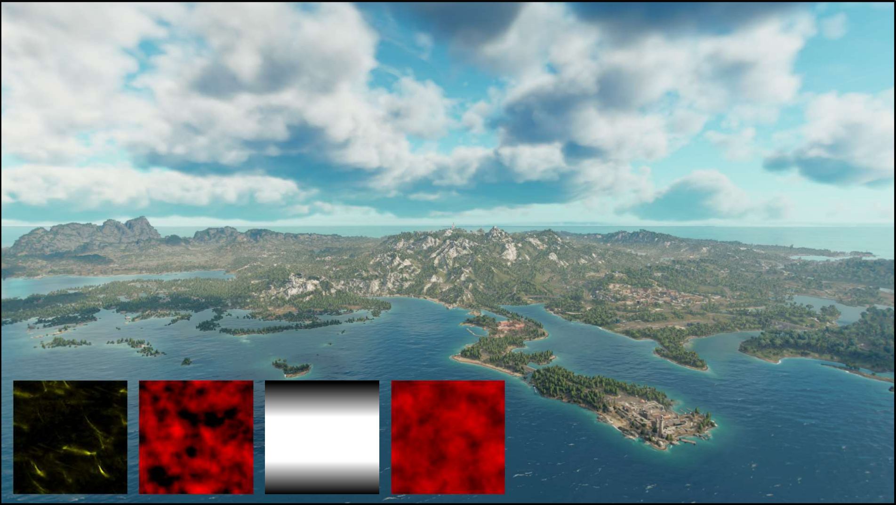

采样 Base Noise Texture 这张 3D 纹理之后的效果。

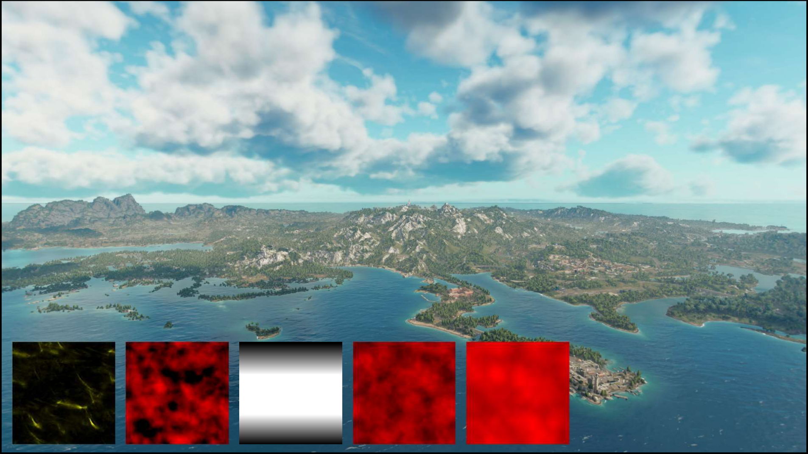

采样 Detail Noise Texture 添加更多细节。

采样 Curl Noise Texture 做偏移，最终得到了一个看起来还不错的效果。

体积云的渲染使用的是 Raymarching，从观察者视角发射光线并步进。每前进一步，都计算当前位置到太阳方向的 ，然后作为透射率累加起来，用于后面计算散射。

Raymarching 本身很慢，常用的优化手法是改变步进的策略和结果的分帧累加。

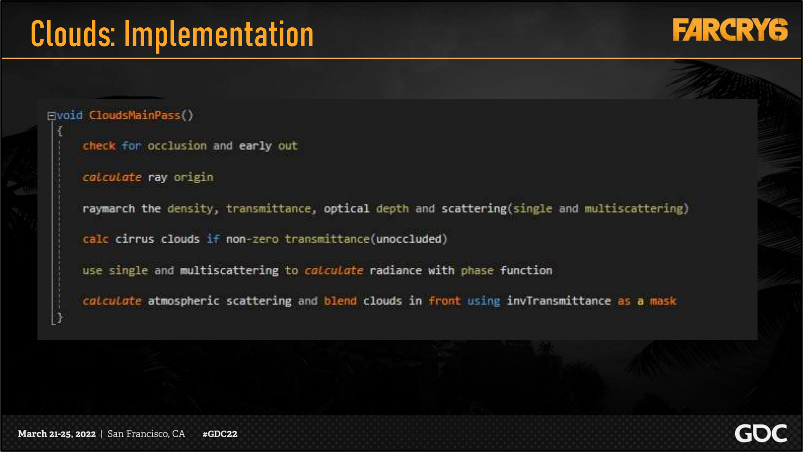

伪代码：

1. 先检查 Occlusion 并提前 Return
2. 计算光线起始位置
3. 做 Raymarching
4. 计算 Cirrus Clouds
5. 用项函数计算散射
6. 计算大气散射对云的影响

全分辨率做 Raymarching 实在太费了，于是做了半分辨率 + Temporal 的优化，所以最终会有两张 Radiance Texture 和两张 Transmittance Texture。

还做了棋盘格渲染的优化，每帧每四个像素只做一次 Ray Marching，用 Checkboard Offset + Curl Noise 同时做偏移。接下来把历史帧的信息投影到当前帧，用启发式算法做 Clamp，然后再在相邻像素间做双线性插值，得到最终的结果。

存储 Radiance 的时候因为分辨率太低，会出现瑕疵，为了解决这个问题改用了蓝噪声并对噪声做了两倍的模糊，而且在云画到场景的时候也加了两倍的模糊。

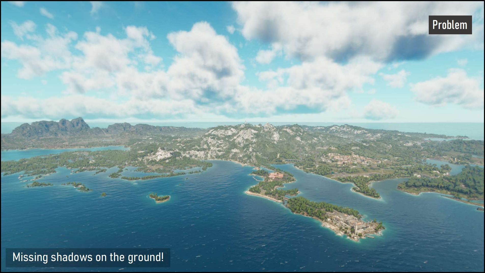

另外一个问题是云对地面没有投影，看起来真实感大大降低。

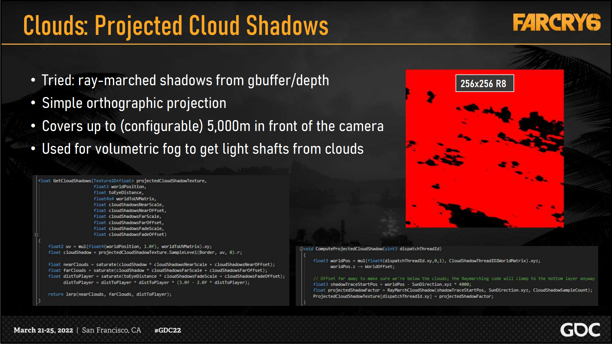

开始尝试了对 GBuffer/Depth 做 Ray-Marched 来获取阴影（就是 Contact Shadow），但是发现太昂贵了。就直接算了一个云对地面的正交投影，覆盖相机 5000m 范围，这张纹理后面也会被用于计算体积雾的 Light Shaft。

用这种方法计算的效果。

下面讲体积雾。

体积雾的实现方法是经典的 Froxel Volume，按照体素划分视椎体，然后在这个区域内计算每个像素的光照结果并沿着视角方向进行离散化积分。体素视椎体的分辨率是 120x68x120，对应一张 Irradiance Volume 纹理和一张 Attenuation Volume 纹理。

整个体积雾渲染的流程。首先进行降采样，然后对深度进行 XY 方向上的膨胀。之后为 Froxel Volume 填充数据，最后沿着视角方向进行积分，再沿着 XY 方向进行 Blur 得到最终的结果。

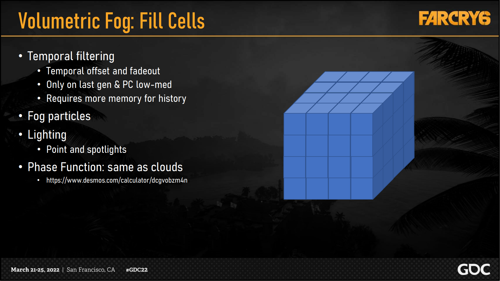

Irradiance Volume 纹理在计算的时候会接受各种光照信息，包括天光、间接光、点光源和聚光灯等。接受的 Irradiance 强度受控于 Weather Manager 中的雾参数。计算的时候使用的项函数跟体积云的是一样的，在上世代主机和 PC 中低端机器上，这一步计算还是比较耗的，所以会用 Temporal Filtering，本世代和高端机器就直接用 Bilateral Blur。

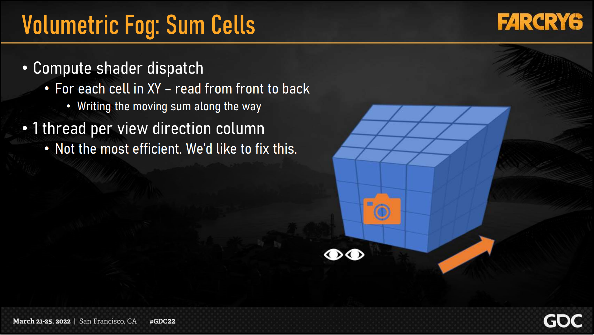

完成 Fill Cell 之后需要按照从前到后的方向累加 Irradiance，这一步用 Compute Shader 算，每一个 Thread 对应 XY 平面上的一个像素，完成累加后再按屏幕空间采样最后一个 XY 平面就是最终的 Irradiance。

最后是做 Bilateral Blur，这一步只在次时代主机和高端 PC上做。其实就是分别在 XY 两个方向上单独做高斯模糊，X 方向上做完 Blur 之后会输出转置的图像，然后 Y 方向做完后会再转回来，这样可以优化纹理的读写效率（没搞懂原理，应该是提升 Cache 命中率吧）。

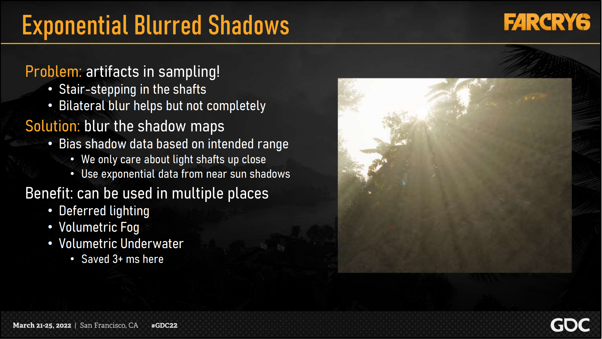

采样的时候 Light Shaft 会有一些 Artifacts，Bilateral Filtering 能减缓这种现象但是不能根治，为了解决这个问题，对 Shadow Maps 做了降采样和模糊。

对 Cascade Shadow Maps 先做一次 1/4 降采样，然后做一次 Blur，接着再做一次降采样，然后变成之前的 1/16，这时候计算体积效果的时候再采样这张 Shadow Maps 会非常快，同时还不会出现之前的 Artifacts。

没有雾的时候的效果。

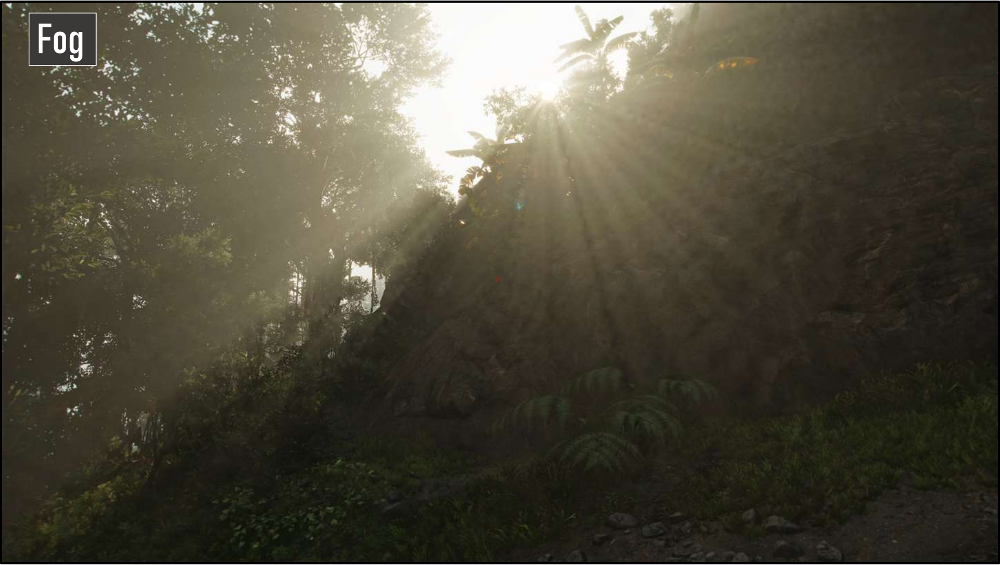

最基本的版本。

加了 Bilateral Blur 之后的效果，Artifacts 少了很多，但还是存在。

对 Shadow Maps 再做 Blur 之后，基本就看不出来了。

目前位置，还没有提到怎么应用云雾效果。为了节省带宽，大气云雾都是同时在屏幕空间内计算的。这样还很容易就可以把云的阴影注入到雾的 Irradiance 计算中，同时可以表现出透过云的 Light Shaft 效果。

在整合阶段，还叠加了更多的蓝噪声，然后依靠 TAA 来糊一下，以达到更好的效果。

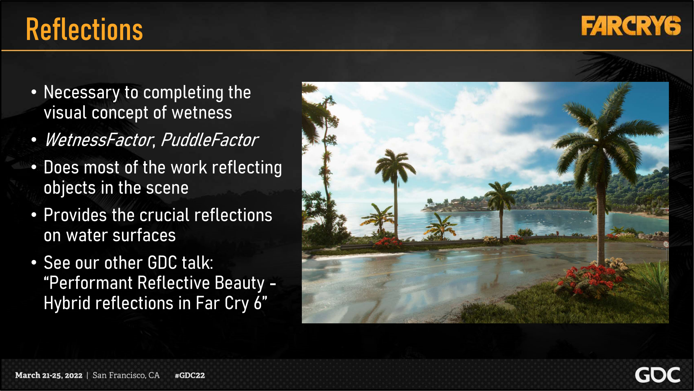

接下来是反射。反射在体现湿度这一特点上至关重要。FarCry6 的反射用的是混合方案，有屏幕空间的反射 SSLR 也有硬件光追反射。

屏幕空间反射有个问题，就是在某些视角下，压根就没有能反射的颜色信息，这时候就要 Fallback 到使用 Cubemap。这些用于 Fallback 的 Cubemap 是美术挑了一些固定场景进行 Bake，然后在运行时加载并进行 Relighting，在 Bake 下来的 Cubemap 上再添加天空云雾，最终再用于反射。

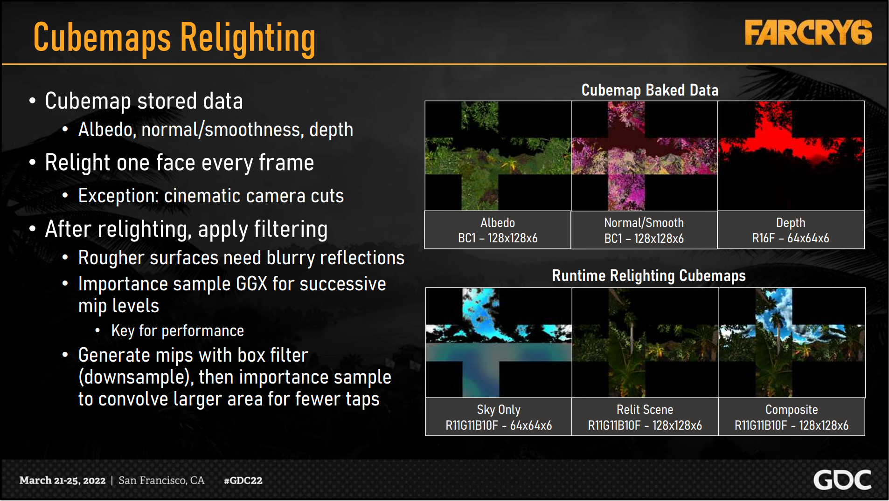

Cubemap Bake 的时候存的是 Albedo、Normal、Smoothness 和低分辨率的 Depth，然后在运行时做 Relighting，为了节省性能，除了渲染过场动画，基本上每一帧只更新 Cubemap 的一个面。

每当 Streaming 地图新区块的时候，就会运行时做 Relighting，Relighting 的时候会先渲染一张 Sky Only 的 Cubemap，里面只包含天光、云雾，这张图会直接用作海面反射的 Fallback，然后会使用 Bake 下来的这几张纹理 Relit Scene，最后再把 Sky Only 和 Relit Scene 拼在一起得到最终的 Cubemap 作为场景整体的反射 Fallback。

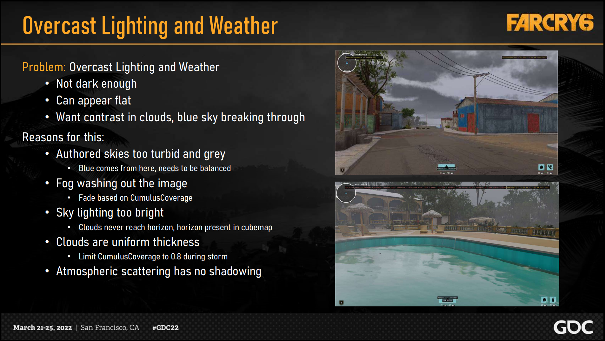

阴天的光照看起来有一些问题，不够黑，看起来很平，美术想要云和天空之间有更强的对比度。效果变成这样有很多原因：

1. 首先是制作的天空本身就看起来太灰暗、浑浊了，这个是首先要修改的地方。
2. 然后就是雾的原因，修改方法是根据云层覆盖率对雾做 Fade Out。
3. 因为云层没法达到地平线，然后 Cubemap 在地平线附近会有蓝色的亮带导致天光太亮。
4. 然后是云层密度太均匀了，看起来就很扁平，这个也很好改，在风暴天气时限制积云覆盖率就行了。
5. 最后是大气散射没有阴影。

下面介绍雨的实现，FarCry6 中的雨是基于 GPU 粒子实现的。

整个 Particle System 的 Overview，粒子的 Emit、Simulate、Sort 和 Render 都是在 GPU 完成的。

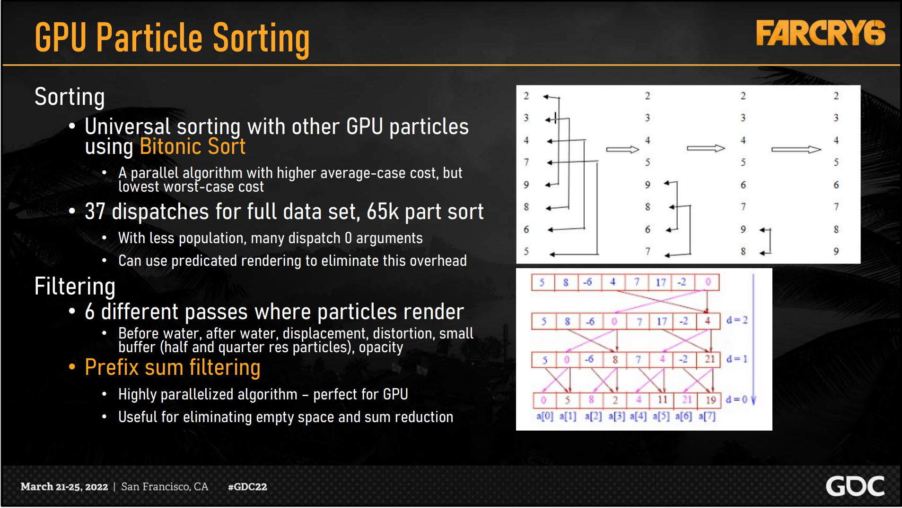

排序跟别的 GPU 粒子系统一样，用的是 Bitonic Sort，就是每一轮排序每个线程调换对应的两个数据，所有数据排序下来用了 37 个 Dispatch。

粒子渲染会在六个不同的 Pass 做，所以要对粒子做过滤，用的 Prefix Sum Filtering 算法（没看懂在干嘛）。

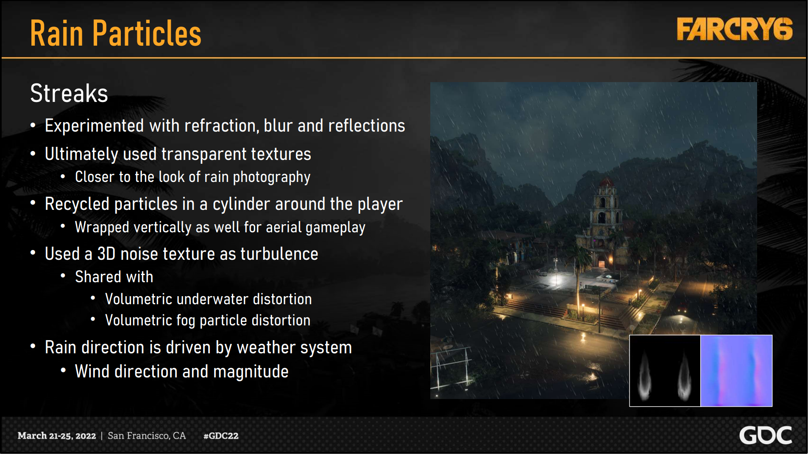

下面看雨水的粒子特效，首先是雨滴效果。开始尝试了折射、模糊、反射效果，最终还是直接用了半透纹理来做粒子，用到的纹理就是右下角的 Albedo 和 Normal。粒子 Emit 的范围就是玩家周围的一个圆柱体，超出范围就回收，所以无论相机移动多块，粒子的数量都是一致的。

为了让画面看起来更自然，还用了 3D 纹理对粒子做扰动，这张 3D 纹理同时也被用在了体积水和体积雾上。雨水粒子 Emit 的方向和速度取决于天气和风速。

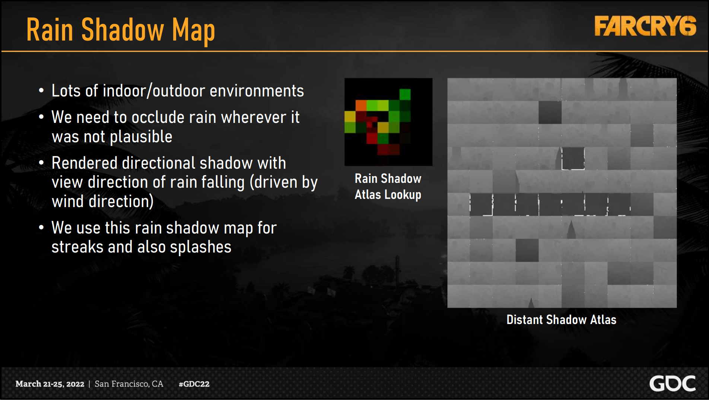

因为有很多室内室外组合的场景，这时需要对雨水做遮挡，不然室内下雨就会穿帮。做法是把雨水当做一个方向光，然后按照雨水的方向去渲染阴影来判断遮挡。Shadow Map 的存储跟游戏中的普通方向光源一样，用了 Altas，貌似是类似 Virtual Shadow Map 的东西。

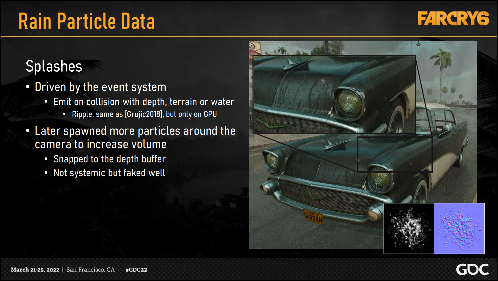

另外一个雨水的粒子特效是雨水滴落到表面上时造成的飞溅效果。早期这个系统就是当雨水粒子与 Depth Buffer、地形、雨水产生撞击后就 Emit 一个新的粒子来做溅射效果。但是这样的话任何不透明的物体都会触发这个效果，一些地方就会很奇怪，比如建筑的侧表面，为了解决这个问题引入了斜率来判断。

另外就是不是所有的雨水粒子都能触发这个事件，所以效果不太明显，所以又在相机周围加了额外的雨水粒子。

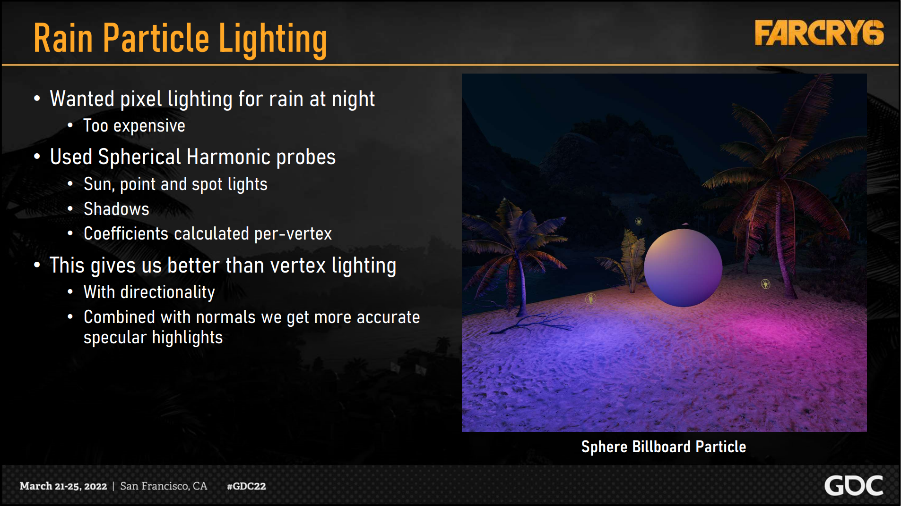

下面是雨水的照明，本来希望是用 Pixel Lighting 的，但是实在太费了，就改用了 Vertex Lighting，这样效果又不够好。

后来就改成了为粒子的每一个顶点生成一个球谐探针，每一个球谐探针都会根据周围的各种光源计算一个三阶球谐系数。最终效果会比 Vertex Lighting 好很多，而且还可以结合 Normal 获得更精确的高光。

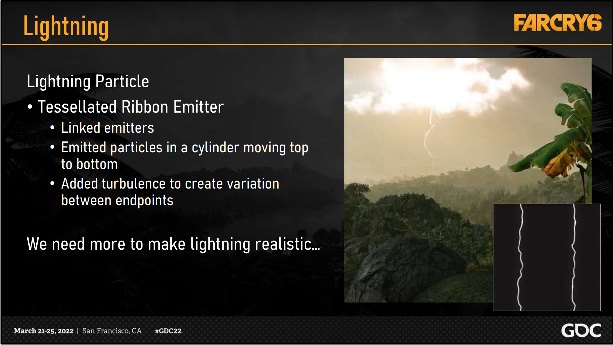

下面是闪电的粒子效果。为了实现闪电这种丝带的效果，做了一套叫 Tessellated Ribbon Emitter 的系统，在一个圆柱体内从上大小发射粒子，然后在断点之间添加扰动，就会得到图中的这种效果。但是这样看起来还是不够真实。

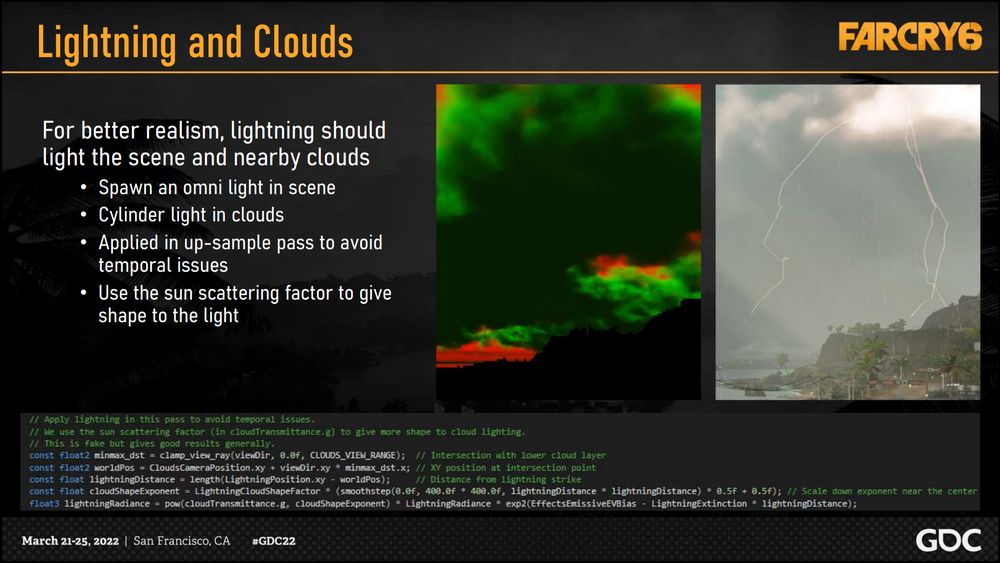

想要更真实的话，雷电要能有光照效果。具体实现是先 Spawn 一个全局的光来照亮场景，然后是云层需要被闪电影响。闪电本身是一个圆柱形的光源，对云层的光照效果需要放到上采样 Pass，不然会因为 Temporal Filter 产生鬼影。然后为了决定把光源放到什么位置，这里用了  Sun Scattering Factor 来计算，这个值会在 Raymarching Pass 时保存到 Attachment 的 G 通道。

下面是海洋。天气有两种方式影响海洋，一种是风级，另外一种是风向。用 Screen Space Tessellation 会有一些限制，有海岸线波浪问题，然后就是远距离看 Tiling 图案太明显了，所以 Screen Space Tessellation 只拿来做淡水效果。

海水的话用了一种新的 Tessellation 技术，叫 SUBD。

下面介绍一下这个算法，其实就是在三角形找找中线不断划分。这个算法是渐进式的，每一帧都会按照相机距离不断地进行细分和合并。可以看到图中离相机最近的部分每个 Quad 有四个三角形，紫色的部分就自由两个三角形了。

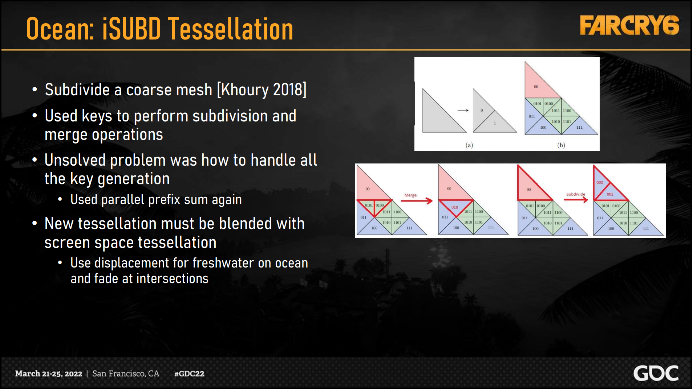

细分和合并的控制是用编号来做的，可以看到图中的灰色三角形，在细分之后会变成 01 两个三角形，一直细分下去就会得到图中这些带编号的三角形。然后每两个三角形合并就会减少一位。这里说他们有个没解决的问题是处理这些编号的生成，最后用了跟 GPU 粒子类似的并行前缀和的算法。

新的 Tessellation 需要跟 Screen Space Tessellation 做 Blend，对水面做 Displacement 并且在交界处做过渡。

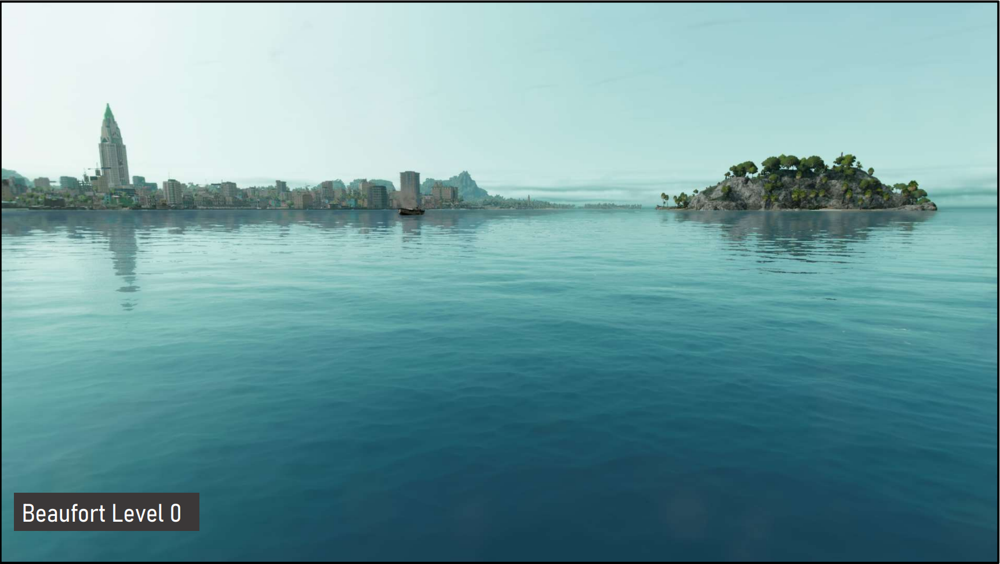

风级 0 的海面。

风级 1。

风级 2。

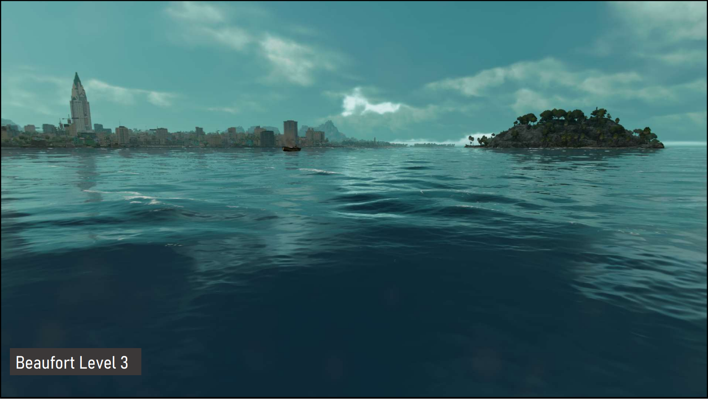

风级 3，到了风级 3 之后还可以控制波浪的振幅、频率、数量等。

风级 4，增加了泡沫的选项。

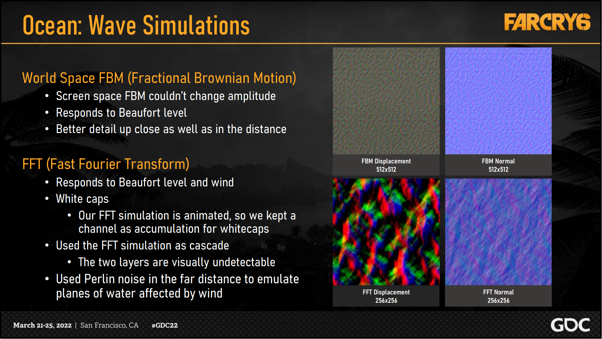

用了几张 Texture 来模拟海浪，这些 Texture 每帧都会更新，而且可以回读回 CPU 做物理计算，但是因为性能限制没有开这些功能。首先是两张 World Space 的 FBM 纹理，用来在相机附近产生尖锐的波浪，之所以用世界空间是因为可以直接从 Displacement Texture 生成 Normal Texture，这样可以获得更好的细节。远处的波使用的是 FFT，这两张纹理可以受到风的影响，另外为了防止远处看起来 Tilling 图案明显，留了一个通道做累加，然后使用的时候还会拿两张 FFT 做 Cascade 并叠加 Perlin 噪声，进一步降低重复度。

这是只有 FFT 的海面效果。

多级 FFT 叠加之后能消除一些 Tiling。

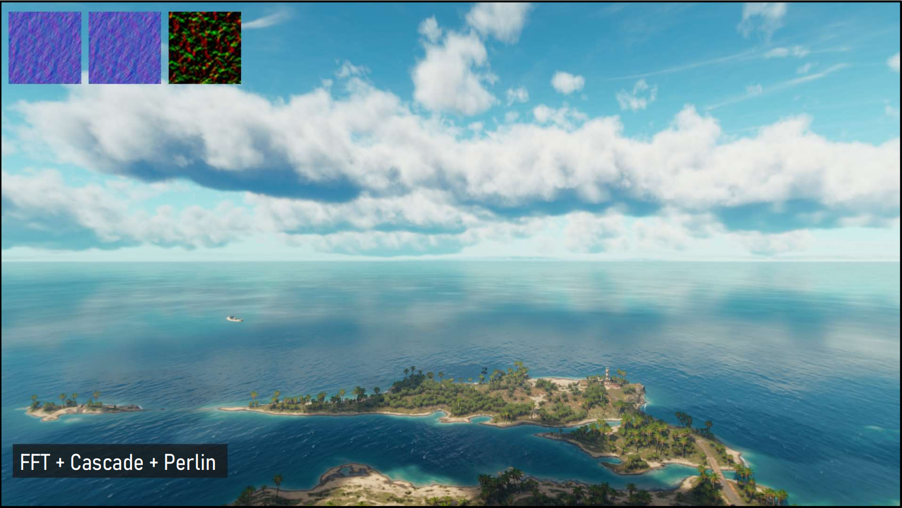

再加上 Perlin 噪声之后 Tiling 基本就没了。

海岸线的波浪。通常是可以用粒子来模拟的，但是游戏中海岸太多了，手摆效率很低，需要程序化生成。在程序化生成的时候会根据海洋和陆地区域自动推导出什么地方需要摆这种波浪，这种波浪用 Gerstner Wave 公式生成，给了一些用于控制视觉效果的参数，振幅、坡度、速度、强度等。最后还给波浪加了一些噪声，不然看起来就是完美的原形波。理论上来说这套系统支持五层波浪，但是最后只用了一层。

树的弯曲。树受到强风影响之后会产生弯曲，这个表现效果很直观，受控于风的方向和强度。这些树本身是 Skeletal Mesh，在受到风影响之后会修改树的形态，表现出在风暴中夸张的姿态。但是有时候运动会超出 Bounding Box，然后导致一些剔除上的错误，因为这个 Feature，把这些树的 Bounding Box 都调大了一些，然后只对近处的树开这个 Feature。

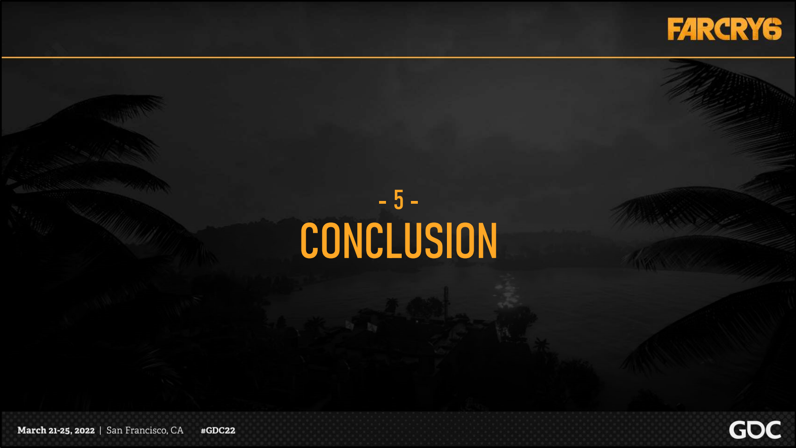

总结。

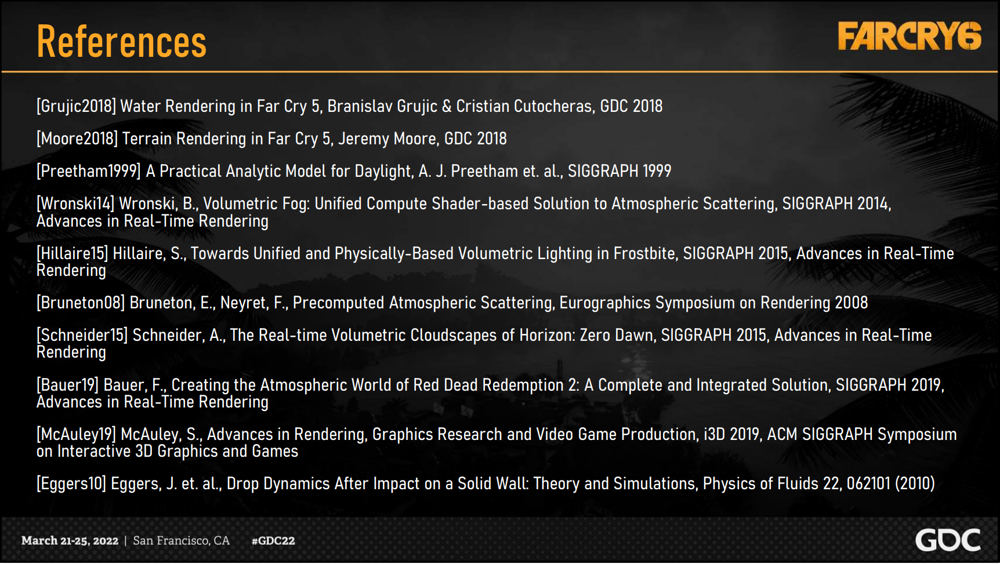

